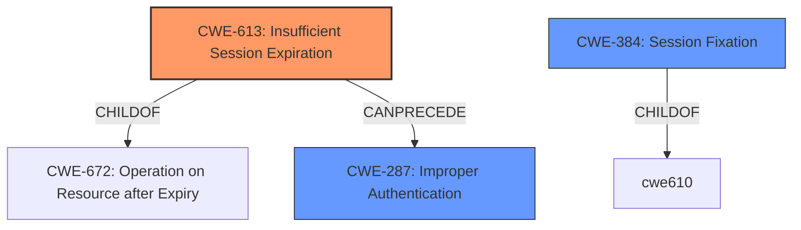

# Analysis Report for CVE-2022-35293

# Vulnerability Analysis Report: CVE-2022-35293

## Description


## Analysis (with Relationship Data)

# Summary
| CWE ID | CWE Name | Confidence | CWE Abstraction Level | CWE Vulnerability Mapping Label | CWE-Vulnerability Mapping Notes |
|---|---|---|---|---|---|
| CWE-613 | Insufficient Session Expiration | 0.75 | Base | Allowed | Primary CWE |
| CWE-384 | Session Fixation | 0.5 | Compound | Allowed | Secondary Candidate |
| CWE-287 | Improper Authentication | 0.3 | Class | Discouraged | Secondary Candidate |

## Evidence and Confidence

*   **Confidence Score:** 0.75
*   **Evidence Strength:** MEDIUM

## Relationship Analysis
The primary CWE is CWE-613, which is a base level CWE and a child of CWE-672. CWE-613 can precede CWE-287 (Improper Authentication) because insufficient session expiration can lead to authentication vulnerabilities. CWE-384 (Session Fixation) is a compound weakness that requires multiple conditions to occur simultaneously.



## Vulnerability Chain
The vulnerability chain starts with **insecure session management**, specifically **insufficient session expiration** (CWE-613). This leads to a situation where an unauthenticated attacker can gain access to user accounts, potentially leading to unauthorized viewing or modification of user data.

## Summary of Analysis
The initial assessment identified **insecure session management** as the root cause, leading to the selection of CWE-613 (Insufficient Session Expiration) as the primary CWE. This selection is based on the vulnerability description stating "Due to **insecure session management**, SAP Enable Now allows an unauthenticated attacker to gain access to users account."

The retriever results suggested other potential CWEs, including CWE-384 (Session Fixation) and CWE-287 (Improper Authentication). However, given the information provided, CWE-613 appears to be the most accurate representation of the root cause. CWE-384 may be a secondary factor if the application uses predictable session identifiers, and CWE-287 could be a consequence if the insufficient session expiration allows an attacker to bypass authentication checks.

The evidence provided focuses on the **insecure session management**, and the CWE-613 description matches this well: "According to WASC, 'Insufficient Session Expiration is when a web site permits an attacker to reuse old session credentials or session IDs for authorization.'"

The selection of CWE-613 is at the optimal level of specificity because it directly addresses the **insecure session management** mentioned in the vulnerability description.

Relevant CWE Information:

# Enhanced Context (25 CWEs)
The following CWEs were identified as potentially relevant to this vulnerability:

## CWE-99: Improper Control of Resource Identifiers ('Resource Injection')
**Abstraction Level**: Class
**Similarity Score**: 0.75
**Source**: dense

**Description**:
The product receives input from an upstream component, but it does not restrict or incorrectly restricts the input before it is used as an identifier for a resource that may be outside the intended sphere of control.
NOT USED: This CWE is not relevant as the vulnerability is not related to resource injection.

## CWE-74: Improper Neutralization of Special Elements in Output Used by a Downstream Component ('Injection')
**Abstraction Level**: Class
**Similarity Score**: 0.75
**Source**: dense

**Description**:
The product constructs all or part of a command, data structure, or record using externally-influenced input from an upstream component, but it does not neutralize or incorrectly neutralizes special elements that could modify how it is parsed or interpreted when it is sent to a downstream component.
NOT USED: This CWE is not relevant as the vulnerability is not related to injection.

## CWE-470: Use of Externally-Controlled Input to Select Classes or Code ('Unsafe Reflection')
**Abstraction Level**: Base
**Similarity Score**: 0.74
**Source**: dense

**Description**:
The product uses external input with reflection to select which classes or code to use, but it does not sufficiently prevent the input from selecting improper classes or code.
NOT USED: This CWE is not relevant as the vulnerability is not related to unsafe reflection.

## CWE-915: Improperly Controlled Modification of Dynamically-Determined Object Attributes
**Abstraction Level**: Base
**Similarity Score**: 0.74
**Source**: dense

**Description**:
The product receives input from an upstream component that specifies multiple attributes, properties, or fields that are to be initialized or updated in an object, but it does not properly control which attributes can be modified.
NOT USED: This CWE is not relevant as the vulnerability is not related to modification of dynamically-determined object attributes.

## CWE-807: Reliance on Untrusted Inputs in a Security Decision
**Abstraction Level**: Base
**Similarity Score**: 0.73
**Source**: dense

**Description**:
The product uses a protection mechanism that relies on the existence or values of an input, but the input can be modified by an untrusted actor in a way that bypasses the protection mechanism.
NOT USED: This CWE is not relevant as the vulnerability is not related to reliance on untrusted inputs in a security decision.

## CWE-691: Insufficient Control Flow Management
**Abstraction Level**: Pillar
**Similarity Score**: 0.73
**Source**: dense

**Description**:
The code does not sufficiently manage its control flow during execution, creating conditions in which the control flow can be modified in unexpected ways.
NOT USED: This CWE is too general and does not accurately describe the vulnerability.

## CWE-1220: Insufficient Granularity of Access Control
**Abstraction Level**: Base
**Similarity Score**: 0.73
**Source**: dense

**Description**:
The product implements access controls via a policy or other feature with the intention to disable or restrict accesses (reads and/or writes) to assets in a system from untrusted agents. However, implemented access controls lack required granularity, which renders the control policy too broad because it allows accesses from unauthorized agents to the security-sensitive assets.
NOT USED: This CWE is not relevant as the vulnerability is not related to access control granularity.

## CWE-653: Improper Isolation or Compartmentalization
**Abstraction Level**: Class
**Similarity Score**: 0.73
**Source**: dense

**Description**:
The product does not properly compartmentalize or isolate functionality, processes, or resources that require different privilege levels, rights, or permissions.
NOT USED: This CWE is not relevant as the vulnerability is not related to improper isolation or compartmentalization.

## CWE-538: Insertion of Sensitive Information into Externally-Accessible File or Directory
**Abstraction Level**: Base
**Similarity Score**: 0.73
**Source**: dense

**Description**:
The product places sensitive information into files or directories that are accessible to actors who are allowed to have access to the files, but not to the sensitive information.
NOT USED: This CWE is not relevant as the vulnerability is not related to insertion of sensitive information into externally-accessible file or directory.

## CWE-749: Exposed Dangerous Method or Function
**Abstraction Level**: Base
**Similarity Score**: 0.73
**Source**: dense

**Description**:
The product provides an Applications Programming Interface (API) or similar interface for interaction with external actors, but the interface includes a dangerous method or function that is not properly restricted.
NOT USED: This CWE is not relevant as the vulnerability is not related to exposed dangerous method or function.

## CWE-639: Authorization Bypass Through User-Controlled Key
**Abstraction Level**: Base
**Similarity Score**: 6586.72
**Source**: sparse

**Description**:
The system's authorization functionality does not prevent one user from gaining access to another user's data or record by modifying the key value identifying the data.
NOT USED: This CWE is not relevant as the vulnerability is not related to authorization bypass through user-controlled key.

## CWE-863: Incorrect Authorization
**Abstraction Level**: Class
**Similarity Score**: 6350.29
**Source**: sparse

**Description**:
The product performs an authorization check when an actor attempts to access a resource or perform an action, but it does not correctly perform the check.
NOT USED: This CWE is not relevant as the vulnerability is not related to incorrect authorization.

## CWE-200: Exposure of Sensitive Information to an Unauthorized Actor
**Abstraction Level**: Class
**Similarity Score**: 6283.71


## CWE Relationship Analysis

Current CWEs represent these abstraction levels: .


### Vulnerability Chain Analysis

**Chain starting from CWE-200:**
- 200 (Exposure of Sensitive Information to an Unauthorized Actor) - ROOT


**Chain starting from CWE-470:**
- 470 (Use of Externally-Controlled Input to Select Classes or Code ('Unsafe Reflection')) - ROOT


### CWE Relationship Diagram

```mermaid
graph TD
    classDef primary fill:#f96,stroke:#333,stroke-width:2px
    classDef secondary fill:#69f,stroke:#333
    classDef tertiary fill:#9e9,stroke:#333
```


*Report generated on 2025-03-31 12:47:46*
