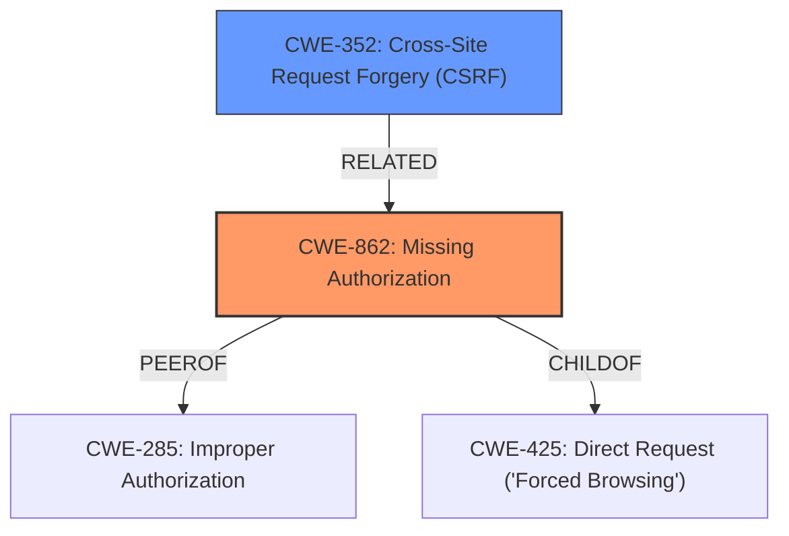

# Analysis for CVE-2022-3538

# Summary
| CWE ID  | CWE Name                                                                                             | Confidence | CWE Abstraction Level | CWE Vulnerability Mapping Label | CWE-Vulnerability Mapping Notes |
| ------- | ---------------------------------------------------------------------------------------------------- | ---------- | ----------------------- | ------------------------------- | ------------------------------- |
| CWE-862 | Missing Authorization                                                                                | 0.9        | Class                   | Primary                         | Allowed-with-Review             |
| CWE-352 | Cross-Site Request Forgery (CSRF)                                                                    | 0.8        | Compound                | Secondary                       | Allowed                         |

## Evidence and Confidence

*   **Confidence Score:** 0.85
*   **Evidence Strength:** HIGH

## Relationship Analysis

The primary weakness is **CWE-862 (Missing Authorization)**, a Class-level CWE. Since the application **does not perform an authorization check**, this is the most accurate representation. The secondary weakness is **CWE-352 (Cross-Site Request Forgery (CSRF))**, a Compound CWE. This occurs because the application **doesn't verify if the request was intentionally provided by the user**. Both weaknesses exist independently, leading to the described vulnerability.

## Vulnerability Chain

The vulnerability chain involves two primary weaknesses: **missing authorization** and **missing CSRF checks**.

1.  **Root Cause 1:** **Missing Authorization (CWE-862)**: The plugin **does not perform an authorization check** when disabling plugins.
2.  **Root Cause 2:** **Missing CSRF Checks (CWE-352)**: The plugin **does not verify if the request was intentionally provided by the user**.
3.  **Impact:** Unauthenticated users can disable arbitrary plugins.

## Summary of Analysis

The initial assessment focused on identifying the **missing authorization** and **missing CSRF checks** as the main weaknesses. **CWE-862 (Missing Authorization)** and **CWE-352 (Cross-Site Request Forgery (CSRF))** emerged as the most relevant CWEs.

The vulnerability description clearly states the plugin **does not have authorisation** and **CSRF checks** when disabling plugins, allowing unauthenticated users to disable arbitrary plugins. This directly supports the selection of **CWE-862** and **CWE-352**.

**CWE-862 (Missing Authorization)** is at the Class level. It accurately describes the **lack of authorization checks**. **CWE-352 (Cross-Site Request Forgery (CSRF))** is a Compound CWE that describes the **lack of CSRF protection**.

Other CWEs like **CWE-425 (Direct Request ('Forced Browsing'))** and **CWE-285 (Improper Authorization)** were considered but deemed less specific. **CWE-425** is a child of **CWE-862** but doesn't fully capture the authorization issue. **CWE-285** is too general, as it covers both missing and incorrect authorization, while the vulnerability description specifically mentions **missing authorisation**.

The final decision is based on the clear evidence of **missing authorization** and **CSRF checks**, making **CWE-862** and **CWE-352** the most appropriate classifications.

Relevant CWE Information:

# Enhanced Context (25 CWEs)

## CWE-425: Direct Request ('Forced Browsing')
**Abstraction Level**: Base
**Similarity Score**: 0.75
**Source**: dense

**Description**:
The web application does not adequately enforce appropriate authorization on all restricted URLs, scripts, or files.

**Mapping Guidance**:
- Usage: Allowed
- Rationale: This CWE entry is at the Base level of abstraction, which is a preferred level of abstraction for mapping to the root causes of vulnerabilities.

## CWE-472: External Control of Assumed-Immutable Web Parameter
**Abstraction Level**: Base
**Similarity Score**: 0.74
**Source**: dense

**Description**:
The web application does not sufficiently verify inputs that are assumed to be immutable but are actually externally controllable, such as hidden form fields.

**Mapping Guidance**:
- Usage: Allowed
- Rationale: This CWE entry is at the Base level of abstraction, which is a preferred level of abstraction for mapping to the root causes of vulnerabilities.

## CWE-352: Cross-Site Request Forgery (CSRF)
**Abstraction Level**: Compound
**Similarity Score**: 0.74
**Source**: dense

**Description**:
The web application does not, or can not, sufficiently verify whether a well-formed, valid, consistent request was intentionally provided by the user who submitted the request.

**Mapping Guidance**:
- Usage: Allowed
- Rationale: This is a well-known Composite of multiple weaknesses that must all occur simultaneously, although it is attack-oriented in nature.

## CWE-807: Reliance on Untrusted Inputs in a Security Decision
**Abstraction Level**: Base
**Similarity Score**: 0.72
**Source**: dense

**Description**:
The product uses a protection mechanism that relies on the existence or values of an input, but the input can be modified by an untrusted actor in a way that bypasses the protection mechanism.

**Mapping Guidance**:
- Usage: Allowed
- Rationale: This CWE entry is at the Base level of abstraction, which is a preferred level of abstraction for mapping to the root causes of vulnerabilities.

## CWE-434: Unrestricted Upload of File with Dangerous Type
**Abstraction Level**: Base
**Similarity Score**: 0.71
**Source**: dense

**Description**:
The product allows the upload or transfer of dangerous file types that are automatically processed within its environment.

**Mapping Guidance**:
- Usage: Allowed
- Rationale: This CWE entry is at the Base level of abstraction, which is a preferred level of abstraction for mapping to the root causes of vulnerabilities.

## CWE-639: Authorization Bypass Through User-Controlled Key
**Abstraction Level**: Base
**Similarity Score**: 0.71
**Source**: dense

**Description**:
The system's authorization functionality does not prevent one user from gaining access to another user's data or record by modifying the key value identifying the data.

**Mapping Guidance**:
- Usage: Allowed
- Rationale: This CWE entry is at the Base level of abstraction, which is a preferred level of abstraction for mapping to the root causes of vulnerabilities.

## CWE-184: Incomplete List of Disallowed Inputs
**Abstraction Level**: Base
**Similarity Score**: 0.71
**Source**: dense

**Description**:
The product implements a protection mechanism that relies on a list of inputs (or properties of inputs) that are not allowed by policy or otherwise require other action to neutralize before additional processing takes place, but the list is incomplete.

**Mapping Guidance**:
- Usage: Allowed
- Rationale: This CWE entry is at the Base level of abstraction, which is a preferred level of abstraction for mapping to the root causes of vulnerabilities.

## CWE-303: Incorrect Implementation of Authentication Algorithm
**Abstraction Level**: Base
**Similarity Score**: 0.71
**Source**: dense

**Description**:
The requirements for the product dictate the use of an established authentication algorithm, but the implementation of the algorithm is incorrect.

**Mapping Guidance**:
- Usage: Allowed
- Rationale: This CWE entry is at the Base level of abstraction, which is a preferred level of abstraction for mapping to the root causes of vulnerabilities.

## CWE-1391: Use of Weak Credentials
**Abstraction Level**: Class
**Similarity Score**: 0.71
**Source**: dense

**Description**:
The product uses weak credentials (such as a default key or hard-coded password) that can be calculated, derived, reused, or guessed by an attacker.

**Mapping Guidance**:
- Usage: Allowed-with-Review
- Rationale: This CWE entry is a Class and might have Base-level children that would be more appropriate

## CWE-1390: Weak Authentication
**Abstraction Level**: Class
**Similarity Score**: 0.70
**Source**: dense

**Description**:
The product uses an authentication mechanism to restrict access to specific users or identities, but the mechanism does not sufficiently prove that the claimed identity is correct.

**Mapping Guidance**:
- Usage: Allowed-with-Review
- Rationale: This CWE entry is a Class and might have Base-level children

# Enhanced Query for CVE-2022-3538

# Vulnerability Description

    The Webmaster Tools Verification WordPress plugin through 1.2 does not have authorisation and CSRF checks when disabling plugins, allowing unauthenticated users to disable arbitrary plugins

    # Keyphrase-Specific CWE Analysis
    This vulnerability contains multiple keyphrases that may map to different CWEs. 
    Please analyze each keyphrase separately and determine the most appropriate CWE(s) for each.

    ## ROOTCAUSE: 'missing authorisation'

Relevant CWEs for this ROOTCAUSE:

### 1. CWE-352: Cross-Site Request Forgery (CSRF) (Score: 294.92)

The web application does not, or can not, sufficiently verify whether a well-formed, valid, consistent request was intentionally provided by the user who submitted the request....

### 2. CWE-862: Missing Authorization (Score: 254.04)

The product does not perform an authorization check when an actor attempts to access a resource or perform an action....

### 3. CWE-863: Incorrect Authorization (Score: 196.47)

The product performs an authorization check when an actor attempts to access a resource or perform an action, but it does not correctly perform the check....

### 4. CWE-425: Direct Request ('Forced Browsing') (Score: 182.43)

The web application does not adequately enforce appropriate authorization on all restricted URLs, scripts, or files....

### 5. CWE-434: Unrestricted Upload of File with Dangerous Type (Score: 180.73)

The product allows the upload or transfer of dangerous file types that are automatically processed within its environment....

## ROOTCAUSE: 'missing CSRF checks'

Relevant CWEs for this ROOTCAUSE:

### 1. CWE-352: Cross-Site Request Forgery (CSRF) (Score: 294.92)

The web application does not, or can not, sufficiently verify whether a well-formed, valid, consistent request was intentionally provided by the user who submitted the request....

### 2. CWE-862: Missing Authorization (Score: 254.04)

The product does not perform an authorization check when an actor attempts to access a resource or perform an action....

### 3. CWE-863: Incorrect Authorization (Score: 196.47)

The product performs an authorization check when an actor attempts to access a resource or perform an action, but it does not correctly perform the check....

### 4. CWE-425: Direct Request ('Forced Browsing') (Score: 182.43)

The web application does not adequately enforce appropriate authorization on all restricted URLs, scripts, or files....

### 5. CWE-434: Unrestricted Upload of File with Dangerous Type (Score: 180.73)

The product allows the upload or transfer of dangerous file types that are automatically processed within its environment....

## IMPACT: 'disable arbitrary plugins'

Relevant CWEs for this IMPACT:

### 1. CWE-352: Cross-Site Request Forgery (CSRF) (Score: 294.92)

The web application does not, or can not, sufficiently verify whether a well-formed, valid, consistent request was intentionally provided by the user who submitted the request....

### 2. CWE-862: Missing Authorization (Score: 254.04)

The product does not perform an authorization check when an actor attempts to access a resource or perform an action....

### 3. CWE-863: Incorrect Authorization (Score: 196.47)

The product performs an authorization check when an actor attempts to access a resource or perform an action, but it does not correctly perform the check....

### 4. CWE-425: Direct Request ('Forced Browsing') (Score: 182.43)

The web application does not adequately enforce appropriate authorization on all restricted URLs, scripts, or files....

### 5. CWE-285: Improper Authorization (Score: 63.21)

The product does not perform or incorrectly performs an authorization check when an actor attempts to access a resource or perform an action....

## ATTACKER: 'unauthenticated users'

Relevant CWEs for this ATTACKER:

### 1. CWE-352: Cross-Site Request Forgery (CSRF) (Score: 294.92)

The web application does not, or can not, sufficiently verify whether a well-formed, valid, consistent request was intentionally provided by the user who submitted the request....

### 2. CWE-862: Missing Authorization (Score: 254.04)

The product does not perform an authorization check when an actor attempts to access a resource or perform an action....

### 3. CWE-863: Incorrect Authorization (Score: 196.47)

The product performs an authorization check when an actor attempts to access a resource or perform an action, but it does not correctly perform the check....

### 4. CWE-425: Direct Request ('Forced Browsing') (Score: 182.43)

The web application does not adequately enforce appropriate authorization on all restricted URLs, scripts, or files....

### 5. CWE-285: Improper Authorization (Score: 63.21)

The product does not perform or incorrectly performs an authorization check when an actor attempts to access a resource or perform an action....

## PRODUCT: 'Webmaster Tools Verification WordPress plugin'

Relevant CWEs for this PRODUCT:

### 1. CWE-352: Cross-Site Request Forgery (CSRF) (Score: 294.92)

The web application does not, or can not, sufficiently verify whether a well-formed, valid, consistent request was intentionally provided by the user who submitted the request....

### 2. CWE-862: Missing Authorization (Score: 254.04)

The product does not perform an authorization check when an actor attempts to access a resource or perform an action....

### 3. CWE-863: Incorrect Authorization (Score: 196.47)

The product performs an authorization check when an actor attempts to access a resource or perform an action, but it does not correctly perform the check....

### 4. CWE-434: Unrestricted Upload of File with Dangerous Type (Score: 180.73)

The product allows the upload or transfer of dangerous file types that are automatically processed within its environment....

### 5. CWE-1390: Weak Authentication (Score: 70.82)

The product uses an authentication mechanism to restrict access to specific users or identities, but the mechanism does not sufficiently prove that the claimed identity is correct....

## VERSION: 'through 1.2'

Relevant CWEs for this VERSION:

### 1. CWE-352: Cross-Site Request Forgery (CSRF) (Score: 294.92)

The web application does not, or can not, sufficiently verify whether a well-formed, valid, consistent request was intentionally provided by the user who submitted the request....

### 2. CWE-862: Missing Authorization (Score: 254.04)

The product does not perform an authorization check when an actor attempts to access a resource or perform an action....

### 3. CWE-863: Incorrect Authorization (Score: 196.47)

The product performs an authorization check when an actor attempts to access a resource or perform an action, but it does not correctly perform the check....

### 4. CWE-434: Unrestricted Upload of File with Dangerous Type (Score: 180.73)

The product allows the upload or transfer of dangerous file types that are automatically processed within its environment....

### 5. CWE-285: Improper Authorization (Score: 63.21)

The product does not perform or incorrectly performs an authorization check when an actor attempts to access a resource or perform an action....

    # Analysis Instructions
    1. For each keyphrase, identify the most appropriate CWE(s) that represent the weakness.
    2. Consider how the different keyphrases might relate to each other in the vulnerability chain.
    3. Provide a final determination of primary CWE(s) and any secondary CWEs.
    4. Format your response using the standard analysis template.

    Please analyze how these different weaknesses interact and provide a comprehensive CWE classification.
    