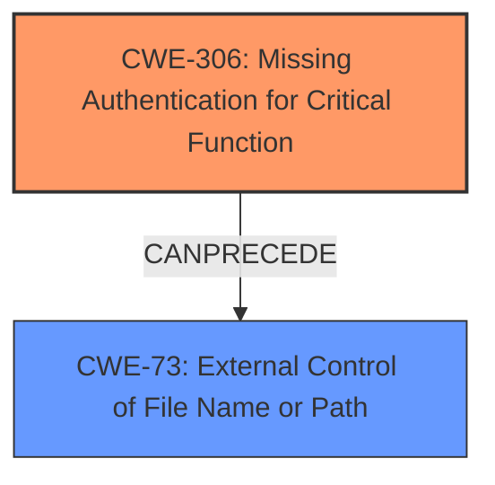

# Analysis for CVE-2022-35404

# Summary
| CWE ID  | CWE Name                                                                                     | Confidence | CWE Abstraction Level | CWE Vulnerability Mapping Label | CWE-Vulnerability Mapping Notes |
| :-------- | :------------------------------------------------------------------------------------------- | :---------- | :---------------------- | :------------------------------ | :------------------------------ |
| CWE-306   | Missing Authentication for Critical Function                                                 | 0.9         | Base                    | Primary                        | Allowed                       |
| CWE-73   | External Control of File Name or Path                                                       | 0.7         | Base                    | Secondary                       | Allowed                       |

## Evidence and Confidence

*   **Confidence Score:** 0.8
*   **Evidence Strength:** HIGH

## Relationship Analysis
The primary relationship influencing the decision is that CWE-306 **Missing Authentication for Critical Function** allows an attacker to perform actions without proper verification. The **External Control of File Name or Path (CWE-73)** is a consequence of the missing authentication, allowing the attacker to specify the file and directory to be created. The chain relationship shows how the missing authentication leads to external control of file operations.

## Vulnerability Chain
The vulnerability chain starts with **Missing Authentication for Critical Function (CWE-306)**, allowing for **External Control of File Name or Path (CWE-73)**, which leads to unauthorized file and directory creation. The root cause is the **lack of authentication** for a critical function, enabling the subsequent weakness.

## Summary of Analysis
The initial analysis identified that the vulnerability description states that ManageEngine Password Manager Pro and OPManager are vulnerable to unauthorized file and directory creation on a server machine. The key phrase is the unauthorized file and directory creation.

The CVE Reference Links Content Summary provides more details. The **root cause** is a **lack of proper validation of parameters** in the server-side source code, specifically before initiating a session. This allows for the unauthenticated creation of arbitrary files and directories.

The **primary vulnerability** is that an attacker can create files and directories on the system **without needing authentication.**

Given this analysis, CWE-306 **Missing Authentication for Critical Function** is the primary CWE. The "Retriever Results" also lists CWE-306 as the top combined result.
The vulnerability also includes **External Control of File Name or Path (CWE-73)** because the missing authentication allows the attacker to control the file name and path.

I considered other CWEs from the Retriever Results, but they were not as relevant:

*   CWE-256 **Plaintext Storage of a Password**: This is not relevant because the vulnerability is about file creation, not password storage.
*   CWE-23 **Relative Path Traversal** and CWE-22 **Improper Limitation of a Pathname to a Restricted Directory**: These are related to path manipulation, but the primary issue is the missing authentication that allows arbitrary file creation in the first place. They could be a secondary weakness if combined with CWE-73.
*   CWE-522 **Insufficiently Protected Credentials**: This is not relevant because the vulnerability is not about credentials.
*   CWE-620 **Unverified Password Change**: This is not relevant because the vulnerability is not about password changes.
*   CWE-732 **Incorrect Permission Assignment for Critical Resource**: This is not directly relevant. The problem is not incorrect permissions but the ability to create files without authentication.
*   CWE-379 **Creation of Temporary File in Directory with Insecure Permissions**: This is not specific enough, as the vulnerability allows creation of arbitrary files, not just temporary files.
*   CWE-214 **Invocation of Process Using Visible Sensitive Information**: This is not relevant because the vulnerability is not about invoking processes with sensitive information.

The selected CWEs are at the optimal level of specificity because they directly address the root cause **(missing authentication)** and the immediate consequence **(external control of file name/path)**.

Relevant CWE Information:

# Enhanced Context (25 CWEs)
The following CWEs were identified as potentially relevant to this vulnerability:

## CWE-73: External Control of File Name or Path
**Abstraction Level**: Base
**Similarity Score**: 0.79
**Source**: dense

**Description**:
The product allows user input to control or influence paths or file names that are used in filesystem operations.

**Mapping Guidance**:
- Usage: Allowed
- Rationale: This CWE entry is at the Base level of abstraction, which is a preferred level of abstraction for mapping to the root causes of vulnerabilities.

## CWE-23: Relative Path Traversal
**Abstraction Level**: Base
**Similarity Score**: 0.79
**Source**: dense

**Description**:
The product uses external input to construct a pathname that should be within a restricted directory, but it does not properly neutralize sequences such as ".." that can resolve to a location that is outside of that directory.

**Mapping Guidance**:
- Usage: Allowed
- Rationale: This CWE entry is at the Base level of abstraction, which is a preferred level of abstraction for mapping to the root causes of vulnerabilities.

## CWE-41: Improper Resolution of Path Equivalence
**Abstraction Level**: Base
**Similarity Score**: 0.78
**Source**: dense

**Description**:
The product is vulnerable to file system contents disclosure through path equivalence. Path equivalence involves the use of special characters in file and directory names. The associated manipulations are intended to generate multiple names for the same object.

**Mapping Guidance**:
- Usage: Allowed
- Rationale: This CWE entry is at the Base level of abstraction, which is a preferred level of abstraction for mapping to the root causes of vulnerabilities.

## CWE-59: Improper Link Resolution Before File Access ('Link Following')
**Abstraction Level**: Base
**Similarity Score**: 0.78
**Source**: dense

**Description**:
The product attempts to access a file based on the filename, but it does not properly prevent that filename from identifying a link or shortcut that resolves to an unintended resource.

**Mapping Guidance**:
- Usage: Allowed
- Rationale: This CWE entry is at the Base level of abstraction, which is a preferred level of abstraction for mapping to the root causes of vulnerabilities.

## CWE-538: Insertion of Sensitive Information into Externally-Accessible File or Directory
**Abstraction Level**: Base
**Similarity Score**: 0.78
**Source**: dense

**Description**:
The product places sensitive information into files or directories that are accessible to actors who are allowed to have access to the files, but not to the sensitive information.

**Mapping Guidance**:
- Usage: Allowed
- Rationale: This CWE entry is at the Base level of abstraction, which is a preferred level of abstraction for mapping to the root causes of vulnerabilities.

## CWE-552: Files or Directories Accessible to External Parties
**Abstraction Level**: Base
**Similarity Score**: 0.78
**Source**: dense

**Description**:
The product makes files or directories accessible to unauthorized actors, even though they should not be.

**Mapping Guidance**:
- Usage: Allowed
- Rationale: This CWE entry is at the Base level of abstraction, which is a preferred level of abstraction for mapping to the root causes of vulnerabilities.

## CWE-668: Exposure of Resource to Wrong Sphere
**Abstraction Level**: Class
**Similarity Score**: 0.78
**Source**: dense

**Description**:
The product exposes a resource to the wrong control sphere, providing unintended actors with inappropriate access to the resource.

**Mapping Guidance**:
- Usage: Discouraged
- Rationale: CWE-668 is high-level and is often misused as a catch-all when lower-level CWE IDs might be applicable. It is sometimes used for low-information vulnerability reports [REF-1287]. It is a level-1 Class (i.e., a child of a Pillar). It is not useful for trend analysis.

## CWE-427: Uncontrolled Search Path Element
**Abstraction Level**: Base
**Similarity Score**: 0.77
**Source**: dense

**Description**:
The product uses a fixed or controlled search path to find resources, but one or more locations in that path can be under the control of unintended actors.

**Mapping Guidance**:
- Usage: Allowed
- Rationale: This CWE entry is at the Base level of abstraction, which is a preferred level of abstraction for mapping to the root causes of vulnerabilities.

## CWE-807: Reliance on Untrusted Inputs in a Security Decision
**Abstraction Level**: Base
**Similarity Score**: 0.76
**Source**: dense

**Description**:
The product uses a protection mechanism that relies on the existence or values of an input, but the input can be modified by an untrusted actor in a way that bypasses the protection mechanism.

**Mapping Guidance**:
- Usage: Allowed