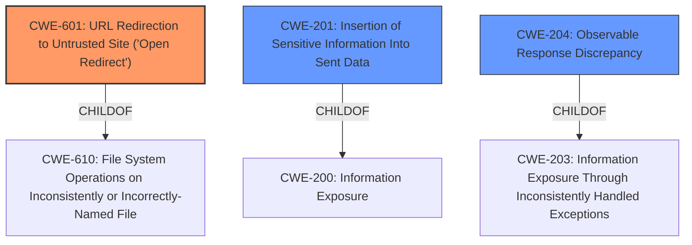

# Raw Analyzer Response for CVE-2022-35406

# Summary
| CWE ID | CWE Name | Confidence | CWE Abstraction Level | CWE Vulnerability Mapping Label | CWE-Vulnerability Mapping Notes |
|---|---|---|---|---|---|
| CWE-601 | URL Redirection to Untrusted Site ('Open Redirect') | 0.8 | Base | Allowed | Primary CWE |
| CWE-201 | Insertion of Sensitive Information Into Sent Data | 0.6 | Base | Allowed | Secondary Candidate |
| CWE-204 | Observable Response Discrepancy | 0.5 | Base | Allowed | Secondary Candidate |

## Evidence and Confidence

*   **Confidence Score:** 0.7
*   **Evidence Strength:** MEDIUM

## Relationship Analysis
The primary relationship that influenced the decision was the direct matching of the vulnerability description to the CWE-601 description. While other CWEs were considered due to the information disclosure aspect, CWE-601 directly addresses the **incorrect redirection**, making it the most specific and relevant choice. CWE-201 and CWE-204 were considered because of the **URL disclosure**, but they are less specific to the redirect itself.

## Vulnerability Chain
The vulnerability chain starts with a **crafted HTTP response**. This leads to **incorrect interpretation as a redirect** by Burp Suite. The final impact is **URL disclosure**.
  - Root Cause: Crafted HTTP Response
  - Weakness: Incorrect Interpretation as Redirect
  - Impact: URL Disclosure

## Summary of Analysis
The initial assessment strongly pointed to CWE-601 due to the explicit mention of "redirect" in both the vulnerability description and the CVE summary. The core issue is that a crafted response is **incorrectly interpreted as a redirect**, leading to **URL disclosure**. The evidence for this is in the "CVE Reference Links Content Summary": "Specifically, a crafted response could be incorrectly interpreted as a redirect, leading to the disclosure of URLs."

While CWE-201 and CWE-204 were considered due to the "URL disclosure" aspect, they are less precise than CWE-601, which specifically addresses the redirection issue. CWE-204 relates to observable discrepancies, which is a more general case of information disclosure. CWE-201 focuses on the insertion of sensitive information, but the primary problem here is the incorrect redirect, not necessarily the insertion of sensitive information, although sensitive information *is* ultimately disclosed.

The final decision favors CWE-601 as the primary CWE because it directly describes the core weakness: an **unvalidated redirect** to an untrusted site due to the **incorrect interpretation** of a crafted response. The other CWEs represent secondary consequences or related issues but not the root cause. The selection of CWE-601 is at the optimal level of specificity (Base) because it directly addresses the weakness without being overly broad or abstract.

Relevant CWE Information:

# Enhanced Context (25 CWEs)
The following CWEs were identified as potentially relevant to this vulnerability:

## CWE-41: Improper Resolution of Path Equivalence
**Abstraction Level**: Base
**Similarity Score**: 0.77
**Source**: dense

**Description**:
The product is vulnerable to file system contents disclosure through path equivalence. Path equivalence involves the use of special characters in file and directory names. The associated manipulations are intended to generate multiple names for the same object.

**Mapping Guidance**:
- Usage: Allowed
- Rationale: This CWE entry is at the Base level of abstraction, which is a preferred level of abstraction for mapping to the root causes of vulnerabilities.

*This CWE is not relevant because it deals with file system path manipulations, which are not involved in this vulnerability.*

## CWE-74: Improper Neutralization of Special Elements in Output Used by a Downstream Component ('Injection')
**Abstraction Level**: Class
**Similarity Score**: 0.76
**Source**: dense

**Description**:
The product constructs all or part of a command, data structure, or record using externally-influenced input from an upstream component, but it does not neutralize or incorrectly neutralizes special elements that could modify how it is parsed or interpreted when it is sent to a downstream component.

**Mapping Guidance**:
- Usage: Discouraged
- Rationale: CWE-74 is high-level and often misused when lower-level weaknesses are more appropriate.

*This CWE is not relevant. While a crafted response is used, the issue is not a classic injection vulnerability.*

## CWE-668: Exposure of Resource to Wrong Sphere
**Abstraction Level**: Class
**Similarity Score**: 0.76
**Source**: dense

**Description**:
The product exposes a resource to the wrong control sphere, providing unintended actors with inappropriate access to the resource.

**Mapping Guidance**:
- Usage: Discouraged
- Rationale: CWE-668 is high-level and is often misused as a catch-all when lower-level CWE IDs might be applicable. It is sometimes used for low-information vulnerability reports [REF-1287]. It is a level-1 Class (i.e., a child of a Pillar). It is not useful for trend analysis.

*This CWE is too broad. The specific issue is related to URL redirection, not general resource exposure.*

## CWE-639: Authorization Bypass Through User-Controlled Key
**Abstraction Level**: Base
**Similarity Score**: 0.75
**Source**: dense

**Description**:
The system's authorization functionality does not prevent one user from gaining access to another user's data or record by modifying the key value identifying the data.

**Mapping Guidance**:
- Usage: Allowed
- Rationale: This CWE entry is at the Base level of abstraction, which is a preferred level of abstraction for mapping to the root causes of vulnerabilities.

*This CWE is not relevant, as the vulnerability does not involve authorization bypass through user-controlled keys.*

## CWE-113: Improper Neutralization of CRLF Sequences in HTTP Headers ('HTTP Request/Response Splitting')
**Abstraction Level**: Variant
**Similarity Score**: 0.75
**Source**: dense

**Description**:
The product receives data from an HTTP agent/component (e.g., web server, proxy, browser, etc.), but it does not neutralize or incorrectly neutralizes CR and LF characters before the data is included in outgoing HTTP headers.

**Mapping Guidance**:
- Usage: Allowed
- Rationale: This CWE entry is at the Variant level of abstraction, which is a preferred level of abstraction for mapping to the root causes of vulnerabilities.

*While this CWE relates to HTTP, the specific vulnerability is not about CRLF injection but rather about incorrect redirection.*

## CWE-807: Reliance on Untrusted Inputs in a Security Decision
**Abstraction Level**: Base
**Similarity Score**: 0.75
**Source**: dense

**Description**:
The product uses a protection mechanism that relies on the existence or values of an input, but the input can be modified by an untrusted actor in a way that bypasses the protection mechanism.

**Mapping Guidance**:
- Usage: Allowed
- Rationale: This CWE entry is at the Base level of abstraction, which is a preferred level of abstraction for mapping to the root causes of vulnerabilities.

*This CWE is not relevant because the core issue is the incorrect handling of redirects, not a flawed security decision based on untrusted input.*

## CWE-23: Relative Path Traversal
**Abstraction Level**: Base
**Similarity Score**: 0.75
**Source**: dense

**Description**:
The product uses external input to construct a pathname that should be within a restricted directory, but it does not properly neutralize sequences such as ".." that can resolve to a location that is outside of that directory.

**Mapping Guidance**:
- Usage: Allowed
- Rationale: This CWE entry is at the Base level of abstraction, which is a preferred level of abstraction for mapping to the root causes of vulnerabilities.

*This CWE is not relevant, as the vulnerability does not involve path traversal.*

## CWE-451: User Interface (UI) Misrepresentation of Critical Information
**Abstraction Level**: Class
**Similarity Score**: 0.75
**Source**: dense

**Description**:
The user interface (UI) does not properly represent critical information to the user, allowing the information - or its source - to be obscured or spoofed. This is often a