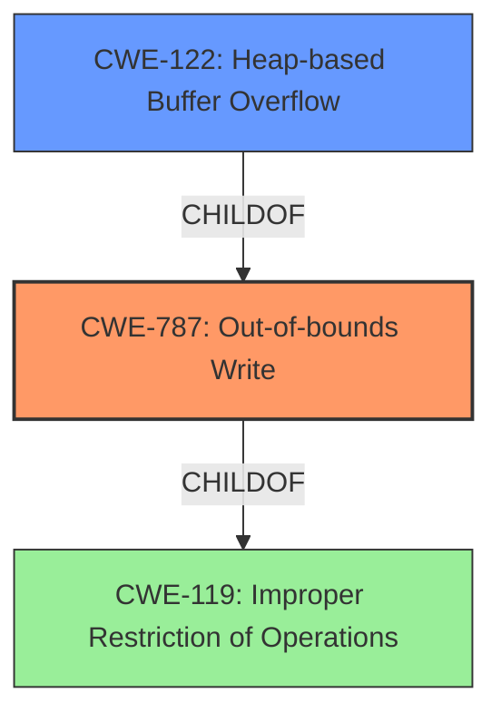

# Analysis for CVE-2022-35447

# Summary
| CWE ID  | CWE Name    | Confidence | CWE Abstraction Level | CWE Vulnerability Mapping Label | CWE-Vulnerability Mapping Notes |
|----------------|--------------------------------------------------------------------|------------|-------------------------|------------------------------------|-----------------------------------|
| CWE-787 | Out-of-bounds Write | 1.0 | Base | Allowed | Primary CWE |
| CWE-122 | Heap-based Buffer Overflow | 0.7 | Variant | Allowed | Secondary Candidate |
| CWE-119 | Improper Restriction of Operations within the Bounds of a Memory Buffer | 0.4 | Class | Discouraged | Secondary Candidate |

## Evidence and Confidence

*   **Confidence Score:** 0.9
*   **Evidence Strength:** HIGH

## Relationship Analysis
The primary weakness is CWE-787, which is a base-level CWE describing an out-of-bounds write. CWE-122, a variant of CWE-787 specifically denotes a heap-based buffer overflow. CWE-119 is a class-level CWE that is more general and discouraged when more specific CWEs are available. The graph below shows the relationship:

## Vulnerability Chain
The vulnerability chain starts with a **heap-buffer overflow** (CWE-787) caused by an **improper restriction of operations** within the bounds of a memory buffer (CWE-119). The specific type of overflow being on the heap makes CWE-122 a good secondary candidate. The final impact is a crash due to out-of-bounds write.

## Summary of Analysis
The initial analysis pointed towards CWE-787 due to the explicit mention of "heap-buffer overflow" in the vulnerability description. The "CWE for similar CVE Descriptions" section also listed CWE-787 as the primary match. The "CVE Reference Links Content Summary" section provides further details about the vulnerability, confirming that it is a heap buffer overflow.

The retriever results listed CWE-119, CWE-190, CWE-122, CWE-125, CWE-126, CWE-121, CWE-128, CWE-476, CWE-193 and CWE-1284, among others.

CWE-119 is a class-level CWE and is too general for this vulnerability. The mapping guidance for CWE-119 discourages its use when more specific CWEs are available.

CWE-190, Integer Overflow or Wraparound, is not directly related to the vulnerability, as the root cause is a buffer overflow, not an integer overflow.

CWE-122, Heap-based Buffer Overflow, is a variant of CWE-787 and is a more specific CWE. Since the vulnerability is a heap buffer overflow, CWE-122 is a good secondary candidate.

CWE-125, Out-of-bounds Read, and CWE-126, Buffer Over-read, are not applicable, as the vulnerability is a buffer overflow (write), not a read.

CWE-121, Stack-based Buffer Overflow, is not applicable, as the vulnerability is a heap buffer overflow, not a stack buffer overflow.

CWE-128, Wrap-around Error, is not applicable, as the vulnerability is a buffer overflow, not a wrap-around error.

CWE-476, NULL Pointer Dereference, is not applicable, as the vulnerability is a buffer overflow, not a null pointer dereference.

CWE-193, Off-by-one Error, is not applicable, as the vulnerability is a buffer overflow, not an off-by-one error.

CWE-1284, Improper Validation of Specified Quantity in Input, is not directly related to the vulnerability, as the root cause is a buffer overflow, not an improper validation of input.

The final decision is to assign CWE-787 as the primary CWE, as it is the most accurate and specific CWE for the vulnerability. CWE-122 is a secondary candidate because it specifies that the buffer overflow occurs on the heap.

Relevant CWE Information:
*   **CWE-787:** Out-of-bounds Write - This CWE describes a condition where the software writes data past the end, or before the beginning, of the intended buffer. The vulnerability description states that there is a **heap-buffer overflow**, which aligns with CWE-787.
*   **CWE-122:** Heap-based Buffer Overflow - This CWE is a variant of CWE-787 and describes a buffer overflow that occurs on the heap. The vulnerability description explicitly states that the overflow is heap-based, making this a more specific classification.
*   **CWE-119:** Improper Restriction of Operations within the Bounds of a Memory Buffer - This CWE is a more general class of vulnerability that encompasses buffer overflows. While applicable, it is less specific than CWE-787 or CWE-122. The mapping guidance for CWE-119 discourages its use when more specific CWEs are available.