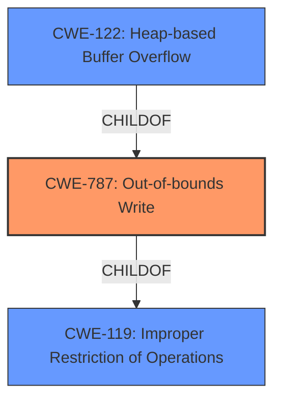

# Enhanced Analysis for CVE-2022-35449

# Summary
| CWE ID | CWE Name | Confidence | CWE Abstraction Level | CWE Vulnerability Mapping Label | CWE-Vulnerability Mapping Notes |
|---|---|---|---|---|---|
| CWE-787 | Out-of-bounds Write | 1.0 | Base | Primary | Allowed |
| CWE-122 | Heap-based Buffer Overflow | 0.8 | Variant | Secondary Candidate | Allowed |
| CWE-119 | Improper Restriction of Operations within the Bounds of a Memory Buffer | 0.5 | Class | Secondary Candidate | Discouraged |

## Evidence and Confidence

*   **Confidence Score:** 0.9
*   **Evidence Strength:** HIGH

## Relationship Analysis
The primary CWE is CWE-787, which is a base-level CWE and a child of CWE-119. CWE-122 is a variant of CWE-787.
The vulnerability description indicates a heap buffer overflow, which can be further specified with CWE-122. However, the description primarily indicates an out-of-bounds write, making CWE-787 the more direct fit.



## Vulnerability Chain
The vulnerability chain starts with the **heap-buffer overflow**, leading to an out-of-bounds write. The root cause is likely due to **insufficient bounds checking** when writing data to the heap buffer.

## Summary of Analysis
The initial analysis strongly pointed towards CWE-787 (Out-of-bounds Write) due to the explicit mention of a **heap-buffer overflow** and the **insufficient bounds checking** root cause evidence. The primary CWE match and top CWEs in similar CVE descriptions also indicated CWE-787.

The analysis considered the provided evidence and the relationships between CWEs. The final decision was to select CWE-787 as the primary CWE, with CWE-122 (Heap-based Buffer Overflow) as a secondary candidate. While CWE-122 is more specific, the vulnerability description focused on the out-of-bounds write aspect rather than the heap allocation, making CWE-787 a more accurate fit. CWE-119 was also considered but discouraged as it is too high-level.

The evidence from the "CVE Reference Links Content Summary" section supports the selection of CWE-787, as it indicates that the **root cause** of the vulnerability is **insufficient bounds checking** when copying data to heap buffers, leading to writing beyond the allocated memory region.

Relevant CWE Information:

# Enhanced Context (25 CWEs)

## CWE-191: Integer Underflow (Wrap or Wraparound)
**Abstraction Level**: Base
**Similarity Score**: 0.78
**Source**: dense
Not selected as there is no evidence of Integer Underflow.

## CWE-131: Incorrect Calculation of Buffer Size
**Abstraction Level**: Base
**Similarity Score**: 0.78
**Source**: dense
Not selected as there is no evidence of incorrect calculation of buffer size.

## CWE-125: Out-of-bounds Read
**Abstraction Level**: Base
**Similarity Score**: 0.77
**Source**: dense
Not selected as the primary issue is an out-of-bounds write.

## CWE-681: Incorrect Conversion between Numeric Types
**Abstraction Level**: Base
**Similarity Score**: 0.77
**Source**: dense
Not selected as there is no evidence of incorrect conversion between numeric types.

## CWE-124: Buffer Underwrite ('Buffer Underflow')
**Abstraction Level**: Base
**Similarity Score**: 0.76
**Source**: dense
Not selected as the primary issue is an out-of-bounds write.

## CWE-193: Off-by-one Error
**Abstraction Level**: Base
**Similarity Score**: 0.76
**Source**: dense
Not selected as the vulnerability description does not suggest an off-by-one error, but rather a more general out-of-bounds write.

## CWE-129: Improper Validation of Array Index
**Abstraction Level**: Variant
**Similarity Score**: 0.76
**Source**: dense
Not selected as there is no evidence of improper validation of array index.

## CWE-126: Buffer Over-read
**Abstraction Level**: Variant
**Similarity Score**: 0.76
**Source**: dense
Not selected as the primary issue is an out-of-bounds write.

## CWE-805: Buffer Access with Incorrect Length Value
**Abstraction Level**: Base
**Similarity Score**: 0.76
**Source**: dense
Not selected as there is no evidence of incorrect length value.

## CWE-197: Numeric Truncation Error
**Abstraction Level**: Base
**Similarity Score**: 0.76
**Source**: dense
Not selected as there is no evidence of truncation error.

## CWE-190: Integer Overflow or Wraparound
**Abstraction Level**: Base
**Similarity Score**: 6836.02
**Source**: sparse
Not selected as there is no evidence of Integer Overflow.

## CWE-125: Out-of-bounds Read
**Abstraction Level**: Base
**Similarity Score**: 6625.53
**Source**: sparse
Not selected as the primary issue is an out-of-bounds write.

## CWE-193: Off-by-one Error
**Abstraction Level**: Base
**Similarity Score**: 6321.29
**Source**: sparse
Not selected as the vulnerability description does not suggest an off-by-one error, but rather a more general out-of-bounds write.

## CWE-1284: Improper Validation of Specified Quantity in Input
**Abstraction Level**: Base
**Similarity Score**: 6204.88
**Source**: sparse
Not selected as there is no evidence of improper validation of specified quantity in the input.

## CWE-119: Improper Restriction of Operations within the Bounds of a Memory Buffer
**Abstraction Level**: Class
**Similarity Score**: 6140.55
**Source**: sparse
Considered but discouraged due to being too high-level. Lower level CWEs like CWE-787 and CWE-122 are better fits.

## CWE-128: Wrap-around Error
**Abstraction Level**: base
**Similarity Score**: 5.03
**Source**: graph
Not selected as there is no evidence of Wrap-around error.

## CWE-170: Improper Null Termination
**Abstraction Level**: base
**Similarity Score**: 5.03
**Source**: graph
Not selected as there is no evidence of improper null termination.

## CWE-120: Buffer Copy without Checking Size of Input ('Classic Buffer Overflow')
**Abstraction Level**: base
**Similarity Score**: 4.82
**Source**: graph
Not selected as there is no explicit mention of missing check of input size, however, it is related to the **heap-buffer-overflow**.

## CWE-123: Write-what-where Condition
**Abstraction Level**: base
**Similarity Score**: 4.33
**Source**: graph
Not selected as there is no evidence of write-what-where condition.

## CWE-1284: Improper Validation of Specified Quantity in Input
**Abstraction Level**: base
**Similarity Score**: 4.33
**Source**: graph
Not selected as there is no evidence of improper validation of specified quantity in the input.

## CWE-617: Reachable Assertion
**Abstraction Level**: base
**Similarity Score**: 4.33
**Source**: graph
Not selected as there is no evidence of reachable assertion.

## CWE-195: Signed to Unsigned Conversion Error
**Abstraction Level**: variant
**Similarity Score**: 3.88
**Source**: graph
Not selected as there is no evidence of signed to unsigned conversion error.

## CWE-463: Deletion of Data Structure Sentinel
**Abstraction Level**: base
**Similarity Score**: 3.64
**Source**: graph
Not selected as there is no evidence of deletion of data structure sentinel.

## CWE-1339: Insufficient Precision or Accuracy of a Real Number
**Abstraction Level**: base
**Similarity Score**: 3.57
**Source**: graph
Not selected as there is no evidence of insufficient precision or accuracy of a real number.

## CWE-190: Integer Overflow or Wraparound
**Abstraction Level**: Base
**Similarity Score**: 3.32
**Source**: graph
Not selected


## CWE Relationship Analysis

Current CWEs represent these abstraction levels: .


### Vulnerability Chain Analysis

**Chain starting from CWE-119:**
- 119 (Improper Restriction of Operations within the Bounds of a Memory Buffer) - ROOT


**Chain starting from CWE-123:**
- 123 (Write-what-where Condition) - ROOT


### CWE Relationship Diagram

```mermaid
graph TD
    classDef primary fill:#f96,stroke:#333,stroke-width:2px
    classDef secondary fill:#69f,stroke:#333
    classDef tertiary fill:#9e9,stroke:#333
```