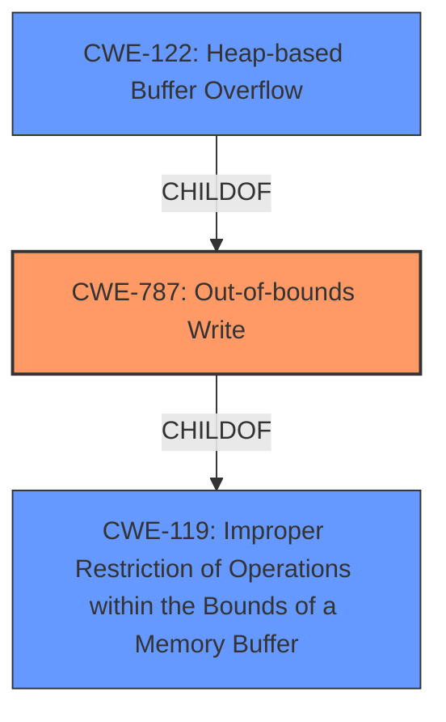

# Analysis for CVE-2022-35452

# Summary
| CWE ID  | CWE Name                                                                       | Confidence | CWE Abstraction Level | CWE Vulnerability Mapping Label | CWE-Vulnerability Mapping Notes |
| :-------- | :----------------------------------------------------------------------------- | :---------- | :---------------------- | :------------------------------ | :------------------------------ |
| CWE-787   | Out-of-bounds Write                                                            | 1         | Base                   | Primary CWE                     | Allowed                       |
| CWE-122   | Heap-based Buffer Overflow                                                    | 0.75         | Variant                 | Secondary CWE                     | Allowed                       |
| CWE-119   | Improper Restriction of Operations within the Bounds of a Memory Buffer       | 0.5         | Class                   | Secondary CWE                     | Discouraged                   |

## Evidence and Confidence

*   **Confidence Score:** 0.85
*   **Evidence Strength:** HIGH

## Relationship Analysis
The primary CWE is CWE-787, which is a base-level CWE and a child of CWE-119. CWE-122, Heap-based Buffer Overflow, is a variant of CWE-787, offering a more specific classification, though the evidence doesn't explicitly confirm a heap allocation. CWE-119 is a class-level CWE that is too general. The hierarchical relationships guide the selection towards the most specific and accurate representation of the vulnerability.

## Vulnerability Chain
The vulnerability chain starts with the **improper handling of buffer boundaries**, leading to an **out-of-bounds write** condition. This can potentially result in a heap-based buffer overflow if the buffer is heap-allocated. The final impact is potential arbitrary code execution or denial of service.

## Summary of Analysis
The initial assessment identified a **heap-buffer overflow** in OTFCC v0.10.4. The primary CWE match from similar CVE descriptions is CWE-787. The provided content includes details about multiple crashes found in the `otfcc` library, including heap buffer overflows. The root cause is identified as **improper bounds checking when copying data to a heap allocated buffer**, leading to a write operation past the allocated buffer size.

The selection of CWE-787 is based on the evidence of an **out-of-bounds write** condition. While the initial description mentions "heap-buffer overflow," the detailed analysis from the CVE Reference Links Content Summary confirms that the **root cause is the lack of bounds checking when writing to a buffer**. CWE-787 directly addresses this **out-of-bounds write** condition, making it the most appropriate primary CWE.

CWE-122 is considered as a secondary CWE since the vulnerability is described as a heap-based buffer overflow and the **improper bounds checking when copying data to a heap allocated buffer**. However, without more concrete evidence confirming heap allocation, the confidence level is lower.

CWE-119 is a more general case of memory buffer errors. The mapping guidance discourages its use when more specific CWEs are available.

Relevant CWE Information:

# Enhanced Context (25 CWEs)

## CWE-191: Integer Underflow (Wrap or Wraparound)
**Abstraction Level**: Base
**Similarity Score**: 0.78
**Source**: dense
**Considered but not used:** Not relevant to the described vulnerability, which focuses on buffer overflows.

## CWE-131: Incorrect Calculation of Buffer Size
**Abstraction Level**: Base
**Similarity Score**: 0.78
**Source**: dense
**Considered but not used:** While potentially related, the core issue is the lack of bounds checking during the copy operation, not the initial size calculation.

## CWE-125: Out-of-bounds Read
**Abstraction Level**: Base
**Similarity Score**: 0.77
**Source**: dense
**Considered but not used:** The vulnerability is described as a write, not a read.

## CWE-681: Incorrect Conversion between Numeric Types
**Abstraction Level**: Base
**Similarity Score**: 0.77
**Source**: dense
**Considered but not used:** Not relevant to the described vulnerability.

## CWE-124: Buffer Underwrite ('Buffer Underflow')
**Abstraction Level**: Base
**Similarity Score**: 0.76
**Source**: dense
**Considered but not used:** The vulnerability is described as an overflow (write past the buffer), not an underflow.

## CWE-193: Off-by-one Error
**Abstraction Level**: Base
**Similarity Score**: 0.76
**Source**: dense
**Considered but not used:** While an off-by-one error could contribute to a buffer overflow, the description focuses on the general lack of bounds checking.

## CWE-126: Buffer Over-read
**Abstraction Level**: Variant
**Similarity Score**: 0.76
**Source**: dense
**Considered but not used:** The vulnerability is described as a write, not a read.

## CWE-129: Improper Validation of Array Index
**Abstraction Level**: Variant
**Similarity Score**: 0.76
**Source**: dense
**Considered but not used:** Not specifically related to array index validation.

## CWE-197: Numeric Truncation Error
**Abstraction Level**: Base
**Similarity Score**: 0.76
**Source**: dense
**Considered but not used:** Not relevant to the described vulnerability.

## CWE-805: Buffer Access with Incorrect Length Value
**Abstraction Level**: Base
**Similarity Score**: 0.76
**Source**: dense
**Considered but not used:** While potentially related, the core issue is the lack of bounds checking during the copy operation.

## CWE-190: Integer Overflow or Wraparound
**Abstraction Level**: Base
**Similarity Score**: 6712.82
**Source**: sparse
**Considered but not used:** Not directly related to the described buffer overflow.

## CWE-125: Out-of-bounds Read
**Abstraction Level**: Base
**Similarity Score**: 6458.48
**Source**: sparse
**Considered but not used:** The vulnerability is described as a write, not a read.

## CWE-193: Off-by-one Error
**Abstraction Level**: Base
**Similarity Score**: 6223.42
**Source**: sparse
**Considered but not used:** While an off-by-one error could contribute to a buffer overflow, the description focuses on the general lack of bounds checking.

## CWE-1284: Improper Validation of Specified Quantity in Input
**Abstraction Level**: Base
**Similarity Score**: 6123.62
**Source**: sparse
**Considered but not used:** Not directly related to the described buffer overflow.

## CWE-119: Improper Restriction of Operations within the Bounds of a Memory Buffer
**Abstraction Level**: Class
**Similarity Score**: 6059.32
**Source**: sparse
**Considered but not used:** Too general; CWE-787 provides a more specific description of the weakness.

## CWE-128: Wrap-around Error
**Abstraction Level**: base
**Similarity Score**: 5.03
**Source**: graph
**Considered but not used:** Not relevant to the described vulnerability, which focuses on buffer overflows.

## CWE-170: Improper Null Termination
**Abstraction Level**: base
**Similarity Score**: 5.03
**Source**: graph
**Considered but not used:** Not relevant to the described vulnerability.

## CWE-120: Buffer Copy without Checking Size of Input ('Classic Buffer Overflow')
**Abstraction Level**: base
**Similarity Score**: 4.82
**Source**: graph
**Considered but not used:** While related to buffer overflows, CWE-787 is a more direct representation of the out-of-bounds write.

## CWE-123: Write-what-where Condition
**Abstraction Level**: base
**Similarity Score**: 4.33
**Source**: graph
**Considered but not used:** Too specific; the vulnerability doesn't explicitly describe the ability to write arbitrary data to arbitrary locations.

## CWE-1284: Improper Validation of Specified Quantity in Input
**Abstraction Level**: base
**Similarity Score**: 4.33
**Source**: graph
**Considered but not used:** Not directly related to the described buffer overflow.

## CWE-617: Reachable Assertion
**Abstraction Level**: base
**Similarity Score**: