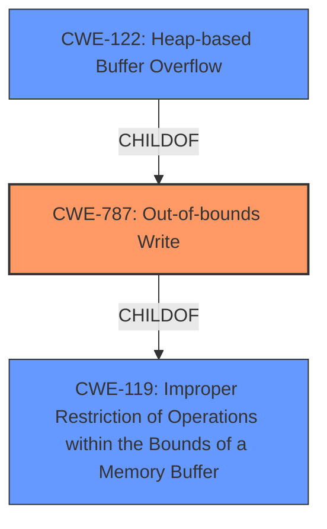

# Enhanced Analysis for CVE-2022-35453

# Summary
| CWE ID | CWE Name | Confidence | CWE Abstraction Level | CWE Vulnerability Mapping Label | CWE-Vulnerability Mapping Notes |
|---|---|---|---|---|---|
| CWE-787 | Out-of-bounds Write | 1.0 | Base | Primary | Allowed |
| CWE-122 | Heap-based Buffer Overflow | 0.8 | Variant | Secondary | Allowed |
| CWE-119 | Improper Restriction of Operations within the Bounds of a Memory Buffer | 0.6 | Class | Secondary | Discouraged |

## Evidence and Confidence

*   **Confidence Score:** 0.9
*   **Evidence Strength:** HIGH

## Relationship Analysis
The primary weakness is CWE-787 (**Out-of-bounds Write**), which is a specific type of CWE-119 (**Improper Restriction of Operations within the Bounds of a Memory Buffer**). CWE-122 (**Heap-based Buffer Overflow**) is a variant of CWE-787, indicating where the overflow occurs in memory.



## Vulnerability Chain
The vulnerability chain starts with a crafted font file leading to a **heap-buffer overflow** (CWE-787). This occurs because the software **does not properly** validate the size or boundaries when writing data to the heap. The final impact is a crash due to memory corruption.

## Summary of Analysis
The primary CWE is CWE-787 (**Out-of-bounds Write**), supported by the vulnerability description stating "**heap-buffer overflow**". The key phrases also indicate a "**heap-buffer overflow**" **weakness**. The CVE reference links content summary confirms the **root cause** is a heap buffer overflow due to the code lacking proper bounds checking. The primary CWE match from similar CVE descriptions also suggests CWE-787.

CWE-122 (**Heap-based Buffer Overflow**) is considered as a secondary CWE because the overflow occurs specifically on the heap. CWE-119 (**Improper Restriction of Operations within the Bounds of a Memory Buffer**) is a more general class of weakness, and while technically applicable, it is discouraged when a more specific CWE like CWE-787 or CWE-122 can be used.

The selection of CWE-787 is at the optimal level of specificity because it directly describes the **root cause**, which is an out-of-bounds write.

Relevant CWE Information:

# Enhanced Context (25 CWEs)
The following CWEs were identified as potentially relevant to this vulnerability:

## CWE-131: Incorrect Calculation of Buffer Size
**Abstraction Level**: Base
**Similarity Score**: 0.78
**Source**: dense

**Description**:
The product **does not correctly calculate the size** to be used when allocating a buffer, which could lead to a buffer overflow.

**Mapping Guidance**:
- Usage: Allowed
- Rationale: This CWE entry is at the Base level of abstraction, which is a preferred level of abstraction for mapping to the root causes of vulnerabilities.

## CWE-190: Integer Overflow or Wraparound
**Abstraction Level**: Base
**Similarity Score**: 7156.78
**Source**: sparse

**Description**:
The product performs a calculation that can produce an integer overflow or wraparound when the logic assumes that the resulting value will always be larger than the original value.

**Mapping Guidance**:
- Usage: Allowed
- Rationale: This CWE entry is at the Base level of abstraction, which is a preferred level of abstraction for mapping to the root causes of vulnerabilities.

## CWE-125: Out-of-bounds Read
**Abstraction Level**: Base
**Similarity Score**: 6882.61
**Source**: sparse

**Description**:
The product reads data past the end, or before the beginning, of the intended buffer.

**Mapping Guidance**:
- Usage: Allowed
- Rationale: This CWE entry is at the Base level of abstraction, which is a preferred level of abstraction for mapping to the root causes of vulnerabilities.

## CWE-193: Off-by-one Error
**Abstraction Level**: Base
**Similarity Score**: 6604.94
**Source**: sparse

**Description**:
A product calculates or uses an incorrect maximum or minimum value that is 1 more, or 1 less, than the correct value.

**Mapping Guidance**:
- Usage: Allowed
- Rationale: This CWE entry is at the Base level of abstraction, which is a preferred level of abstraction for mapping to the root causes of vulnerabilities.

## CWE-1284: Improper Validation of Specified Quantity in Input
**Abstraction Level**: Base
**Similarity Score**: 6503.03
**Source**: sparse

**Description**:
The product receives input that is expected to specify a quantity (such as size or length), but it **does not validate** or incorrectly validates that the quantity has the required properties.

**Mapping Guidance**:
- Usage: Allowed
- Rationale: This CWE entry is at the Base level of abstraction, which is a preferred level of abstraction for mapping to the root causes of vulnerabilities.

## CWE-119: Improper Restriction of Operations within the Bounds of a Memory Buffer
**Abstraction Level**: Class
**Similarity Score**: 6462.49
**Source**: sparse

**Description**:
The product performs operations on a memory buffer, but it reads from or writes to a memory location outside the buffer's intended boundary. This may result in read or write operations on unexpected memory locations that could be linked to other variables, data structures, or internal program data.

**Mapping Guidance**:
- Usage: Discouraged
- Rationale: CWE-119 is commonly misused in low-information vulnerability reports when lower-level CWEs could be used instead, or when more details about the vulnerability are available.

## CWE-120: Buffer Copy without Checking Size of Input ('Classic Buffer Overflow')
**Abstraction Level**: base
**Similarity Score**: 4.82
**Source**: graph

**Description**:
CWE-120: Buffer Copy without Checking Size of Input ('Classic Buffer Overflow')

**Mapping Guidance**:
- Usage: Allowed-with-Review
- Rationale: There are some indications that this CWE ID might be misused and selected simply because it mentions "buffer overflow" - an increasingly vague term. This CWE entry is only appropriate for "Buffer Copy" operations (not buffer reads), in which where there is no "Checking [the] Size of Input", and (by implication of the copy) writing past the end of the buffer.

### CWE-787: Out-of-bounds Write
The product writes data past the end, or before the beginning, of the intended buffer. The vulnerability description explicitly states a **heap-buffer overflow**. The CVE Reference Links Content Summary further confirms that the **root cause** is a heap buffer overflow, because the code lacks proper bounds checking when handling data from the font files. The "Top CWEs" from similar CVE descriptions also lists CWE-787 as the primary match. Confidence: 1.0

### CWE-122: Heap-based Buffer Overflow
This CWE specifies that the **buffer overflow** occurs in the heap portion of memory. While the primary **weakness** is an out-of-bounds write (CWE-787), the location of the overflow (heap) is a relevant detail. Confidence: 0.8

### CWE-119: Improper Restriction of Operations within the Bounds of a Memory Buffer
This is a more general category that encompasses both out-of-bounds reads and writes. While technically correct, it is discouraged by MITRE when a more specific CWE is available. Because CWE-787 more precisely describes the **weakness**, CWE-119 is considered a secondary candidate. Confidence: 0.6


## CWE Relationship Analysis

Current CWEs represent these abstraction levels: .


### Vulnerability Chain Analysis

**Chain starting from CWE-131:**
- 131 (Incorrect Calculation of Buffer Size) - ROOT


**Chain starting from CWE-190:**
- 190 (Integer Overflow or Wraparound) - ROOT


### CWE Relationship Diagram

```mermaid
graph TD
    classDef primary fill:#f96,stroke:#333,stroke-width:2px
    classDef secondary fill:#69f,stroke:#333
    classDef tertiary fill:#9e9,stroke:#333
```