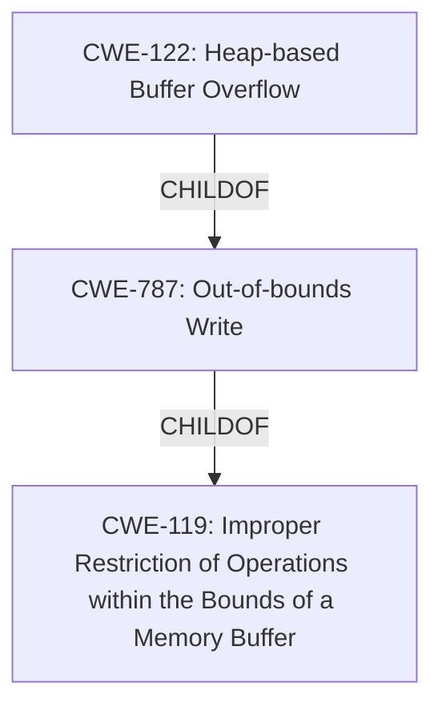

# Enhanced Analysis for CVE-2022-35455

# Summary
| CWE ID  | CWE Name | Confidence | CWE Abstraction Level | CWE Vulnerability Mapping Label | CWE-Vulnerability Mapping Notes |
|---|---|---|---|---|---|
| CWE-787 | Out-of-bounds Write | 1.0 | Base | Primary | Allowed |
| CWE-122 | Heap-based Buffer Overflow | 0.8 | Variant | Secondary | Allowed |
| CWE-119 | Improper Restriction of Operations within the Bounds of a Memory Buffer | 0.6 | Class | Secondary | Discouraged |

## Evidence and Confidence

*   **Confidence Score:** 0.9
*   **Evidence Strength:** HIGH

## Relationship Analysis
The primary CWE is CWE-787, which is a base-level CWE. CWE-122 is a variant of CWE-787 and describes a heap-based buffer overflow, which aligns with the description. CWE-119 is a class-level CWE that represents improper restriction of operations within memory bounds and encompasses both out-of-bounds reads and writes. The relationships are as follows:



## Vulnerability Chain
The vulnerability chain involves a heap-based buffer overflow due to an out-of-bounds write:

1.  **Root Cause:** Out-of-bounds Write (**CWE-787**)
2.  **Weakness:** Heap-based Buffer Overflow (**CWE-122**)

## Summary of Analysis
The initial analysis strongly points to a buffer overflow. The vulnerability description explicitly states "**heap-buffer overflow**" in OTFCC v0.10.4. The "CVE Reference Links Content Summary" further corroborates this, highlighting "**Heap Buffer Overflow**" and "**Global Heap Buffer Overflow**" as key vulnerabilities due to "**incorrect memory allocation or manipulation**" and "**failure to validate the size of the buffer when writing to it**". This evidence supports the classification of **CWE-787** Out-of-bounds Write, as the primary root cause.

**CWE-787** (Out-of-bounds Write) is the best fit as it directly describes the **root cause** of the vulnerability, which is writing data beyond the intended buffer boundary.

**CWE-122** (Heap-based Buffer Overflow) is a more specific variant of a general buffer overflow because the vulnerability occurs in the heap.

**CWE-119** (Improper Restriction of Operations within the Bounds of a Memory Buffer) is a broader class that encompasses both out-of-bounds reads and writes. While applicable, it's less precise than CWE-787 and CWE-122. The MITRE mapping guidance discourages the use of CWE-119 when more specific CWEs are available.

Other considered CWEs and why they were not selected:

*   CWE-190 (Integer Overflow or Wraparound): While integer overflows can sometimes lead to buffer overflows, there's no explicit mention of integer overflow in the provided vulnerability description or reference links content summary.
*   CWE-125 (Out-of-bounds Read): The vulnerability description and content summary focus on writing past the buffer boundary (overflow) rather than reading.
*   CWE-193 (Off-by-one Error): Although an off-by-one error could contribute to a buffer overflow, the evidence doesn't specifically point to this type of error.
*   CWE-1284 (Improper Validation of Specified Quantity in Input): While input validation issues can contribute to buffer overflows, the description doesn't emphasize this aspect.

The final selection of CWE-787 and CWE-122 is based on the direct evidence of a heap-based buffer overflow due to an out-of-bounds write, making it the most specific and accurate classification. CWE-119 is also included as a secondary candidate due to its relationship to buffer overflows, but it is less specific than CWE-787 and CWE-122. The selection is at the optimal level of specificity, with CWE-787 capturing the root cause and CWE-122 specifying the memory region where the overflow occurs.


## CWE Relationship Analysis

Current CWEs represent these abstraction levels: .


### Vulnerability Chain Analysis

**Chain starting from CWE-190:**
- 190 (Integer Overflow or Wraparound) - ROOT


**Chain starting from CWE-193:**
- 193 (Off-by-one Error) - ROOT


### CWE Relationship Diagram

```mermaid
graph TD
    classDef primary fill:#f96,stroke:#333,stroke-width:2px
    classDef secondary fill:#69f,stroke:#333
    classDef tertiary fill:#9e9,stroke:#333
```