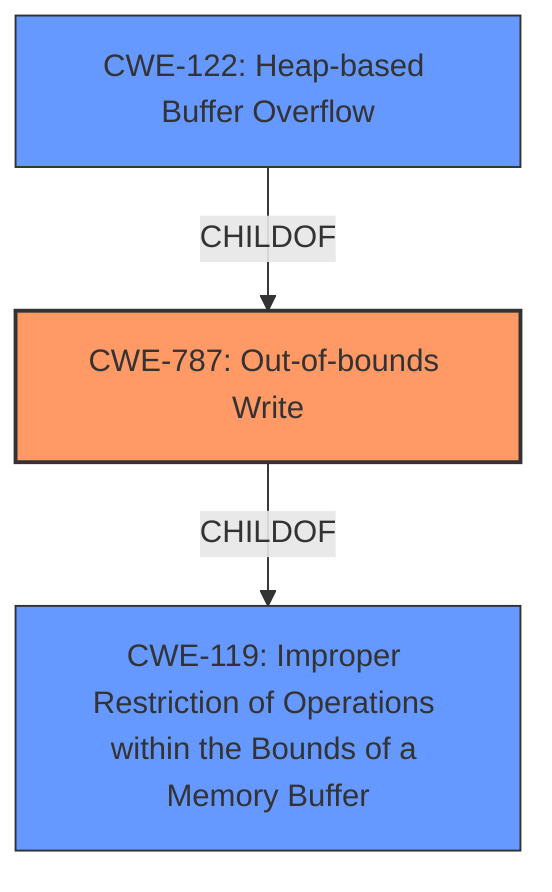

# Analysis Report for CVE-2022-35462

# Vulnerability Analysis Report: CVE-2022-35462

## Description


## Analysis (with Relationship Data)

# Summary
| CWE ID  | CWE Name                                                                       | Confidence | CWE Abstraction Level | CWE Vulnerability Mapping Label | CWE-Vulnerability Mapping Notes |
| :-------- | :----------------------------------------------------------------------------- | :---------- | :---------------------- | :------------------------------ | :------------------------------ |
| CWE-787   | Out-of-bounds Write                                                            | 1.0         | Base                    | Primary CWE                      | Allowed                       |
| CWE-122   | Heap-based Buffer Overflow                                                     | 0.9         | Variant                 | Secondary Candidate              | Allowed                       |
| CWE-119   | Improper Restriction of Operations within the Bounds of a Memory Buffer          | 0.7         | Class                   | Secondary Candidate              | Discouraged                    |

## Evidence and Confidence

*   **Confidence Score:** 0.95
*   **Evidence Strength:** HIGH

## Relationship Analysis
The primary relationship is that CWE-787 **Out-of-bounds Write** is a base CWE that describes writing data past the end of a buffer. CWE-122 **Heap-based Buffer Overflow** is a variant of CWE-787 that occurs specifically on the heap. CWE-119 **Improper Restriction of Operations within the Bounds of a Memory Buffer** is a class-level CWE that is a more general form of buffer overflows/out-of-bounds writes. The relationship between CWE-787 and CWE-122 indicates that CWE-122 is more specific, but requires knowing that the overflow is heap-based. The relationship between CWE-787 and CWE-119 indicates that CWE-787 is more specific and therefore preferred.



## Vulnerability Chain
The chain of events starts with the program receiving a malicious OTF file. The program then **fails to properly validate the size of the input data**, which leads to a **heap-based buffer overflow (CWE-122/CWE-787)**. This overflow allows an attacker to **write data outside the intended buffer (CWE-787)**, potentially leading to a denial of service (crash) or, if exploited precisely, code execution.

## Summary of Analysis
The initial analysis identified a **heap-buffer overflow**. The primary CWE match for similar CVE descriptions is CWE-787 **Out-of-bounds Write**, and the top CWEs include CWE-787 and CWE-120. The retriever results also suggest CWE-119, CWE-190, CWE-122, and CWE-125 as potential candidates.

Based on the evidence from the vulnerability description, the key phrase is "**heap-buffer overflow**". The CVE Reference Links Content Summary confirms the presence of heap buffer overflows due to inconsistent memory handling and lack of proper bounds checking.

CWE-787 **Out-of-bounds Write** is the most appropriate primary CWE because it directly describes the **writing of data past the end of a buffer**.
CWE-122 **Heap-based Buffer Overflow** is a more specific variant, but it is only applicable if the overflow occurs on the heap, which is specified in the vulnerability description. Therefore, CWE-122 is a viable secondary candidate.
CWE-119 **Improper Restriction of Operations within the Bounds of a Memory Buffer** is a more general class of vulnerability and is discouraged when more specific CWEs are available. While it is related, it does not capture the specific nature of the **out-of-bounds write**.

Therefore, based on the evidence, relationship analysis, and mapping guidance, CWE-787 is the optimal primary CWE, with CWE-122 as a secondary candidate providing more specific context.

Relevant CWE Information:

# Enhanced Context (25 CWEs)

## CWE-131: Incorrect Calculation of Buffer Size
**Abstraction Level**: Base
**Similarity Score**: 0.78
**Source**: dense

**Description**:
The product does not correctly calculate the size to be used when allocating a buffer, which could lead to a buffer overflow.

**Mapping Guidance**:
- Usage: Allowed
- Rationale: This CWE entry is at the Base level of abstraction, which is a preferred level of abstraction for mapping to the root causes of vulnerabilities.

## CWE-191: Integer Underflow (Wrap or Wraparound)
**Abstraction Level**: Base
**Similarity Score**: 0.78
**Source**: dense

**Description**:
The product subtracts one value from another, such that the result is less than the minimum allowable integer value, which produces a value that is not equal to the correct result.

**Mapping Guidance**:
- Usage: Allowed
- Rationale: This CWE entry is at the Base level of abstraction, which is a preferred level of abstraction for mapping to the root causes of vulnerabilities.

## CWE-125: Out-of-bounds Read
**Abstraction Level**: Base
**Similarity Score**: 0.77
**Source**: dense

**Description**:
The product reads data past the end, or before the beginning, of the intended buffer.

**Mapping Guidance**:
- Usage: Allowed
- Rationale: This CWE entry is at the Base level of abstraction, which is a preferred level of abstraction for mapping to the root causes of vulnerabilities.

## CWE-193: Off-by-one Error
**Abstraction Level**: Base
**Similarity Score**: 0.76
**Source**: dense

**Description**:
A product calculates or uses an incorrect maximum or minimum value that is 1 more, or 1 less, than the correct value.

**Mapping Guidance**:
- Usage: Allowed
- Rationale: This CWE entry is at the Base level of abstraction, which is a preferred level of abstraction for mapping to the root causes of vulnerabilities.

## CWE-124: Buffer Underwrite ('Buffer Underflow')
**Abstraction Level**: Base
**Similarity Score**: 0.76
**Source**: dense

**Description**:
The product writes to a buffer using an index or pointer that references a memory location prior to the beginning of the buffer.

**Mapping Guidance**:
- Usage: Allowed
- Rationale: This CWE entry is at the Base level of abstraction, which is a preferred level of abstraction for mapping to the root causes of vulnerabilities.

## CWE-681: Incorrect Conversion between Numeric Types
**Abstraction Level**: Base
**Similarity Score**: 0.76
**Source**: dense

**Description**:
When converting from one data type to another, such as long to integer, data can be omitted or translated in a way that produces unexpected values. If the resulting values are used in a sensitive context, then dangerous behaviors may occur.

**Mapping Guidance**:
- Usage: Allowed
- Rationale: This CWE entry is at the Base level of abstraction, which is a preferred level of abstraction for mapping to the root causes of vulnerabilities.

## CWE-126: Buffer Over-read
**Abstraction Level**: Variant
**Similarity Score**: 0.76
**Source**: dense

**Description**:
The product reads from a buffer using buffer access mechanisms such as indexes or pointers that reference memory locations after the targeted buffer.

**Mapping Guidance**:
- Usage: Allowed
- Rationale: This CWE entry is at the Variant level of abstraction, which is a preferred level of abstraction for mapping to the root causes of vulnerabilities.

## CWE-129: Improper Validation of Array Index
**Abstraction Level**: Variant
**Similarity Score**: 0.76
**Source**: dense

**Description**:
The product uses untrusted input when calculating or using an array index, but the product does not validate or incorrectly validates the index to ensure the index references a valid position within the array.

**Mapping Guidance**:
- Usage: Allowed
- Rationale: This CWE entry is at the Variant level of abstraction, which is a preferred level of abstraction for mapping to the root causes of vulnerabilities.

## CWE-805: Buffer Access with Incorrect Length Value
**Abstraction Level**: Base
**Similarity Score**: 0.76
**Source**: dense

**Description**:
The product uses a sequential operation to read or write a buffer, but it uses an incorrect length value that causes it to access memory that is outside of the bounds of the buffer.

**Mapping Guidance**:
- Usage: Allowed
- Rationale: This CWE entry is at the Base level of abstraction, which is a preferred level of abstraction for mapping to the root causes of vulnerabilities.

## CWE-197: Numeric Truncation Error
**Abstraction Level**: Base
**Similarity Score**: 0.76


## CWE Relationship Analysis

Current CWEs represent these abstraction levels: .


### Vulnerability Chain Analysis

**Chain starting from CWE-190:**
- 190 (Integer Overflow or Wraparound) - ROOT


**Chain starting from CWE-131:**
- 131 (Incorrect Calculation of Buffer Size) - ROOT


### CWE Relationship Diagram

```mermaid
graph TD
    classDef primary fill:#f96,stroke:#333,stroke-width:2px
    classDef secondary fill:#69f,stroke:#333
    classDef tertiary fill:#9e9,stroke:#333
```


*Report generated on 2025-03-31 02:13:12*
