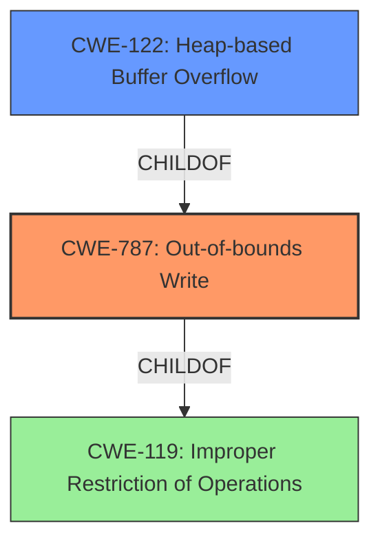

# Raw Analyzer Response for CVE-2022-35464

# Summary
| CWE ID | CWE Name | Confidence | CWE Abstraction Level | CWE Vulnerability Mapping Label | CWE-Vulnerability Mapping Notes |
|---|---|---|---|---|---|
| CWE-787 | Out-of-bounds Write | 1.0 | Base | Allowed | Primary CWE. Matches the description of a heap-buffer-overflow |
| CWE-122 | Heap-based Buffer Overflow | 0.7 | Variant | Allowed | Secondary CWE.  Specifies that the buffer overflow occurs on the heap. |
| CWE-119 | Improper Restriction of Operations within the Bounds of a Memory Buffer | 0.5 | Class | Discouraged | Secondary CWE. A general class of buffer issues.  |

## Evidence and Confidence

*   **Confidence Score:** 0.8
*   **Evidence Strength:** HIGH

## Relationship Analysis
The primary CWE is CWE-787 (**CWE-787: Out-of-bounds Write**), which is a base CWE.
It is related to CWE-119 (**CWE-119: Improper Restriction of Operations**) through a parent-child relationship.
CWE-122 (**CWE-122: Heap-based Buffer Overflow**) is a more specific variant of CWE-787, indicating that the overflow occurs on the heap.
CWE-119 is a class-level CWE that is too general, but still related.

## Vulnerability Chain
The vulnerability chain starts with a **heap-buffer overflow** due to an unspecified issue in the OTFCC library.
This leads to an out-of-bounds write on the heap, which can cause memory corruption, denial of service, or potentially arbitrary code execution.

## Summary of Analysis
The initial analysis identified a **heap-buffer overflow** in OTFCC v0.10.4. The primary weakness is CWE-787 (**CWE-787: Out-of-bounds Write**), as it accurately describes the **root cause** of the vulnerability. The vulnerability description key phrases mention "**heap-buffer overflow**", directly indicating an out-of-bounds write on the heap. The CVE Reference Links Content Summary also mentions "**Heap buffer overflow**" as a frequent type of issue.

CWE-122 (**CWE-122: Heap-based Buffer Overflow**) is a more specific variant of CWE-787, specifying that the overflow occurs on the heap, and is included as a secondary candidate.

CWE-119 (**CWE-119: Improper Restriction of Operations within the Bounds of a Memory Buffer**) is a more general class of buffer issues, and is therefore less specific, so it is included as a tertiary candidate.

The selected CWEs are at the optimal level of specificity, as they accurately describe the **root cause** and location of the buffer overflow.