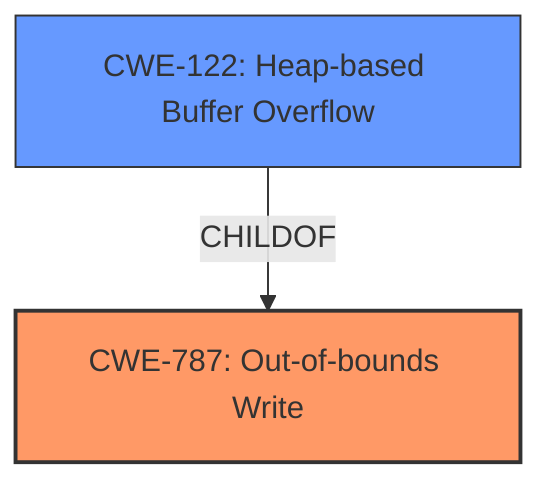

# Enhanced Analysis for CVE-2022-35468

# Summary
| CWE ID | CWE Name | Confidence | CWE Abstraction Level | CWE Vulnerability Mapping Label | CWE-Vulnerability Mapping Notes |
|---|---|---|---|---|---|
| CWE-787 | Out-of-bounds Write | 1.0 | Base | Primary | Allowed |
| CWE-122 | Heap-based Buffer Overflow | 0.8 | Variant | Secondary | Allowed |

## Evidence and Confidence

*   **Confidence Score:** 0.9
*   **Evidence Strength:** HIGH

## Relationship Analysis
The primary CWE, CWE-787 **(Out-of-bounds Write)**, is a base CWE that describes the condition where a program writes data past the end of a buffer. It is related to CWE-122 **(Heap-based Buffer Overflow)**, which is a variant of CWE-787, specifying that the buffer is allocated on the heap. The vulnerability description explicitly mentions a "heap-buffer overflow," making CWE-122 a strong secondary candidate.


## Vulnerability Chain
The vulnerability chain involves a **heap-buffer overflow** due to insufficient bounds checking when handling data. This leads to memory corruption and potentially arbitrary code execution.
  - The root cause is **improper** memory management.
  - The weakness is a **heap-buffer overflow** (CWE-787).
  - The impact is application crash and potential arbitrary code execution.

## Summary of Analysis
The initial assessment, based on the vulnerability description "**heap-buffer overflow**," points to CWE-787 **(Out-of-bounds Write)** as the primary CWE. The "CVE Reference Links Content Summary" provides strong supporting evidence, stating that the root cause is insufficient bounds checking when handling data, leading to out-of-bounds writes. The description clearly states the vulnerability as a "**heap-buffer overflow**," providing further evidence for CWE-122 **(Heap-based Buffer Overflow)** as a secondary, more specific variant of the primary CWE.

The retriever results also support this assessment, with CWE-119 (Improper Restriction of Operations within the Bounds of a Memory Buffer) and CWE-190 (Integer Overflow or Wraparound) being listed as potential candidates. However, CWE-119 is a class-level CWE and is discouraged when more specific CWEs are available. CWE-190, while related to memory allocation, does not directly describe the out-of-bounds write condition.

The chosen CWEs are at the optimal level of specificity, with CWE-787 describing the general out-of-bounds write condition and CWE-122 specifying that the overflow occurs on the heap. The evidence from the vulnerability description and the CVE reference links strongly supports this classification.

Relevant CWE Information:

# Enhanced Context (25 CWEs)
The following CWEs were identified as potentially relevant to this vulnerability:

## CWE-131: Incorrect Calculation of Buffer Size
**Abstraction Level**: Base
**Similarity Score**: 0.79
**Source**: dense

**Description**:
The product does not correctly calculate the size to be used when allocating a buffer, which could lead to a buffer overflow.

**Mapping Guidance**:
- Usage: Allowed
- Rationale: This CWE entry is at the Base level of abstraction, which is a preferred level of abstraction for mapping to the root causes of vulnerabilities.

## CWE-787: Out-of-bounds Write
**Abstraction Level**: Base

### Description
The product writes data past the end, or before the beginning, of the intended buffer. The write operations result in modification of memory locations that do not belong to the buffer. This typically occurs when the pointer or its index is incremented to a position beyond the bounds of the buffer.

### Extended Description
This can cause a variety of problems, including program crashes, unexpected behavior, privilege escalation, or denial of service. In some cases, an attacker might be able to execute arbitrary code.
Note: This description is primarily for languages that offer direct access to memory, such as C/C++. The concepts are similar in higher level languages, but the specifics of the implementation might vary.

### Alternative Terms
None

### Relationships
ParentOf -> CWE-120
ParentOf -> CWE-121
ParentOf -> CWE-122
ParentOf -> CWE-788
ParentOf -> CWE-123
CanFollow -> CWE-123
CanFollow -> CWE-134
CanFollow -> CWE-416
CanFollow -> CWE-456
CanFollow -> CWE-476
CanFollow -> CWE-590
CanFollow -> CWE-675
CanFollow -> CWE-676
CanFollow -> CWE-680
CanFollow -> CWE-825
CanFollow -> CWE-835
ChildOf -> CWE-119
ChildOf -> CWE-119
PeerOf -> CWE-125
PeerOf -> CWE-125
CanPrecede -> CWE-131

### Mapping Guidance
**Usage:** Allowed
**Rationale:** This CWE entry is at the Base level of abstraction, which is a preferred level of abstraction for mapping to the root causes of vulnerabilities.
**Comments:** Carefully read both the name and description to ensure that this mapping is an appropriate fit. Do not try to 'force' a mapping to a lower-level Base/Variant simply to comply with this preferred level of abstraction.
**Reasons:**
- Acceptable-Use

### Additional Notes
**[Applicable Platform]**
Languages such as C/C++ that provide direct access to memory are vulnerable to this type of weakness. Other languages such as Java and .NET provide some built-in mechanisms to prevent writing outside of buffer boundaries. However, even in these languages it is possible to bypass the built-in mechanisms if native code or unsafe code is used.
**[Impact]**
Impact varies depending on what the overwritten memory controls. This can range from a crash to arbitrary code execution.
**[Detection]**
Automated static analysis, dynamic analysis, and manual code reviews can discover buffer overflows.
**[Mitigation]**
Strategies to avoid buffer overflows include:

*   Use libraries that perform automatic bounds checking.
*   Use compilers that perform bounds checking.
*   Use safe string manipulation functions.
*   Avoid functions that are known to be sources of buffer overflows.
*   Randomize the location of memory to make it more difficult for attackers to predict the location of a given buffer.
*   Make memory pages non-executable to prevent attackers from executing code that they inject into a buffer. This is not always possible in cases where code legitimately needs to be executed from a given memory region, such as with Just-in-Time compilers.

### Observed Examples
- **CVE-2021-22991:** Incorrect URI normalization in application traffic product leads to buffer overflow, as exploited in the wild per CISA KEV.
- **CVE-2020-29557:** Buffer overflow in Wi-Fi router web interface, as exploited in the wild per CISA KEV.
- **CVE-2009-2550:** Classic stack-based buffer overflow in media player using a long entry in a playlist

### CWE-122: Heap-based Buffer Overflow
**Abstraction:** Variant
**Status:** Draft

### Description
A heap overflow condition is a buffer overflow, where the buffer that can be overwritten is allocated in the heap portion of memory, generally meaning that the buffer was allocated using a routine such as malloc().

### Extended Description
Not provided

### Alternative Terms
None

### Relationships
ChildOf -> CWE-788
ChildOf -> CWE-787

### Mapping Guidance
**Usage:** Allowed
**Rationale:** This CWE entry is at the Variant level of abstraction, which is a preferred level of abstraction for mapping to the root causes of vulnerabilities.
**Comments:** Carefully read both the name and description to ensure that this mapping is an appropriate fit. Do not try to 'force' a mapping to a lower-level Base/Variant simply to comply with this preferred level of abstraction.
**Reasons:**
- Acceptable-Use

### Additional Notes
**[Relationship]** Heap-based buffer overflows are usually just as dangerous as stack-based buffer overflows.

### Observed Examples
- **CVE-2021-43537:** Chain: in a web browser, an unsigned 64-bit integer is forcibly cast to a 32-bit integer (CWE-681) and potentially leading to an integer overflow (CWE-190). If an integer overflow occurs, this can cause heap memory corruption (CWE-122)
- **CVE-2007-4268:** Chain: integer signedness error (CWE-195) passes signed comparison, leading to heap overflow (CWE-122)
- **CVE


## CWE Relationship Analysis

Current CWEs represent these abstraction levels: .


### Vulnerability Chain Analysis

**Chain starting from CWE-121:**
- 121 (Stack-based Buffer Overflow) - ROOT


**Chain starting from CWE-119:**
- 119 (Improper Restriction of Operations within the Bounds of a Memory Buffer) - ROOT


### CWE Relationship Diagram

```mermaid
graph TD
    classDef primary fill:#f96,stroke:#333,stroke-width:2px
    classDef secondary fill:#69f,stroke:#333
    classDef tertiary fill:#9e9,stroke:#333
```