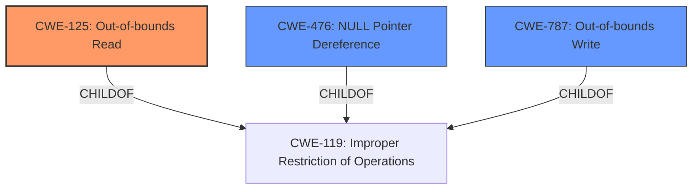

# Enhanced Analysis for CVE-2022-35482

# Summary
| CWE ID | CWE Name | Confidence | CWE Abstraction Level | CWE Vulnerability Mapping Label | CWE-Vulnerability Mapping Notes |
|---|---|---|---|---|---|
| CWE-125 | Out-of-bounds Read | 0.9 | Base | Allowed | Primary CWE |
| CWE-476 | NULL Pointer Dereference | 0.7 | Base | Allowed | Secondary Candidate |
| CWE-787 | Out-of-bounds Write | 0.6 | Base | Allowed | Secondary Candidate |

## Evidence and Confidence

*   **Confidence Score:** 0.8
*   **Evidence Strength:** HIGH

## Relationship Analysis
The primary relationship is that CWE-125 **(Out-of-bounds Read)** is a child of CWE-119 **(Improper Restriction of Operations within the Bounds of a Memory Buffer)**. While CWE-119 is a broader class, CWE-125 provides a more specific description of the vulnerability. CWE-476 **(NULL Pointer Dereference)** and CWE-787 **(Out-of-bounds Write)** are also related to memory access issues and could be present depending on the specific code path triggered by the crafted input.



## Vulnerability Chain
The vulnerability chain starts with a crafted input file that is processed by OTFCC. This leads to an **improper memory access**, manifesting as either an out-of-bounds read, write, or a NULL pointer dereference. The impact is a segmentation fault, potentially leading to arbitrary code execution (though not explicitly confirmed).

## Summary of Analysis
Initially, the vulnerability description pointed to a segmentation violation, which could have many root causes. The additional information from the "CVE Reference Links Content Summary" clarified that the root cause often involves memory corruption due to out-of-bounds reads/writes. The primary CWE, CWE-125 **(Out-of-bounds Read)**, was chosen because the provided crash reports frequently mentioned AddressSanitizer detecting out-of-bounds reads when processing crafted font files.

The evidence supporting this decision comes from:
- **Vulnerability Description Key Phrases:** "segmentation violation"
- **CVE Reference Links Content Summary:** Mentions "memory corruption due to writing data beyond the allocated boundary," "lacks proper bounds checking," and "segmentation fault occurs when the program attempts to access a memory location that it is not permitted to access."
- **Retriever Results:** CWE-125 **(Out-of-bounds Read)** is the top result.
- **Complete CWE Specifications:** The description of CWE-125 matches the vulnerability description.

CWE-476 **(NULL Pointer Dereference)** and CWE-787 **(Out-of-bounds Write)** were considered because they are also common causes of segmentation faults, especially when dealing with memory management issues. They are listed as secondary candidates because the provided information does not explicitly confirm their presence.

The selection of CWE-125 **(Out-of-bounds Read)** is at the optimal level of specificity because it is a Base CWE that directly addresses the root cause of the vulnerability, as evidenced by the crash reports and vulnerability descriptions.

Relevant CWE Information:

# Enhanced Context (25 CWEs)

## CWE-125: Out-of-bounds Read
**Abstraction:** Base
**Status:** Draft

### Description
The product reads data past the end, or before the beginning, of the intended buffer.

### Extended Description
Not provided

### Alternative Terms
OOB read: Shorthand for "Out of bounds" read

### Relationships
ChildOf -> CWE-119
ChildOf -> CWE-119
ChildOf -> CWE-119
ChildOf -> CWE-119

### Mapping Guidance
**Usage:** Allowed
**Rationale:** This CWE entry is at the Base level of abstraction, which is a preferred level of abstraction for mapping to the root causes of vulnerabilities.
**Comments:** Carefully read both the name and description to ensure that this mapping is an appropriate fit. Do not try to 'force' a mapping to a lower-level Base/Variant simply to comply with this preferred level of abstraction.
**Reasons:**
- Acceptable-Use


## CWE Relationship Analysis

Current CWEs represent these abstraction levels: .


### Vulnerability Chain Analysis

**Chain starting from CWE-787:**
- 787 (Out-of-bounds Write) - ROOT


**Chain starting from CWE-119:**
- 119 (Improper Restriction of Operations within the Bounds of a Memory Buffer) - ROOT


### CWE Relationship Diagram

```mermaid
graph TD
    classDef primary fill:#f96,stroke:#333,stroke-width:2px
    classDef secondary fill:#69f,stroke:#333
    classDef tertiary fill:#9e9,stroke:#333
```