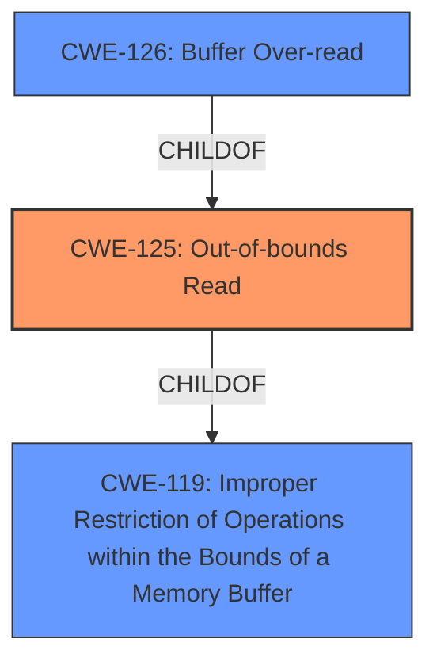

# Raw Analyzer Response for CVE-2022-35484

# Summary
| CWE ID    | CWE Name                        | Confidence | CWE Abstraction Level | CWE Vulnerability Mapping Label | CWE-Vulnerability Mapping Notes |
| :-------- | :------------------------------ | :--------- | :-------------------- | :------------------------------ | :------------------------------ |
| CWE-125   | Out-of-bounds Read              | 0.9        | Base                  | Primary CWE                     | Allowed                       |

## Evidence and Confidence

*   **Confidence Score:** 0.9
*   **Evidence Strength:** MEDIUM

## Relationship Analysis
The primary CWE selected was CWE-125 **Out-of-bounds Read**. This is a base level CWE and is a child of CWE-119 **Improper Restriction of Operations within the Bounds of a Memory Buffer**. The retriever results also showed that CWE-126 **Buffer Over-read** which is a variant of CWE-125.

## Vulnerability Chain
The vulnerability chain is:
1.  The OTFCC software attempts to read data from a buffer.
2.  Due to an unspecified error, the software reads beyond the bounds of the buffer (**CWE-125**).
3.  This out-of-bounds read causes a segmentation fault/violation, leading to a crash.

## Summary of Analysis
The vulnerability description states that OTFCC v0.10.4 has a segmentation violation. The vulnerability description key phrases note the impact as a segmentation violation. The CVE reference links content summary does not directly describe an out-of-bounds read, but the primary CWE match for similar CVE descriptions is CWE-125 **Out-of-bounds Read**. The retriever results also list CWE-125 as the top combined result. Given the segmentation violation and the suggestions from similar CVE descriptions and retriever results, the best CWE match is CWE-125.

Relevant CWE Information:

# Enhanced Context (25 CWEs)
The following CWEs were identified as potentially relevant to this vulnerability:

## CWE-131: Incorrect Calculation of Buffer Size
**Abstraction Level**: Base
**Similarity Score**: 0.78
**Source**: dense

**Description**:
The product does not correctly calculate the size to be used when allocating a buffer, which could lead to a buffer overflow.

**Mapping Guidance**:
- Usage: Allowed
- Rationale: This CWE entry is at the Base level of abstraction, which is a preferred level of abstraction for mapping to the root causes of vulnerabilities.

## CWE-125: Out-of-bounds Read
**Abstraction Level**: Base
**Similarity Score**: 0.77
**Source**: dense

**Description**:
The product reads data past the end, or before the beginning, of the intended buffer.

**Mapping Guidance**:
- Usage: Allowed
- Rationale: This CWE entry is at the Base level of abstraction, which is a preferred level of abstraction for mapping to the root causes of vulnerabilities.

## CWE-125: Out-of-bounds Read
**Abstraction Level**: Base
**Similarity Score**: 6504.70
**Source**: sparse

**Description**:
The product reads data past the end, or before the beginning, of the intended buffer.

**Mapping Guidance**:
- Usage: Allowed
- Rationale: This CWE entry is at the Base level of abstraction, which is a preferred level of abstraction for mapping to the root causes of vulnerabilities.

CWE-125 is at the optimal level of specificity and is the best fit for the vulnerability description.