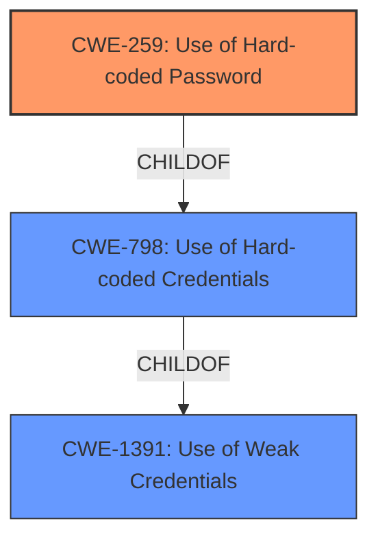

# Raw Analyzer Response for CVE-2022-35491

# Summary
| CWE ID | CWE Name | Confidence | CWE Abstraction Level | CWE Vulnerability Mapping Label | CWE-Vulnerability Mapping Notes |
|---|---|---|---|---|---|
| CWE-259 | Use of Hard-coded Password | 1 | Variant | Allowed | Primary CWE |
| CWE-798 | Use of Hard-coded Credentials | 0.9 | Base | Allowed | Secondary Candidate |

## Evidence and Confidence

*   **Confidence Score:** 0.95
*   **Evidence Strength:** HIGH

## Relationship Analysis
The primary CWE is CWE-259, which is a variant of CWE-798. CWE-798 is a more general case of using hardcoded credentials, while CWE-259 specifically focuses on hardcoded passwords. The vulnerability description explicitly mentions a hardcoded password, making CWE-259 a more specific and accurate classification.

## Vulnerability Chain
The vulnerability chain starts with the **hardcoded password** (CWE-259), which allows an attacker to gain unauthorized access to the system.

## Summary of Analysis
The initial analysis correctly identifies the presence of a **hardcoded password**. This is supported by the vulnerability description, which states "TOTOLINK A3002RU V3.0.0-B20220304.1804 has a **hardcoded password** for root in /etc/shadow.sample." The CVE Reference Links Content Summary further confirms this, stating "The TOTOLINK A3002RU V3.0.0-B20220304.1804 firmware contains a **hardcoded password** for the root user in the `/etc/shadow.sample` file."

The Retriever Results also support this analysis, with CWE-259 and CWE-798 being the top matches.

CWE-259 is chosen as the primary CWE because it is a more specific variant of CWE-798, focusing specifically on passwords. The evidence clearly indicates that the vulnerability involves a hardcoded *password*, not just any type of credential. The abstraction level of CWE-259 is Variant, which is a preferred level of abstraction according to the mapping guidance.

CWE-798 was considered as a possible candidate. However, since the provided text specifies that the credential is a "password", it makes more sense to classify it as CWE-259 "Use of Hard-coded Password" because it is more specific.

Relevant CWE Information:

# Enhanced Context (25 CWEs)

## CWE-312: Cleartext Storage of Sensitive Information
**Abstraction Level**: Base
**Similarity Score**: 0.78
**Source**: dense

**Description**:
The product stores sensitive information in cleartext within a resource that might be accessible to another control sphere.
**Not Used:** This CWE focuses on the storage of sensitive information in cleartext, which is not the primary issue here. The vulnerability is the presence of a hardcoded password, regardless of how it is stored.

## CWE-798: Use of Hard-coded Credentials
**Abstraction Level**: Base
**Similarity Score**: 0.77
**Source**: dense

**Description**:
The product contains hard-coded credentials, such as a password or cryptographic key.
**Used:** This CWE is the parent of CWE-259. The vulnerability is the presence of a hardcoded password.

## CWE-1391: Use of Weak Credentials
**Abstraction Level**: Class
**Similarity Score**: 0.76
**Source**: dense

**Description**:
The product uses weak credentials (such as a default key or hard-coded password) that can be calculated, derived, reused, or guessed by an attacker.
**Not Used:** While a hardcoded password can be considered a weak credential, CWE-1391 is a more general class. CWE-259 is a more precise description of the vulnerability.

## CWE-319: Cleartext Transmission of Sensitive Information
**Abstraction Level**: Base
**Similarity Score**: 0.75
**Source**: dense

**Description**:
The product transmits sensitive or security-critical data in cleartext in a communication channel that can be sniffed by unauthorized actors.
**Not Used:** This CWE relates to transmission of data, which is not relevant to the vulnerability.

## CWE-257: Storing Passwords in a Recoverable Format
**Abstraction Level**: Base
**Similarity Score**: 0.75
**Source**: dense

**Description**:
The storage of passwords in a recoverable format makes them subject to password reuse attacks by malicious users. In fact, it should be noted that recoverable encrypted passwords provide no significant benefit over plaintext passwords since they are subject not only to reuse by malicious attackers but also by malicious insiders. If a system administrator can recover a password directly, or use a brute force search on the available information, the administrator can use the password on other accounts.
**Not Used:** This CWE is not the primary issue, which is the existence of a **hardcoded password**.

## CWE-807: Reliance on Untrusted Inputs in a Security Decision
**Abstraction Level**: Base
**Similarity Score**: 0.74
**Source**: dense

**Description**:
The product uses a protection mechanism that relies on the existence or values of an input, but the input can be modified by an untrusted actor in a way that bypasses the protection mechanism.
**Not Used:** This CWE focuses on reliance on untrusted inputs, which is not the core issue in this vulnerability.

## CWE-1392: Use of Default Credentials
**Abstraction Level**: Base
**Similarity Score**: 0.74
**Source**: dense

**Description**:
The product uses default credentials (such as passwords or cryptographic keys) for potentially critical functionality.
**Not Used:** The description does not specify the password is a *default* password, only that it is hardcoded.

## CWE-259: Use of Hard-coded Password
**Abstraction Level**: Variant
**Similarity Score**: 0.74
**Source**: dense

**Description**:
The product contains a hard-coded password, which it uses for its own inbound authentication or for outbound communication to external components.
**Used:** This is the primary CWE.

## CWE-472: External Control of Assumed-Immutable Web Parameter
**Abstraction Level**: Base
**Similarity Score**: 0.74
**Source**: dense

**Description**:
The web application does not sufficiently verify inputs that are assumed to be immutable but are actually externally controllable, such as hidden form fields.
**Not Used:** This CWE focuses on web parameter manipulation, which is not relevant to this vulnerability.

## CWE-345: Insufficient Verification of Data Authenticity
**Abstraction Level**: Class
**Similarity Score**: 0.73
**Source**: dense

**Description**:
The product does not sufficiently verify the origin or authenticity of data, in a way that causes it to accept invalid data.
**Not Used:** This CWE relates to data authenticity, which is not the primary concern in this vulnerability.

## CWE-259: Use of Hard-coded Password
**Abstraction Level**: Variant
**Similarity Score**: 7049.72
**Source**: sparse

**Description**:
The product contains a hard-coded password, which it uses for its own inbound authentication or for outbound communication to external components.
**Used:** This is the primary CWE.

## CWE-798: Use of Hard-coded Credentials
**Abstraction Level**: Base
**Similarity Score**: 6903.08
**Source**: sparse

**Description**:
The product contains hard-coded credentials, such as a password or cryptographic key.
**Used:** This is the parent of CWE-259

## CWE-321: Use of Hard-coded Cryptographic Key
**Abstraction Level**: Variant
**Similarity Score**: 6472.86
**Source**: sparse

**Description**:
The use of a hard-coded cryptographic key significantly increases the possibility that encrypted data may be recovered.
**Not Used:** The credential in question is a *password*, not a cryptographic key.

## CWE-1391: Use of Weak Credentials
**Abstraction Level**: Class
**Similarity Score**: 6362.23
**Source**: sparse

**Description**:
The product uses weak credentials (such as a default key or hard-coded password) that can be calculated, derived, reused, or guessed by an attacker.
**Not Used:** While a hardcoded password can be considered a weak credential, CWE-1391 is a more general class. CWE-2