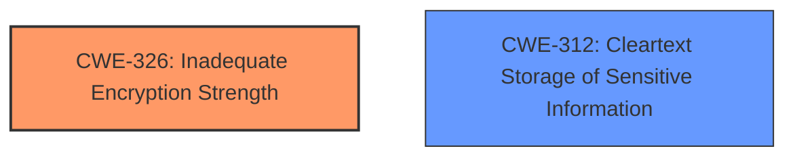

# Analysis for CVE-2022-35513

# Summary
| CWE ID | CWE Name | Confidence | CWE Abstraction Level | CWE Vulnerability Mapping Label | CWE-Vulnerability Mapping Notes |
|---|---|---|---|---|---|
| CWE-326 | Inadequate Encryption Strength | 0.9 | Base | Allowed | Primary CWE for **weak password encryption** |
| CWE-312 | Cleartext Storage of Sensitive Information | 0.9 | Base | Allowed | Secondary CWE for **insecure method of storage** |

## Evidence and Confidence

*   **Confidence Score:** 0.9
*   **Evidence Strength:** HIGH

## Relationship Analysis
The primary weakness, **weak password encryption**, is best captured by CWE-326 (Inadequate Encryption Strength) because the description states the encryption is "theoretically sound, but is not strong enough for the level of protection required." The secondary weakness, **insecure method of storage**, aligns with CWE-312 (Cleartext Storage of Sensitive Information) because it involves storing sensitive information in cleartext where it might be accessible.

## Vulnerability Chain
The vulnerability chain involves two distinct weaknesses:
1.  **Root Cause 1:** **Weak Password Encryption** (CWE-326)
2.  **Root Cause 2:** **Insecure Method of Storage** (CWE-312)
There is no sequential dependency indicated between these two vulnerabilities. They appear to be independent weaknesses in the application.

## Summary of Analysis
The analysis focused on mapping the two key phrases, **weak password encryption** and **insecure method of storage**, to the most appropriate CWEs. The description provides explicit details about the nature of each weakness, allowing for a confident mapping.

*   **Weak Password Encryption:** The description aligns with CWE-326, which specifies encryption that is theoretically sound but practically weak. This is a more precise classification than CWE-327, which is a broader category of broken or risky cryptographic algorithms.
*   **Insecure Method of Storage:** The description suggests storing sensitive information without proper encryption, aligning with CWE-312.

The final decision is based on the explicit information provided in the vulnerability description, leading to a high confidence score.

Relevant CWE Information:

# Enhanced Context (25 CWEs)
The following CWEs were identified as potentially relevant to this vulnerability:

## CWE-1391: Use of Weak Credentials
**Abstraction Level**: Class
**Similarity Score**: 0.74
**Source**: dense

**Description**:
The product uses **weak credentials** (such as a default key or hard-coded password) that can be calculated, derived, reused, or guessed by an attacker.

**Mapping Guidance**:
- Usage: Allowed-with-Review
- Rationale: This CWE entry is a Class and might have Base-level children that would be more appropriate

*Not selected:* Although the vulnerability involves passwords, the root cause described is about the encryption strength and the storage method, not the credentials themselves. Therefore, CWE-1391 is not the most appropriate choice.

## CWE-312: Cleartext Storage of Sensitive Information
**Abstraction Level**: Base
**Similarity Score**: 0.72
**Source**: dense

**Description**:
The product stores sensitive information in cleartext within a resource that might be accessible to another control sphere.

**Mapping Guidance**:
- Usage: Allowed
- Rationale: This CWE entry is at the Base level of abstraction, which is a preferred level of abstraction for mapping to the root causes of vulnerabilities.

*Selected as a secondary CWE:* The description mentions an **insecure method of storage**, which directly corresponds to storing data in cleartext.

## CWE-311: Missing Encryption of Sensitive Data
**Abstraction Level**: Class
**Similarity Score**: 0.72
**Source**: dense

**Description**:
The product does not encrypt sensitive or critical information before storage or transmission.

**Mapping Guidance**:
- Usage: Discouraged
- Rationale: CWE-311 is high-level with more precise children available. It is a level-1 Class (i.e., a child of a Pillar).

*Not selected:* While related to storage, CWE-312 is a more specific and appropriate CWE for the **insecure method of storage** than CWE-311.

## CWE-916: Use of Password Hash With Insufficient Computational Effort
**Abstraction Level**: Base
**Similarity Score**: 0.71
**Source**: dense

**Description**:
The product generates a hash for a password, but it uses a scheme that does not provide a sufficient level of computational effort that would make password cracking attacks infeasible or expensive.

**Mapping Guidance**:
- Usage: Allowed
- Rationale: This CWE entry is at the Base level of abstraction, which is a preferred level of abstraction for mapping to the root causes of vulnerabilities.

*Not selected:* The vulnerability description focuses on **weak password encryption** rather than the computational effort of the hashing algorithm.

## CWE-1240: Use of a Cryptographic Primitive with a Risky Implementation
**Abstraction Level**: Base
**Similarity Score**: 0.71
**Source**: dense

**Description**:
To fulfill the need for a cryptographic primitive, the product implements a cryptographic algorithm using a non-standard, unproven, or disallowed/non-compliant cryptographic implementation.

**Mapping Guidance**:
- Usage: Allowed
- Rationale: This CWE entry is at the Base level of abstraction, which is a preferred level of abstraction for mapping to the root causes of vulnerabilities.

*Not selected:* This CWE is too broad, as the vulnerability description mentions **weak password encryption** suggesting the issue is related to the encryption strength rather than using a risky implementation.

## CWE-328: Use of Weak Hash
**Abstraction Level**: Base
**Similarity Score**: 0.70
**Source**: dense

**Description**:
The product uses an algorithm that produces a digest (output value) that does not meet security expectations for a hash function that allows an adversary to reasonably determine the original input (preimage attack), find another input that can produce the same hash (2nd preimage attack), or find multiple inputs that evaluate to the same hash (birthday attack).

**Mapping Guidance**:
- Usage: Allowed
- Rationale: This CWE entry is at the Base level of abstraction, which is a preferred level of abstraction for mapping to the root causes of vulnerabilities.

*Not selected:* Similar to CWE-916, this CWE is focused on hashing algorithms, while the description relates to encryption strength.

## CWE-798: Use of Hard-coded Credentials
**Abstraction Level**: Base
**Similarity Score**: 0.70
**Source**: dense

**Description**:
The product contains hard-coded credentials, such as a password or cryptographic key.

**Mapping Guidance**:
- Usage: Allowed
- Rationale: This CWE entry is at the Base level of abstraction, which is a preferred level of abstraction for mapping to the root causes of vulnerabilities.

*Not selected:* While passwords are involved, the issue isn't about hard-coded credentials, but about **weak password encryption** and **insecure method of storage**.

## CWE-330: Use of Insufficiently Random Values
**Abstraction Level**: Class
**Similarity Score**: 0.70
**Source**: dense

**Description**:
The product uses insufficiently random numbers or values in a security context that depends on unpredictable numbers.

**Mapping Guidance**:
- Usage: Discouraged
- Rationale: This CWE entry is a level-1 Class (i.e., a child of a Pillar). It might have lower-level children that would be more appropriate

*Not selected:* This CWE is irrelevant as the vulnerability description does not mention randomness or unpredictability.

## CWE-319: Cleartext Transmission of Sensitive Information
**Abstraction Level**: Base
**Similarity Score**: 0.69
**Source**: dense

**Description**:
The product transmits sensitive or security-critical data in cleartext in a communication channel that can be sniffed by unauthorized actors.

**Mapping Guidance**:
- Usage: Allowed
- Rationale: This CWE entry is at the Base level of abstraction, which is a preferred level of abstraction for mapping to the root causes of vulnerabilities.

*Not selected:* The description focuses on storage, not transmission.

## CWE-345: Insufficient Verification of Data Authenticity
**Abstraction Level**: Class
**Similarity Score**: 0.69
**Source**: dense

**Description**:
The product does not sufficiently verify the origin or authenticity of data, in a way that causes it to accept invalid data.

**Mapping Guidance**:
- Usage: Discouraged
- Rationale: This CWE entry is a level-1 Class (i.e., a child of a Pillar). It might have lower-level children that would be more appropriate

*Not selected:* This CWE is not related to the vulnerability description, which involves **weak password encryption** and **insecure method of storage**.

## CWE-916: Use

# Enhanced Query for CVE-2022-35513

# Vulnerability Description

    The Blink1Control2 application <= 2.2.7 uses **weak password encryption** and an **insecure method of storage**.

    # Keyphrase-Specific CWE Analysis
    This vulnerability contains multiple keyphrases that may map to different CWEs. 
    Please analyze each keyphrase separately and determine the most appropriate CWE(s) for each.

    ## WEAKNESS: 'weak password encryption'

Relevant CWEs for this WEAKNESS:

### 1. CWE-327: Use of a Broken or Risky Cryptographic Algorithm (Score: 171.05)

The product uses a broken or risky cryptographic algorithm or protocol....

### 2. CWE-326: Inadequate Encryption Strength (Score: 165.22)

The product stores or transmits sensitive data using an encryption scheme that is theoretically sound, but is not strong enough for the level of protection required....

### 3. CWE-916: Use of Password Hash With Insufficient Computational Effort (Score: 160.00)

The product generates a hash for a password, but it uses a scheme that does not provide a sufficient level of computational effort that would make password cracking attacks infeasible or expensive....

### 4. CWE-1391: Use of Weak Credentials (Score: 155.11)

The product uses weak credentials (such as a default key or hard-coded password) that can be calculated, derived, reused, or guessed by an attacker....

### 5. CWE-261: Weak Encoding for Password (Score: 150.46)

Obscuring a password with a trivial encoding does not protect the password....

## WEAKNESS: 'insecure method of storage'

Relevant CWEs for this WEAKNESS:

### 1. CWE-327: Use of a Broken or Risky Cryptographic Algorithm (Score: 171.05)

The product uses a broken or risky cryptographic algorithm or protocol....

### 2. CWE-916: Use of Password Hash With Insufficient Computational Effort (Score: 160.00)

The product generates a hash for a password, but it uses a scheme that does not provide a sufficient level of computational effort that would make password cracking attacks infeasible or expensive....

### 3. CWE-377: Insecure Temporary File (Score: 156.08)

Creating and using insecure temporary files can leave application and system data vulnerable to attack....

### 4. CWE-313: Cleartext Storage in a File or on Disk (Score: 153.63)

The product stores sensitive information in cleartext in a file, or on disk....

### 5. CWE-311: Missing Encryption of Sensitive Data (Score: 146.16)

The product does not encrypt sensitive or critical information before storage or transmission....

## PRODUCT: 'Blink1Control2 application'

Relevant CWEs for this PRODUCT:

### 1. CWE-327: Use of a Broken or Risky Cryptographic Algorithm (Score: 171.05)

The product uses a broken or risky cryptographic algorithm or protocol....

### 2. CWE-326: Inadequate Encryption Strength (Score: 165.22)

The product stores or transmits sensitive data using an encryption scheme that is theoretically sound, but is not strong enough for the level of protection required....

### 3. CWE-916: Use of Password Hash With Insufficient Computational Effort (Score: 160.00)

The product generates a hash for a password, but it uses a scheme that does not provide a sufficient level of computational effort that would make password cracking attacks infeasible or expensive....

### 4. CWE-1391: Use of Weak Credentials (Score: 155.11)

The product uses weak credentials (such as a default key or hard-coded password) that can be calculated, derived, reused, or guessed by an attacker....

### 5. CWE-313: Cleartext Storage in a File or on Disk (Score: 153.63)

The product stores sensitive information in cleartext in a file, or on disk....

## VERSION: '<= 2.2.7'

Relevant CWEs for this VERSION:

### 1. CWE-327: Use of a Broken or Risky Cryptographic Algorithm (Score: 171.05)

The product uses a broken or risky cryptographic algorithm or protocol....

### 2. CWE-326: Inadequate Encryption Strength (Score: 165.22)

The product stores or transmits sensitive data using an encryption scheme that is theoretically sound, but is not strong enough for the level of protection required....

### 3. CWE-916: Use of Password Hash With Insufficient Computational Effort (Score: 160.00)

The product generates a hash for a password, but it uses a scheme that does not provide a sufficient level of computational effort that would make password cracking attacks infeasible or expensive....

### 4. CWE-522: Insufficiently Protected Credentials (Score: 40.34)

The product transmits or stores authentication credentials, but it uses an insecure method that is susceptible to unauthorized interception and/or retrieval....

### 5. CWE-1204: Generation of Weak Initialization Vector (IV) (Score: 39.70)

The product uses a cryptographic primitive that uses an Initialization
			Vector (IV), but the product does not generate IVs that are
			sufficiently unpredictable or unique according to the expected
			cryptographic requirements for that primitive.
			...

    # Analysis Instructions
    1. For each keyphrase, identify the most appropriate CWE(s) that represent the weakness.
    2. Consider how the different keyphrases might relate to each other in the vulnerability chain.
    3. Provide a final determination of primary CWE(s) and any secondary CWEs.
    4. Format your response using the standard analysis template.

    Please analyze how these different weaknesses interact and provide a comprehensive CWE classification.
    