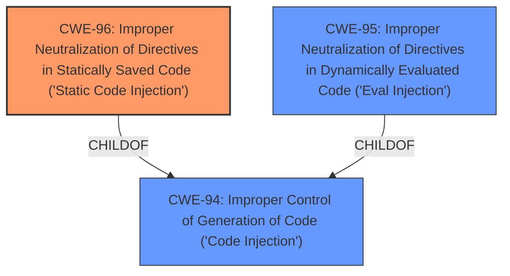

# Analysis Report for CVE-2022-35516

# Vulnerability Analysis Report: CVE-2022-35516

## Description


## Analysis (with Relationship Data)

# Summary
| CWE ID | CWE Name | Confidence | CWE Abstraction Level | CWE Vulnerability Mapping Label | CWE-Vulnerability Mapping Notes |
|---|---|---|---|---|---|
| CWE-96 | Improper Neutralization of Directives in Statically Saved Code ('Static Code Injection') | 1 | Base | Allowed | Primary CWE |
| CWE-95 | Improper Neutralization of Directives in Dynamically Evaluated Code ('Eval Injection') | 0.7 | Variant | Allowed | Secondary Candidate |
| CWE-94 | Improper Control of Generation of Code ('Code Injection') | 0.6 | Base | Allowed-with-Review | Secondary Candidate |

## Evidence and Confidence

*   **Confidence Score:** 0.8
*   **Evidence Strength:** HIGH

## Relationship Analysis
The primary CWE selected is CWE-96, which is a Base level weakness describing **improper neutralization of directives in statically saved code**. This is a `ChildOf` CWE-94 (Improper Control of Generation of Code), indicating a more specific type of code injection. CWE-95 (Improper Neutralization of Directives in Dynamically Evaluated Code) is also a child of CWE-94, representing a different form of code injection where code is dynamically evaluated using functions like `eval()`. The choice between CWE-96 and CWE-95 depends on whether the injected code is statically saved or dynamically evaluated.



## Vulnerability Chain
The vulnerability chain begins with the **lack of input sanitization** of the `userid` parameter. This leads to **improper neutralization**, which allows an attacker to inject malicious code into the `/data/login.data.php` file. When this file is accessed, the injected code is executed, resulting in **remote code execution**.

## Summary of Analysis
The initial assessment, based on the vulnerability description and the content summary, points towards a code injection vulnerability. The root cause is the **insufficient filtering** of the `userid` parameter, which allows for the injection of malicious PHP code into the `/data/login.data.php` file. This file is then accessed and the injected code is executed, leading to remote code execution.

The key evidence supporting this assessment is:

*   The vulnerability description stating that it is a remote code execution vulnerability in `login.php`.
*   The CVE Reference Links Content Summary, which mentions the **lack of input sanitization** of the `userid` parameter and the ability to inject malicious PHP code.

The retriever results suggest CWE-96 (Improper Neutralization of Directives in Statically Saved Code) as the top candidate, with a similarity score of 0.061. This aligns well with the vulnerability description, as the injected code is being written to a file (`/data/login.data.php`) and then executed when the file is accessed.

CWE-95 (Improper Neutralization of Directives in Dynamically Evaluated Code ('Eval Injection')) was considered because PHP's `eval()` function or similar dynamic execution mechanisms *could* be involved in how the injected code is handled. However, the description focuses on code being written to a file, which is then executed. Without explicit mention of `eval()` or other dynamic execution, CWE-96 is a stronger fit.

CWE-94 (Improper Control of Generation of Code ('Code Injection')) is a more general case, and while applicable, CWE-96 provides more specific information about the nature of the injection: it is static, meaning the code is saved and then executed.

The selection of CWE-96 is at the optimal level of specificity because it directly addresses the **root cause** of the vulnerability, which is the **improper neutralization** of input that is then statically saved and executed. The other considered CWEs are either too general (CWE-94) or describe a different, albeit related, type of vulnerability (CWE-95).


## CWE Relationship Analysis

Current CWEs represent these abstraction levels: .


### Vulnerability Chain Analysis

**Chain starting from CWE-94:**
- 94 (Improper Control of Generation of Code ('Code Injection')) - ROOT


**Chain starting from CWE-96:**
- 96 (Improper Neutralization of Directives in Statically Saved Code ('Static Code Injection')) - ROOT


### CWE Relationship Diagram

```mermaid
graph TD
    classDef primary fill:#f96,stroke:#333,stroke-width:2px
    classDef secondary fill:#69f,stroke:#333
    classDef tertiary fill:#9e9,stroke:#333
```


*Report generated on 2025-03-31 02:00:42*
