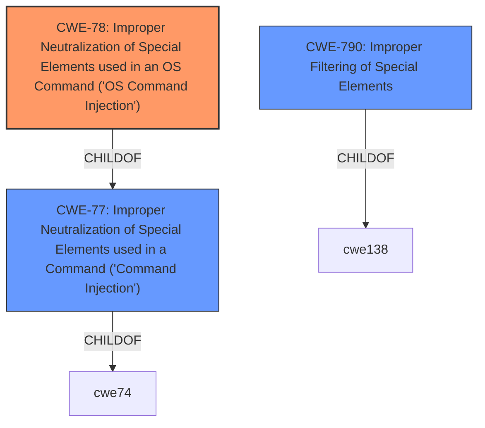

# Analysis for CVE-2022-35517

# Summary
| CWE ID | CWE Name | Confidence | CWE Abstraction Level | CWE Vulnerability Mapping Label | CWE-Vulnerability Mapping Notes |
|---|---|---|---|---|---|
| CWE-78 | Improper Neutralization of Special Elements used in an OS Command ('OS Command Injection') | 1.0 | Base | Primary | Allowed |
| CWE-77 | Improper Neutralization of Special Elements used in a Command ('Command Injection') | 0.8 | Class | Secondary | Allowed-with-Review |
| CWE-790 | Improper Filtering of Special Elements | 0.6 | Class | Secondary | Allowed-with-Review |

## Evidence and Confidence

*   **Confidence Score:** 0.9
*   **Evidence Strength:** HIGH

## Relationship Analysis
The primary relationship influencing the decision is that CWE-78 is a child of CWE-77. Since the vulnerability involves OS commands specifically, CWE-78 is more appropriate. The other relationship to consider is that CWE-77 and CWE-78 can follow CWE-184 (Incomplete List of Disallowed Inputs), which aligns with the **lack of filtering** described in the vulnerability. However, CWE-184 does not appear as a highly ranked retriever result. CWE-790 (Improper Filtering of Special Elements) is a Class-level CWE and a parent of CWE-791 (Incomplete Filtering of Special Elements). It is also relevant because the vulnerability description indicates a **lack of filtering** on parameters.

## Vulnerability Chain
The vulnerability chain starts with a **lack of input filtering**, which leads to **command injection**. Specifically, the **lack of input filtering** allows an attacker to inject arbitrary OS commands.

## Summary of Analysis
The initial analysis identified **command injection** as the primary weakness, stemming from a **lack of input filtering**. The vulnerability description states that "WAVLINK WN572HP3, WN533A8, WN530H4, WN535G3, WN531P3 adm.cgi has no filtering on parameters web_pskValue, wl_Method, wlan_ssid, EncrypType, rwan_ip, rwan_mask, rwan_gateway, ppp_username, ppp_passwd and ppp_setver, which leads to **command injection** in page /wizard_router_mesh.shtml." The CVE Reference Links Content Summary confirms this root cause: "The root cause of all vulnerabilities described is the lack of proper input sanitization... Specifically, user-supplied input in HTTP POST parameters is directly used in shell commands without any filtering or escaping, allowing for command injection."

The retriever results and the CWE specifications were then reviewed. CWE-78 is the most specific and accurate representation of the vulnerability because it involves OS commands. While CWE-77 is a broader category of command injection, CWE-78 directly addresses the use of OS commands. CWE-790 is also relevant as it describes **improper filtering**, but it's a more general class.

The selected CWEs are at the optimal level of specificity, with CWE-78 being the most specific base-level CWE that accurately reflects the vulnerability.

Relevant CWE Information:

# Enhanced Context (25 CWEs)

## CWE-74: Improper Neutralization of Special Elements in Output Used by a Downstream Component ('Injection')
**Abstraction Level**: Class
**Similarity Score**: 0.77
**Source**: dense

**Description**:
The product constructs all or part of a command, data structure, or record using externally-influenced input from an upstream component, but it does not neutralize or incorrectly neutralizes special elements that could modify how it is parsed or interpreted when it is sent to a downstream component.

**Mapping Guidance**:
- Usage: Discouraged
- Rationale: CWE-74 is high-level and often misused when lower-level weaknesses are more appropriate.

*This CWE was considered but is too high-level and not as specific as CWE-78 or CWE-77.*

## CWE-184: Incomplete List of Disallowed Inputs
**Abstraction Level**: Base
**Similarity Score**: 0.76
**Source**: dense

**Description**:
The product implements a protection mechanism that relies on a list of inputs (or properties of inputs) that are not allowed by policy or otherwise require other action to neutralize before additional processing takes place, but the list is incomplete.

**Mapping Guidance**:
- Usage: Allowed
- Rationale: This CWE entry is at the Base level of abstraction, which is a preferred level of abstraction for mapping to the root causes of vulnerabilities.

*This CWE was considered, because the root cause is due to the **lack of input filtering**, but CWE-184 doesn't address the type of injection that occurs.*

## CWE-80: Improper Neutralization of Script-Related HTML Tags in a Web Page (Basic XSS)
**Abstraction Level**: Variant
**Similarity Score**: 0.76
**Source**: dense

**Description**:
The product receives input from an upstream component, but it does not neutralize or incorrectly neutralizes special characters such as "<", ">", and "&" that could be interpreted as web-scripting elements when they are sent to a downstream component that processes web pages.

**Mapping Guidance**:
- Usage: Allowed
- Rationale: This CWE entry is at the Variant level of abstraction, which is a preferred level of abstraction for mapping to the root causes of vulnerabilities.

*This CWE was not considered because it relates to XSS and not command injection.*

## CWE-138: Improper Neutralization of Special Elements
**Abstraction Level**: Class
**Similarity Score**: 0.75
**Source**: dense

**Description**:
The product receives input from an upstream component, but it does not neutralize or incorrectly neutralizes special elements that could be interpreted as control elements or syntactic markers when they are sent to a downstream component.

**Mapping Guidance**:
- Usage: Discouraged
- Rationale: This CWE entry is a level-1 Class (i.e., a child of a Pillar). It might have lower-level children that would be more appropriate

*This CWE was considered, but it is too high level.*

## CWE-41: Improper Resolution of Path Equivalence
**Abstraction Level**: Base
**Similarity Score**: 0.74
**Source**: dense

**Description**:
The product is vulnerable to file system contents disclosure through path equivalence. Path equivalence involves the use of special characters in file and directory names. The associated manipulations are intended to generate multiple names for the same object.

**Mapping Guidance**:
- Usage: Allowed
- Rationale: This CWE entry is at the Base level of abstraction, which is a preferred level of abstraction for mapping to the root causes of vulnerabilities.

*This CWE was not considered because it does not address command injection.*

## CWE-917: Improper Neutralization of Special Elements used in an Expression Language Statement ('Expression Language Injection')
**Abstraction Level**: Base
**Similarity Score**: 0.74
**Source**: dense

**Description**:
The product constructs all or part of an expression language (EL) statement in a framework such as a Java Server Page (JSP) using externally-influenced input from an upstream component, but it does not neutralize or incorrectly neutralizes special elements that could modify the intended EL statement before it is executed.

**Mapping Guidance**:
- Usage: Allowed
- Rationale: This CWE entry is at the Base level of abstraction, which is a preferred level of abstraction for mapping to the root causes of vulnerabilities.

*This CWE was not considered because it is specific to Expression Language Injection.*

## CWE-96: Improper Neutralization of Directives in Statically Saved Code ('Static Code Injection')
**Abstraction Level**: Base
**Similarity Score**: 0.74
**Source**: dense

**Description**:
The product receives input from an upstream component, but it does not neutralize or incorrectly neutralizes code syntax before inserting the input into an executable resource, such as a library, configuration file, or template.

**Mapping Guidance**:
- Usage: Allowed
- Rationale: This CWE entry is at the Base level of abstraction, which is a preferred level of abstraction for mapping to the root causes of vulnerabilities.

*This CWE was not considered because it involves Static Code Injection.*

## CWE-1289: Improper Validation of Unsafe Equivalence in Input
**Abstraction Level**: Base
**Similarity Score**: 0.74
**Source**: dense