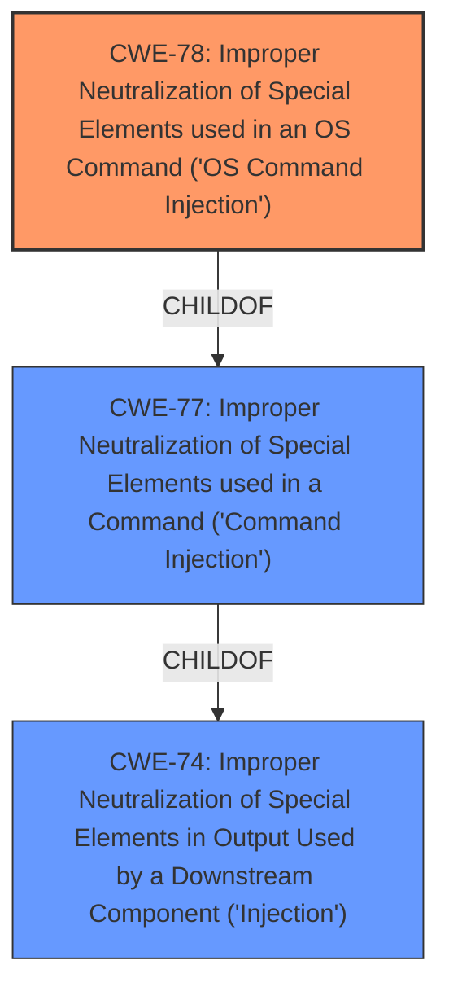

# Analysis Report for CVE-2022-35521

# Vulnerability Analysis Report: CVE-2022-35521

## Description


## Analysis (with Relationship Data)

# Summary
| CWE ID | CWE Name | Confidence | CWE Abstraction Level | CWE Vulnerability Mapping Label | CWE-Vulnerability Mapping Notes |
|---|---|---|---|---|---|
| CWE-78 | Improper Neutralization of Special Elements used in an OS Command ('OS Command Injection') | 1.0 | Base | Primary | Allowed |
| CWE-77 | Improper Neutralization of Special Elements used in a Command ('Command Injection') | 0.7 | Class | Secondary | Allowed-with-Review |

## Evidence and Confidence

*   **Confidence Score:** 0.9
*   **Evidence Strength:** HIGH

## Relationship Analysis
The primary relationship influencing the CWE selection is the parent-child relationship between CWE-77 (Class) and CWE-78 (Base). Since the vulnerability specifically involves OS commands, CWE-78 is the more specific and appropriate choice. CWE-78 is a child of CWE-77, which indicates that OS command injection is a specific type of command injection. The Retriever results also list CWE-78 as a strong candidate.



## Vulnerability Chain
The chain of root cause and weaknesses for this vulnerability is:
1.  **Root Cause:** **Lack of filtering on parameters** (identified in the Vulnerability Description Key Phrases).
2.  **Weakness:** Improper neutralization of special elements in OS commands due to the **lack of filtering on parameters** leading to **command injection**.
3.  **Impact:** Execution of arbitrary shell commands on the router's operating system, potentially leading to complete control over the device.

## Summary of Analysis
The initial analysis focused on identifying the **lack of filtering on parameters** as the root cause of the **command injection** vulnerability. The vulnerability description explicitly mentions that the `firewall.cgi` script **has no filtering on parameters** `remoteManagementEnabled`, `blockPortScanEnabled`, `pingFrmWANFilterEnabled` and `blockSynFloodEnabled`, which leads to **command injection** in page `/man_security.shtml`.

The CVE Reference Links Content Summary confirms this by stating: "The primary cause is the **lack of input validation and sanitization** in multiple CGI scripts... Specifically, several parameters are vulnerable to command injection" and "The identified weakness is the direct use of user-supplied data in shell commands without proper filtering or escaping."

The Retriever Results strongly suggest CWE-77 and CWE-78 as potential candidates. Given the context of OS commands being injected, CWE-78 is the more specific and accurate choice.

CWE-78 is preferred over CWE-77 because the commands being injected are OS commands. The description for CWE-78 states: "The product constructs all or part of an OS command using externally-influenced input from an upstream component, but it does not neutralize or incorrectly neutralizes special elements that could modify the intended OS command when it is sent to a downstream component."

CWE-77 was considered but not used as the primary CWE because it is a broader classification that encompasses command injection in general, not specifically OS command injection. The mapping guidance for CWE-77 even suggests using CWE-78 when OS command injection is the specific issue.

Other CWEs considered but not used:

*   CWE-790: Improper Filtering of Special Elements - This is too general; the specific issue is command injection.
*   CWE-425: Direct Request ('Forced Browsing') - This is not relevant to the described vulnerability.
*   CWE-434: Unrestricted Upload of File with Dangerous Type - This is not relevant to the described vulnerability.
*   CWE-912: Hidden Functionality - This is not relevant to the described vulnerability.
*   CWE-73: External Control of File Name or Path - This is not relevant to the described vulnerability.
*   CWE-138: Improper Neutralization of Special Elements - This is too general; the specific issue is command injection.
*   CWE-116: Improper Encoding or Escaping of Output - This is related to preventing injection but doesn't describe the root cause as accurately as CWE-78.
*   CWE-94: Improper Control of Generation of Code ('Code Injection') - This is not the primary issue; the vulnerability is about injecting OS commands, not generating code.

The decision to use CWE-78 is based on the evidence of **command injection** in OS commands due to a **lack of filtering on parameters**, aligning with the CWE-78 description and its relationship to CWE-77. The selection reflects the optimal level of specificity, focusing on the root cause of the vulnerability.


## CWE Relationship Analysis

Current CWEs represent these abstraction levels: .


### Vulnerability Chain Analysis

**Chain starting from CWE-425:**
- 425 (Direct Request ('Forced Browsing')) - ROOT


**Chain starting from CWE-434:**
- 434 (Unrestricted Upload of File with Dangerous Type) - ROOT


### CWE Relationship Diagram

```mermaid
graph TD
    classDef primary fill:#f96,stroke:#333,stroke-width:2px
    classDef secondary fill:#69f,stroke:#333
    classDef tertiary fill:#9e9,stroke:#333
```


*Report generated on 2025-03-31 05:49:24*
