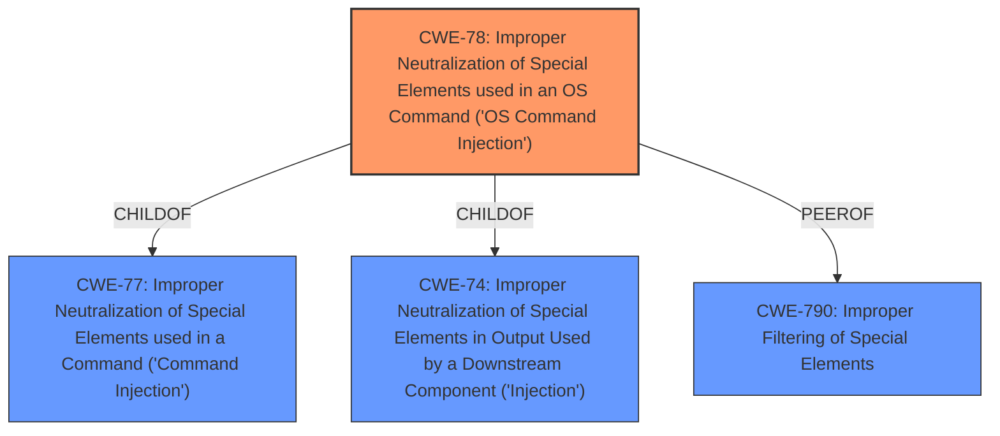

# Analysis for CVE-2022-35523

# Summary
| CWE ID | CWE Name | Confidence | CWE Abstraction Level | CWE Vulnerability Mapping Label | CWE-Vulnerability Mapping Notes |
|---|---|---|---|---|---|
| CWE-78 | Improper Neutralization of Special Elements used in an OS Command ('OS Command Injection') | 1.0 | Base | Primary | Allowed |
| CWE-790 | Improper Filtering of Special Elements | 0.7 | Class | Secondary | Allowed-with-Review |

## Evidence and Confidence

*   **Confidence Score:** 0.9
*   **Evidence Strength:** HIGH

## Relationship Analysis
The primary relationship that influenced the selection was the hierarchical relationship, specifically the ChildOf relationship. CWE-78 is a child of CWE-77 (Improper Neutralization of Special Elements used in a Command ('Command Injection')) and CWE-74 (Improper Neutralization of Special Elements in Output Used by a Downstream Component ('Injection')). This makes CWE-78 a more specific and accurate classification for the vulnerability.

## Vulnerability Chain
The vulnerability chain starts with the **lack of input filtering** (**no filtering on del_mac and parameter flag**), which leads to **command injection**.

## Summary of Analysis
The initial analysis strongly points towards **CWE-78: Improper Neutralization of Special Elements used in an OS Command ('OS Command Injection')** due to the explicit mention of **command injection** and **no filtering** on the parameters del_mac and flag. The vulnerability description states that there is **no filtering** on the del_mac and flag parameters, which directly leads to **command injection**.

The retriever results also list CWE-78 as a highly relevant CWE. The description of CWE-78 matches the vulnerability by stating that the product constructs part of an OS command using externally-influenced input, but it **does not neutralize** special elements.

CWE-790 was considered since the description indicates **no filtering**, but CWE-78 is more specific since the **lack of filtering** directly leads to **OS command injection**. CWE-78 is the optimal level of specificity as it describes the exact nature of the vulnerability.

Relevant CWE Information:
# Enhanced Context (25 CWEs)
The following CWEs were identified as potentially relevant to this vulnerability:

## CWE-807: Reliance on Untrusted Inputs in a Security Decision
**Abstraction Level**: Base
**Similarity Score**: 0.74
**Source**: dense

**Description**:
The product uses a protection mechanism that relies on the existence or values of an input, but the input can be modified by an untrusted actor in a way that bypasses the protection mechanism.

**Mapping Guidance**:
- Usage: Allowed
- Rationale: This CWE entry is at the Base level of abstraction, which is a preferred level of abstraction for mapping to the root causes of vulnerabilities.

## CWE-184: Incomplete List of Disallowed Inputs
**Abstraction Level**: Base
**Similarity Score**: 0.74
**Source**: dense

**Description**:
The product implements a protection mechanism that relies on a list of inputs (or properties of inputs) that are not allowed by policy or otherwise require other action to neutralize before additional processing takes place, but the list is incomplete.

**Mapping Guidance**:
- Usage: Allowed
- Rationale: This CWE entry is at the Base level of abstraction, which is a preferred level of abstraction for mapping to the root causes of vulnerabilities.

## CWE-80: Improper Neutralization of Script-Related HTML Tags in a Web Page (Basic XSS)
**Abstraction Level**: Variant
**Similarity Score**: 0.74
**Source**: dense

**Description**:
The product receives input from an upstream component, but it does not neutralize or incorrectly neutralizes special characters such as "<", ">", and "&" that could be interpreted as web-scripting elements when they are sent to a downstream component that processes web pages.

**Mapping Guidance**:
- Usage: Allowed
- Rationale: This CWE entry is at the Variant level of abstraction, which is a preferred level of abstraction for mapping to the root causes of vulnerabilities.

## CWE-74: Improper Neutralization of Special Elements in Output Used by a Downstream Component ('Injection')
**Abstraction Level**: Class
**Similarity Score**: 0.74
**Source**: dense

**Description**:
The product constructs all or part of a command, data structure, or record using externally-influenced input from an upstream component, but it does not neutralize or incorrectly neutralizes special elements that could modify how it is parsed or interpreted when it is sent to a downstream component.

**Mapping Guidance**:
- Usage: Discouraged
- Rationale: CWE-74 is high-level and often misused when lower-level weaknesses are more appropriate.

## CWE-790: Improper Filtering of Special Elements
**Abstraction Level**: Class
**Similarity Score**: 0.73
**Source**: dense

**Description**:
The product receives data from an upstream component, but does not filter or incorrectly filters special elements before sending it to a downstream component.

**Mapping Guidance**:
- Usage: Allowed-with-Review
- Rationale: This CWE entry is a Class and might have Base-level children that would be more appropriate

## CWE-138: Improper Neutralization of Special Elements
**Abstraction Level**: Class
**Similarity Score**: 0.73
**Source**: dense

**Description**:
The product receives input from an upstream component, but it does not neutralize or incorrectly neutralizes special elements that could be interpreted as control elements or syntactic markers when they are sent to a downstream component.

**Mapping Guidance**:
- Usage: Discouraged
- Rationale: This CWE entry is a level-1 Class (i.e., a child of a Pillar). It might have lower-level children that would be more appropriate

## CWE-303: Incorrect Implementation of Authentication Algorithm
**Abstraction Level**: Base
**Similarity Score**: 0.73
**Source**: dense

**Description**:
The requirements for the product dictate the use of an established authentication algorithm, but the implementation of the algorithm is incorrect.

**Mapping Guidance**:
- Usage: Allowed
- Rationale: This CWE entry is at the Base level of abstraction, which is a preferred level of abstraction for mapping to the root causes of vulnerabilities.

## CWE-668: Exposure of Resource to Wrong Sphere
**Abstraction Level**: Class
**Similarity Score**: 0.73
**Source**: dense

**Description**:
The product exposes a resource to the wrong control sphere, providing unintended actors with inappropriate access to the resource.

**Mapping Guidance**:
- Usage: Discouraged
- Rationale: CWE-668 is high-level and is often misused as a catch-all when lower-level CWE IDs might be applicable. It is sometimes used for low-information vulnerability reports [REF-1287]. It is a level-1 Class (i.e., a child of a Pillar). It is not useful for trend analysis.

## CWE-425: Direct Request ('Forced Browsing')
**Abstraction Level**: Base
**Similarity Score**: 0.73
**Source**: dense

**Description**:
The web application does not adequately enforce appropriate authorization on all restricted URLs, scripts, or files.

**Mapping Guidance**:
- Usage: Allowed
- Rationale: This CWE entry is at the Base level of abstraction, which is a preferred level of abstraction for mapping to the root causes of vulnerabilities.

## CWE-41: Improper Resolution of Path Equivalence
**Abstraction Level**: Base
**Similarity Score**: 0.73
**Source**: dense

**Description**:
The product is vulnerable to file system contents disclosure through path equivalence. Path equivalence involves the use of special characters in file and directory names. The associated manipulations are intended to generate multiple names for the same object.

**Mapping Guidance**:
- Usage: Allowed
- Rationale: This CWE entry is at the Base level of abstraction, which is a preferred level of abstraction for mapping to the root causes of vulnerabilities.

## CWE-790: Improper Filtering of Special Elements
**Abstraction Level**: Class
**Similarity Score**: 3969.01
**Source**: sparse

**Description**:
The product receives data from an upstream component, but does not filter or incorrectly filters special elements before sending it to a downstream component.

**

# Enhanced Query for CVE-2022-35523

# Vulnerability Description

    WAVLINK WN572HP3, WN533A8, WN530H4, WN535G3, WN531P3 firewall.cgi has no filtering on parameter del_mac and parameter flag, which leads to **command injection** in page /cli_black_list.shtml.

    # Keyphrase-Specific CWE Analysis
    This vulnerability contains multiple keyphrases that may map to different CWEs. 
    Please analyze each keyphrase separately and determine the most appropriate CWE(s) for each.

    ## ROOTCAUSE: 'no filtering on del_mac'

Relevant CWEs for this ROOTCAUSE:

### 1. CWE-790: Improper Filtering of Special Elements (Score: 617.85)

The product receives data from an upstream component, but does not filter or incorrectly filters special elements before sending it to a downstream component....

### 2. CWE-425: Direct Request ('Forced Browsing') (Score: 156.05)

The web application does not adequately enforce appropriate authorization on all restricted URLs, scripts, or files....

### 3. CWE-791: Incomplete Filtering of Special Elements (Score: 150.86)

The product receives data from an upstream component, but does not completely filter special elements before sending it to a downstream component....

### 4. CWE-406: Insufficient Control of Network Message Volume (Network Amplification) (Score: 150.36)

The product does not sufficiently monitor or control transmitted network traffic volume, so that an actor can cause the product to transmit more traffic than should be allowed for that actor....

### 5. CWE-78: Improper Neutralization of Special Elements used in an OS Command ('OS Command Injection') (Score: 149.48)

The product constructs all or part of an OS command using externally-influenced input from an upstream component, but it does not neutralize or incorrectly neutralizes special elements that could modify the intended OS command when it is sent to a downstream component....

## ROOTCAUSE: 'no filtering on flag'

Relevant CWEs for this ROOTCAUSE:

### 1. CWE-790: Improper Filtering of Special Elements (Score: 617.85)

The product receives data from an upstream component, but does not filter or incorrectly filters special elements before sending it to a downstream component....

### 2. CWE-214: Invocation of Process Using Visible Sensitive Information (Score: 161.14)

A process is invoked with sensitive command-line arguments, environment variables, or other elements that can be seen by other processes on the operating system....

### 3. CWE-425: Direct Request ('Forced Browsing') (Score: 156.05)

The web application does not adequately enforce appropriate authorization on all restricted URLs, scripts, or files....

### 4. CWE-791: Incomplete Filtering of Special Elements (Score: 150.86)

The product receives data from an upstream component, but does not completely filter special elements before sending it to a downstream component....

### 5. CWE-406: Insufficient Control of Network Message Volume (Network Amplification) (Score: 150.36)

The product does not sufficiently monitor or control transmitted network traffic volume, so that an actor can cause the product to transmit more traffic than should be allowed for that actor....

## WEAKNESS: 'command injection'

Relevant CWEs for this WEAKNESS:

### 1. CWE-790: Improper Filtering of Special Elements (Score: 617.85)

The product receives data from an upstream component, but does not filter or incorrectly filters special elements before sending it to a downstream component....

### 2. CWE-89: Improper Neutralization of Special Elements used in an SQL Command ('SQL Injection') (Score: 151.89)

The product constructs all or part of an SQL command using externally-influenced input from an upstream component, but it does not neutralize or incorrectly neutralizes special elements that could modify the intended SQL command when it is sent to a downstream component. Without sufficient removal o...

### 3. CWE-78: Improper Neutralization of Special Elements used in an OS Command ('OS Command Injection') (Score: 149.48)

The product constructs all or part of an OS command using externally-influenced input from an upstream component, but it does not neutralize or incorrectly neutralizes special elements that could modify the intended OS command when it is sent to a downstream component....

### 4. CWE-77: Improper Neutralization of Special Elements used in a Command ('Command Injection') (Score: 144.94)

The product constructs all or part of a command using externally-influenced input from an upstream component, but it does not neutralize or incorrectly neutralizes special elements that could modify the intended command when it is sent to a downstream component....

### 5. CWE-93: Improper Neutralization of CRLF Sequences ('CRLF Injection') (Score: 138.57)

The product uses CRLF (carriage return line feeds) as a special element, e.g. to separate lines or records, but it does not neutralize or incorrectly neutralizes CRLF sequences from inputs....

## PRODUCT: 'WN572HP3'

Relevant CWEs for this PRODUCT:

### 1. CWE-790: Improper Filtering of Special Elements (Score: 617.85)

The product receives data from an upstream component, but does not filter or incorrectly filters special elements before sending it to a downstream component....

### 2. CWE-425: Direct Request ('Forced Browsing') (Score: 156.05)

The web application does not adequately enforce appropriate authorization on all restricted URLs, scripts, or files....

### 3. CWE-89: Improper Neutralization of Special Elements used in an SQL Command ('SQL Injection') (Score: 151.89)

The product constructs all or part of an SQL command using externally-influenced input from an upstream component, but it does not neutralize or incorrectly neutralizes special elements that could modify the intended SQL command when it is sent to a downstream component. Without sufficient removal o...

### 4. CWE-78: Improper Neutralization of Special Elements used in an OS Command ('OS Command Injection') (Score: 149.48)

The product constructs all or part of an OS command using externally-influenced input from an upstream component, but it does not neutralize or incorrectly neutralizes special elements that could modify the intended OS command when it is sent to a downstream component....

### 5. CWE-79: Improper Neutralization of Input During Web Page Generation ('Cross-site Scripting') (Score: 36.24)

The product does not neutralize or incorrectly neutralizes user-controllable input before it is placed in output that is used as a web page that is served to other users....

## PRODUCT: 'WN533A8'

Relevant CWEs for this PRODUCT:

### 1. CWE-790: Improper Filtering of Special Elements (Score: 617.85)

The product receives data from an upstream component, but does not filter or incorrectly filters special elements before sending it to a downstream component....

### 2. CWE-425: Direct Request ('Forced Browsing') (Score: 156.05)

The web application does not adequately enforce appropriate authorization on all restricted URLs, scripts, or files....

### 3. CWE-89: Improper Neutralization of Special Elements used in an SQL Command ('SQL Injection') (Score: 151.89)

The product constructs all or part of an SQL command using externally-influenced input from an upstream component, but it does not neutralize or incorrectly neutralizes special elements that could modify the intended SQL command when it is sent to a downstream component. Without sufficient removal o...

### 4. CWE-78: Improper Neutralization of Special Elements used in an OS Command ('OS Command Injection') (Score: 149.48)

The product constructs all or part of an OS command using externally-influenced input from an upstream component, but it does not neutralize or incorrectly neutralizes special elements that could modify the intended OS command when it is sent to a downstream component....

### 5. CWE-79: Improper Neutralization of Input During Web Page Generation ('Cross-site Scripting') (Score: 36.24)

The product does not neutralize or incorrectly neutralizes user-controllable input before it is placed in output that is used as a web page that is served to other users....

## PRODUCT: 'WN530H4'

Relevant CWEs for this PRODUCT:

### 1. CWE-790: Improper Filtering of Special Elements (Score: 617.85)

The product receives data from an upstream component, but does not filter or incorrectly filters special elements before sending it to a downstream component....

### 2. CWE-425: Direct Request ('Forced Browsing') (Score: 156.05)

The web application does not adequately enforce appropriate authorization on all restricted URLs, scripts, or files....

### 3. CWE-89: Improper Neutralization of Special Elements used in an SQL Command ('SQL Injection') (Score: 151.89)

The product constructs all or part of an SQL command using externally-influenced input from an upstream component, but it does not neutralize or incorrectly neutralizes special elements that could modify the intended SQL command when it is sent to a downstream component. Without sufficient removal o...

### 4. CWE-78: Improper Neutralization of Special Elements used in an OS Command ('OS Command Injection') (Score: 149.48)

The product constructs all or part of an OS command using externally-influenced input from an upstream component, but it does not neutralize or incorrectly neutralizes special elements that could modify the intended OS command when it is sent to a downstream component....

### 5. CWE-79: Improper Neutralization of Input During Web Page Generation ('Cross-site Scripting') (Score: 36.24)

The product does not neutralize or incorrectly neutralizes user-controllable input before it is placed in output that is used as a web page that is served to other users....

## PRODUCT: 'WN535G3'

Relevant CWEs for this PRODUCT:

### 1. CWE-790: Improper Filtering of Special Elements (Score: 617.85)

The product receives data from an upstream component, but does not filter or incorrectly filters special elements before sending it to a downstream component....

### 2. CWE-425: Direct Request ('Forced Browsing') (Score: 156.05)

The web application does not adequately enforce appropriate authorization on all restricted URLs, scripts, or files....

### 3. CWE-89: Improper Neutralization of Special Elements used in an SQL Command ('SQL Injection') (Score: 151.89)

The product constructs all or part of an SQL command using externally-influenced input from an upstream component, but it does not neutralize or incorrectly neutralizes special elements that could modify the intended SQL command when it is sent to a downstream component. Without sufficient removal o...

### 4. CWE-78: Improper Neutralization of Special Elements used in an OS Command ('OS Command Injection') (Score: 149.48)

The product constructs all or part of an OS command using externally-influenced input from an upstream component, but it does not neutralize or incorrectly neutralizes special elements that could modify the intended OS command when it is sent to a downstream component....

### 5. CWE-79: Improper Neutralization of Input During Web Page Generation ('Cross-site Scripting') (Score: 36.24)

The product does not neutralize or incorrectly neutralizes user-controllable input before it is placed in output that is used as a web page that is served to other users....

## PRODUCT: 'WN531P3'

Relevant CWEs for this PRODUCT:

### 1. CWE-790: Improper Filtering of Special Elements (Score: 617.85)

The product receives data from an upstream component, but does not filter or incorrectly filters special elements before sending it to a downstream component....

### 2. CWE-425: Direct Request ('Forced Browsing') (Score: 156.05)

The web application does not adequately enforce appropriate authorization on all restricted URLs, scripts, or files....

### 3. CWE-89: Improper Neutralization of Special Elements used in an SQL Command ('SQL Injection') (Score: 151.89)

The product constructs all or part of an SQL command using externally-influenced input from an upstream component, but it does not neutralize or incorrectly neutralizes special elements that could modify the intended SQL command when it is sent to a downstream component. Without sufficient removal o...

### 4. CWE-78: Improper Neutralization of Special Elements used in an OS Command ('OS Command Injection') (Score: 149.48)

The product constructs all or part of an OS command using externally-influenced input from an upstream component, but it does not neutralize or incorrectly neutralizes special elements that could modify the intended OS command when it is sent to a downstream component....

### 5. CWE-79: Improper Neutralization of Input During Web Page Generation ('Cross-site Scripting') (Score: 36.24)

The product does not neutralize or incorrectly neutralizes user-controllable input before it is placed in output that is used as a web page that is served to other users....

## COMPONENT: 'firewall.cgi'

Relevant CWEs for this COMPONENT:

### 1. CWE-790: Improper Filtering of Special Elements (Score: 617.85)

The product receives data from an upstream component, but does not filter or incorrectly filters special elements before sending it to a downstream component....

### 2. CWE-425: Direct Request ('Forced Browsing') (Score: 156.05)

The web application does not adequately enforce appropriate authorization on all restricted URLs, scripts, or files....

### 3. CWE-89: Improper Neutralization of Special Elements used in an SQL Command ('SQL Injection') (Score: 151.89)

The product constructs all or part of an SQL command using externally-influenced input from an upstream component, but it does not neutralize or incorrectly neutralizes special elements that could modify the intended SQL command when it is sent to a downstream component. Without sufficient removal o...

### 4. CWE-78: Improper Neutralization of Special Elements used in an OS Command ('OS Command Injection') (Score: 149.48)

The product constructs all or part of an OS command using externally-influenced input from an upstream component, but it does not neutralize or incorrectly neutralizes special elements that could modify the intended OS command when it is sent to a downstream component....

### 5. CWE-1287: Improper Validation of Specified Type of Input (Score: 44.80)

The product receives input that is expected to be of a certain type, but it does not validate or incorrectly validates that the input is actually of the expected type....

    # Analysis Instructions
    1. For each keyphrase, identify the most appropriate CWE(s) that represent the weakness.
    2. Consider how the different keyphrases might relate to each other in the vulnerability chain.
    3. Provide a final determination of primary CWE(s) and any secondary CWEs.
    4. Format your response using the standard analysis template.

    Please analyze how these different weaknesses interact and provide a comprehensive CWE classification.
    