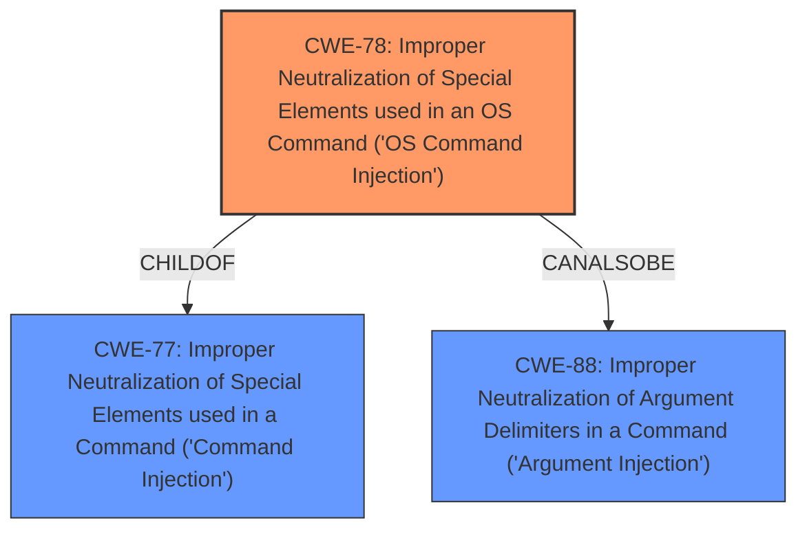

# Analysis Report for CVE-2022-35533

# Vulnerability Analysis Report: CVE-2022-35533

## Description


## Analysis (with Relationship Data)

# Summary
| CWE ID | CWE Name | Confidence | CWE Abstraction Level | CWE Vulnerability Mapping Label | CWE-Vulnerability Mapping Notes |
|---|---|---|---|---|---|
| CWE-78 | Improper Neutralization of Special Elements used in an OS Command ('OS Command Injection') | 1.0 | Base | Allowed | Primary CWE: The application constructs an OS command using external input without proper neutralization of special elements, leading to OS command injection. |
| CWE-77 | Improper Neutralization of Special Elements used in a Command ('Command Injection') | 0.7 | Class | Allowed-with-Review | Secondary Candidate: If the command injection is not specifically an OS command, this could be a more general command injection. |

## Evidence and Confidence

*   **Confidence Score:** 1.0
*   **Evidence Strength:** HIGH

## Relationship Analysis
The primary CWE is CWE-78, which is a base level CWE and a child of CWE-77. This relationship means that CWE-78 is a more specific type of CWE-77. CWE-78 can also be related to CWE-88 (Improper Neutralization of Argument Delimiters in a Command) when argument injection leads to OS command injection. The selection of CWE-78 is based on the explicit mention of command injection vulnerability due to lack of filtering.



## Vulnerability Chain
The vulnerability chain begins with the **lack of input filtering** on the `cli_list` and `cli_num` parameters. This leads to the **improper neutralization** of special elements in an OS command, resulting in **OS command injection**.

## Summary of Analysis
The vulnerability description clearly indicates that the root cause is the **lack of input filtering** on the `cli_list` and `cli_num` parameters in `qos.cgi`. This **lack of filtering** allows an attacker to inject arbitrary commands into the system via these parameters. The vulnerability description explicitly mentions "**command injection**" in the context of the affected page `/qos.shtml`.

Based on the evidence, the most appropriate CWE is CWE-78, "Improper Neutralization of Special Elements used in an OS Command ('OS Command Injection')". This CWE accurately describes the vulnerability where externally-influenced input is used to construct an OS command without proper neutralization, enabling attackers to modify the intended command.

CWE-77 "Improper Neutralization of Special Elements used in a Command ('Command Injection')" was also considered since it is a parent of CWE-78. However, since the context indicates the injection occurs in the context of an OS command, CWE-78 is a more precise selection.

Other CWEs considered but not used:

*   CWE-790: Improper Filtering of Special Elements - This is a class level CWE. The description is too general.
*   CWE-425: Direct Request ('Forced Browsing') - This is not applicable since the issue is not about bypassing authorization.
*   CWE-434: Unrestricted Upload of File with Dangerous Type - This is not related to file uploads.
*   CWE-134: Use of Externally-Controlled Format String - This is not a format string vulnerability.
*   CWE-73: External Control of File Name or Path - This is not related to file path manipulation.
*   CWE-116: Improper Encoding or Escaping of Output - This is not directly about output encoding.
*   CWE-138: Improper Neutralization of Special Elements - This is a class level CWE. The description is too general.
*   CWE-89: Improper Neutralization of Special Elements used in an SQL Command ('SQL Injection') - This is not related to SQL injection.

The selection of CWE-78 is at the optimal level of specificity because it accurately reflects the root cause and nature of the vulnerability.


## CWE Relationship Analysis

Current CWEs represent these abstraction levels: .


### Vulnerability Chain Analysis

**Chain starting from CWE-89:**
- 89 (Improper Neutralization of Special Elements used in an SQL Command ('SQL Injection')) - ROOT


**Chain starting from CWE-425:**
- 425 (Direct Request ('Forced Browsing')) - ROOT


### CWE Relationship Diagram

```mermaid
graph TD
    classDef primary fill:#f96,stroke:#333,stroke-width:2px
    classDef secondary fill:#69f,stroke:#333
    classDef tertiary fill:#9e9,stroke:#333
```


*Report generated on 2025-03-30 21:03:14*
