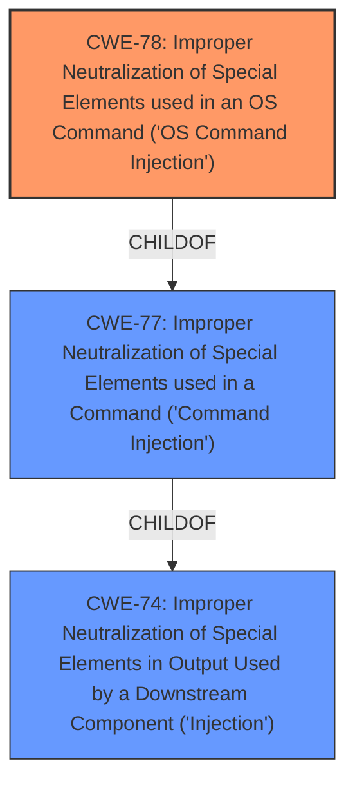

# Analysis Report for CVE-2022-35534

# Vulnerability Analysis Report: CVE-2022-35534

## Description


## Analysis (with Relationship Data)

# Summary
| CWE ID | CWE Name | Confidence | CWE Abstraction Level | CWE Vulnerability Mapping Label | CWE-Vulnerability Mapping Notes |
|---|---|---|---|---|---|
| CWE-78 | Improper Neutralization of Special Elements used in an OS Command ('OS Command Injection') | 1.0 | Base | Allowed | Primary CWE |

## Evidence and Confidence

*   **Confidence Score:** 1.0
*   **Evidence Strength:** HIGH

## Relationship Analysis
The primary relationship that influenced the selection of CWE-78 is its hierarchical relationship as a ChildOf CWE-77. While CWE-77 is broader, covering command injection in general, CWE-78 is specifically for OS command injection, which aligns perfectly with the vulnerability description. No chain relationships were significant for this specific case.



## Vulnerability Chain
The chain of events for this vulnerability is as follows:
1.  **Root Cause:** **Lack of filtering on parameter hiddenSSID32g and SSID2G2** in `wireless.cgi`.
2.  **Weakness:** This leads to **command injection**.
3.  **Impact:** Remote command execution on the router's operating system.

The vulnerability chain clearly shows the progression from the initial coding error (**no filtering**) to the exploitation technique (**command injection**) and the resulting security impact (**remote command execution**).

## Summary of Analysis
The initial assessment, based on the provided evidence, strongly points to CWE-78 as the most appropriate classification. The vulnerability description explicitly mentions **command injection**, and the CVE reference links confirm that the **root cause** is the **lack of input sanitization** which allows for the injection of OS commands. The "Vulnerability Description Key Phrases" also identifies **command injection** as the **weakness**.

The selection of CWE-78 is based on the following evidence:
*   "WAVLINK WN572HP3, WN533A8, WN530H4, WN535G3, WN531P3 wireless.cgi **has no filtering on parameter hiddenSSID32g and SSID2G2**, which leads to **command injection** in page /wifi_multi_ssid.shtml."
*   "**weakness:** **command injection**"
*   "**rootcause:** **has no filtering on parameter hiddenSSID32g and SSID2G2**"
*   "**Vulnerable Parameters:** `hiddenSSID32g` and `SSID2G2`"
*   "**Root Cause:** Lack of input sanitization on the `hiddenSSID32g` and `SSID2G2` parameters in `wireless.cgi`."
*   "**Impact:** Remote command execution on the router's operating system."

The retriever results also list CWE-78 as a highly relevant candidate. While some other CWEs like CWE-77 (Improper Neutralization of Special Elements used in a Command) were considered, CWE-78 provides a more specific classification as it explicitly refers to OS command injection.

The abstraction level of CWE-78 (Base) is optimal, as it directly represents the specific type of command injection occurring in this vulnerability.

Relevant CWE Information:
*   **CWE-78:** Improper Neutralization of Special Elements used in an OS Command ('OS Command Injection')
    *   **Description:** The product constructs all or part of an OS command using externally-influenced input from an upstream component, but it does not neutralize or incorrectly neutralizes special elements that could modify the intended OS command when it is sent to a downstream component.
    *   **Mapping Guidance:** Usage: Allowed. This CWE entry is at the Base level of abstraction, which is a preferred level of abstraction for mapping to the root causes of vulnerabilities.


## CWE Relationship Analysis

Current CWEs represent these abstraction levels: .


### Vulnerability Chain Analysis

**Chain starting from CWE-78:**
- 78 (Improper Neutralization of Special Elements used in an OS Command ('OS Command Injection')) - ROOT


**Chain starting from CWE-77:**
- 77 (Improper Neutralization of Special Elements used in a Command ('Command Injection')) - ROOT


### CWE Relationship Diagram

```mermaid
graph TD
    classDef primary fill:#f96,stroke:#333,stroke-width:2px
    classDef secondary fill:#69f,stroke:#333
    classDef tertiary fill:#9e9,stroke:#333
```


*Report generated on 2025-03-31 13:44:50*
