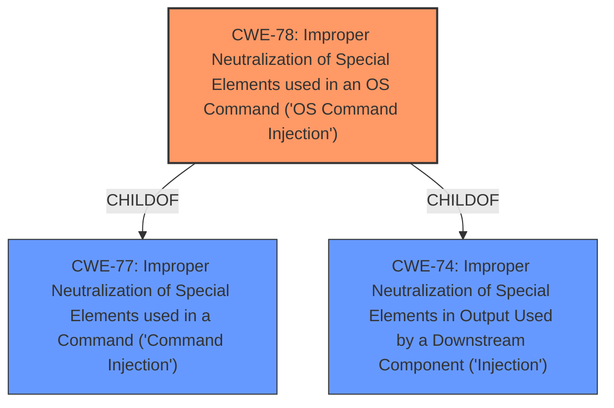

# Analysis for CVE-2022-35535

# Summary
| CWE ID | CWE Name | Confidence | CWE Abstraction Level | CWE Vulnerability Mapping Label | CWE-Vulnerability Mapping Notes |
|---|---|---|---|---|---|
| CWE-78 | Improper Neutralization of Special Elements used in an OS Command ('OS Command Injection') | 1.0 | Base | Allowed | Primary CWE |

## Evidence and Confidence

*   **Confidence Score:** 1.0
*   **Evidence Strength:** HIGH

## Relationship Analysis
The primary relationship influencing the decision is that CWE-78 [Improper Neutralization of Special Elements used in an OS Command ('OS Command Injection')] is a child of CWE-77 [Improper Neutralization of Special Elements used in a Command ('Command Injection')]. Given that the command injection occurs directly at the OS level, CWE-78 is the more specific and appropriate choice. The other relationships of CWE-78, such as CANFOLLOW to CWE-184, and CANALSOBE to CWE-88, do not directly apply to this specific vulnerability description.

## Vulnerability Chain
The vulnerability chain starts with the **lack of filtering on the `macAddr` parameter**, which allows an attacker to inject special elements into the command. This leads directly to **command injection**, allowing the attacker to execute arbitrary OS commands.

## Summary of Analysis
The analysis is based on the provided vulnerability description and the summary of CVE reference links. The vulnerability description explicitly states "**no filtering on parameter macAddr**, which leads to **command injection** in page /wifi_mesh.shtml." The CVE Reference Links Content Summary confirms this, stating that the root cause is the "lack of proper input sanitization" and the primary vulnerability is "Command Injection."

The retriever results strongly suggest CWE-77 and CWE-78. Given that the vulnerability leads to the execution of OS commands, CWE-78 [Improper Neutralization of Special Elements used in an OS Command ('OS Command Injection')] is the most specific and appropriate choice. While CWE-77 [Improper Neutralization of Special Elements used in a Command ('Command Injection')] could also be considered, it is a more general case of command injection.

The selection of CWE-78 is at the optimal level of specificity because it directly reflects the root cause and the resulting impact of the vulnerability, which is the ability to execute arbitrary OS commands.