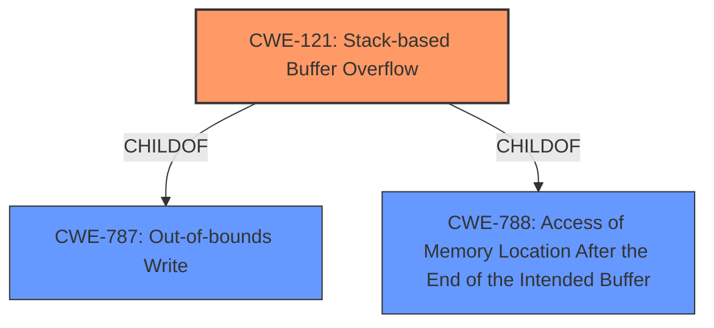

# Analysis for CVE-2022-35560

# Summary
| CWE ID  | CWE Name                       | Confidence | CWE Abstraction Level | CWE Vulnerability Mapping Label | CWE-Vulnerability Mapping Notes |
| :------- | :----------------------------- | :--------- | :-------------------- | :------------------------------ | :------------------------------ |
| CWE-121 | Stack-based Buffer Overflow      | 1.0       | Variant               | Primary CWE                       | Allowed                       |

## Evidence and Confidence

*   **Confidence Score:** 1.0
*   **Evidence Strength:** HIGH

## Relationship Analysis
The primary CWE identified is CWE-121 (Stack-based Buffer Overflow), which is a variant of CWE-788 (Access of Memory Location After the End of the Intended Buffer) and CWE-787 (Out-of-bounds Write). The vulnerability description explicitly mentions a "stack overflow" vulnerability, making CWE-121 the most specific and appropriate choice. Other CWEs such as CWE-190 (Integer Overflow or Wraparound) and CWE-1284 (Improper Validation of Specified Quantity in Input) were considered but deemed less relevant as the root cause is clearly a buffer overflow on the stack, not an integer handling issue or input validation problem. The relationship of CWE-121 being a child of CWE-787 and CWE-788 confirms its specificity to out-of-bounds writes.

## Vulnerability Chain
The vulnerability chain starts with the **stack overflow** due to the **lack of proper bounds checking** on the `index` parameter. This allows an attacker to overwrite memory on the stack, leading to a denial-of-service (DoS) condition. The chain is as follows:

1.  **Improper bounds checking** (implicit)
2.  **Stack overflow** (CWE-121)
3.  **Denial of Service** (Impact)

## Summary of Analysis
The analysis is based on the provided evidence, which explicitly states that a **stack overflow** vulnerability exists in the `/goform/wifiSSIDset` endpoint of the Tenda W6 router due to the **lack of proper bounds checking** on the `index` parameter. The CVE Reference Links Content Summary confirms that the vulnerability allows an attacker to write beyond the allocated buffer on the stack, leading to a denial-of-service (DoS) condition.

The selection of CWE-121 is justified by the direct match with the vulnerability description and the CWE's specification, which defines it as a buffer overflow condition where the buffer being overwritten is allocated on the stack. The MITRE mapping guidance allows the use of CWE-121 as it is at the Variant level of abstraction.

CWE-190 (Integer Overflow or Wraparound) and CWE-1284 (Improper Validation of Specified Quantity in Input) were considered but not selected because the vulnerability's root cause is directly related to a buffer overflow on the stack, not an integer handling issue or a lack of input validation for a quantity. While CWE-1284 could be considered a contributing factor (improper validation leading to the overflow), the primary issue is the overflow itself.

The selected CWE is at the optimal level of specificity as it directly describes the type of buffer overflow (stack-based) and aligns with the vulnerability's root cause and impact.

Relevant CWE Information:
- CWE-121: Stack-based Buffer Overflow
  - "A stack-based buffer overflow condition is a condition where the buffer being overwritten is allocated on the stack (i.e., is a local variable or, rarely, a parameter to a function)."