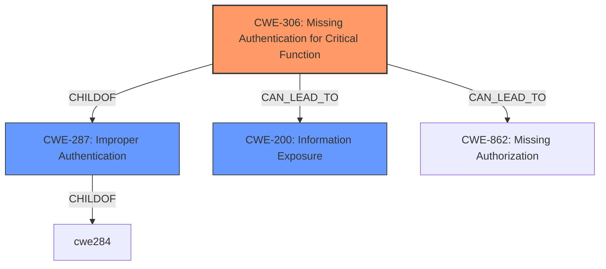

# Analysis Report for CVE-2022-35572

# Vulnerability Analysis Report: CVE-2022-35572

## Description


## Analysis (with Relationship Data)

# Summary
| CWE ID    | CWE Name                                                      | Confidence | CWE Abstraction Level | CWE Vulnerability Mapping Label | CWE-Vulnerability Mapping Notes |
| :-------- | :------------------------------------------------------------ | :--------- | :---------------------- | :------------------------------ | :------------------------------ |
| CWE-306   | Missing Authentication for Critical Function                  | 1          | Base                    | Primary                         | Allowed                       |
| CWE-200   | Information Exposure                                          | 0.7        | Class                   | Secondary                       | Allowed                       |

## Evidence and Confidence

*   **Confidence Score:** 0.9
*   **Evidence Strength:** HIGH

## Relationship Analysis
The primary relationship that influenced the selection was the parent-child relationship between CWE-287 (Improper Authentication) and CWE-306 (Missing Authentication for Critical Function). Since the vulnerability explicitly describes a complete lack of authentication for a critical function, CWE-306 was chosen for its greater specificity. The other considered CWEs, such as CWE-425 (Direct Request) and CWE-22 (Path Traversal), were not as directly relevant as they describe related but distinct weaknesses.



## Vulnerability Chain
The vulnerability chain starts with the **missing authentication (CWE-306)** for the `/SysInfo.htm` URI. This **allows direct access** to the page, leading to **information exposure (CWE-200)** of sensitive data such as WPA passwords, SSIDs, and other device information.

## Summary of Analysis
The analysis is strongly based on the provided evidence, especially the "CVE Reference Links Content Summary." The key phrase "This web page calls a show_sysinfo function which retrieves WPA passwords, SSIDs, MAC Addresses, serial numbers, WPS Pins, and hardware/firmware versions, and prints this information into the web page. This web page is visible when remote management is enabled" directly supports the selection of CWE-306 as the **root cause**: a critical function lacks authentication.

The graph relationships highlight that CWE-306 is a specific type of authentication issue (child of CWE-287) and can lead to other weaknesses, such as information exposure.

The selected CWEs are at the optimal level of specificity because CWE-306 accurately captures the **lack of any authentication** for a critical function, while CWE-200 describes the resulting **information exposure**. More general CWEs like CWE-287 (Improper Authentication) or CWE-20 (Improper Input Validation) would not be as precise.

Relevant CWE Information:

# Enhanced Context (25 CWEs)
The following CWEs were identified as potentially relevant to this vulnerability:

## CWE-807: Reliance on Untrusted Inputs in a Security Decision
**Abstraction Level**: Base
**Similarity Score**: 0.79

## CWE-1289: Improper Validation of Unsafe Equivalence in Input
**Abstraction Level**: Base
**Similarity Score**: 0.77

## CWE-303: Incorrect Implementation of Authentication Algorithm
**Abstraction Level**: Base
**Similarity Score**: 0.77

## CWE-472: External Control of Assumed-Immutable Web Parameter
**Abstraction Level**: Base
**Similarity Score**: 0.77

## CWE-274: Improper Handling of Insufficient Privileges
**Abstraction Level**: Base
**Similarity Score**: 0.77

## CWE-41: Improper Resolution of Path Equivalence
**Abstraction Level**: Base
**Similarity Score**: 0.77

## CWE-280: Improper Handling of Insufficient Permissions or Privileges
**Abstraction Level**: Base
**Similarity Score**: 0.76

## CWE-639: Authorization Bypass Through User-Controlled Key
**Abstraction Level**: Base
**Similarity Score**: 0.76

## CWE-345: Insufficient Verification of Data Authenticity
**Abstraction Level**: Class
**Similarity Score**: 0.76

## CWE-668: Exposure of Resource to Wrong Sphere
**Abstraction Level**: Class
**Similarity Score**: 0.76

## CWE-287: Improper Authentication
**Abstraction Level**: Class
**Similarity Score**: 7407.07

## CWE-863: Incorrect Authorization
**Abstraction Level**: Class
**Similarity Score**: 7403.46

## CWE-22: Improper Limitation of a Pathname to a Restricted Directory ('Path Traversal')
**Abstraction Level**: Base
**Similarity Score**: 7390.43

## CWE-306: Missing Authentication for Critical Function
**Abstraction Level**: Base
**Similarity Score**: 7370.37

## CWE-923: Improper Restriction of Communication Channel to Intended Endpoints
**Abstraction Level**: Class
**Similarity Score**: 7350.76

## CWE-78: Improper Neutralization of Special Elements used in an OS Command ('OS Command Injection')
**Abstraction Level**: base
**Similarity Score**: 4.59

## CWE-98: Improper Control of Filename for Include/Require Statement in PHP Program ('PHP Remote File Inclusion')
**Abstraction Level**: variant
**Similarity Score**: 4.40

## CWE-22: Improper Limitation of a Pathname to a Restricted Directory ('Path Traversal')
**Abstraction Level**: base
**Similarity Score**: 4.33

## CWE-471: Modification of Assumed-Immutable Data (MAID)
**Abstraction Level**: base
**Similarity Score**: 4.33

## CWE-73: External Control of File Name or Path
**Abstraction Level**: base
**Similarity Score**: 4.33

## CWE-190: Integer Overflow or Wraparound
**Abstraction Level**: base
**Similarity Score**: 4.33

## CWE-770: Allocation of Resources Without Limits or Throttling
**Abstraction Level**: base
**Similarity Score**: 4.33

## CWE-426: Untrusted Search Path
**Abstraction Level**: base
**Similarity Score**: 3.64

## CWE-88: Improper Neutralization of Argument Delimiters in a Command ('Argument Injection')
**Abstraction Level**: base
**Similarity Score**: 3.64

## CWE-843: Access of Resource Using Incompatible Type ('Type Confusion')
**Abstraction Level**: base
**Similarity Score**: 3.44

### CWE-306: Missing Authentication for Critical Function
*   **How the Vulnerability Matches:** The vulnerability description clearly states that the `/SysInfo.htm` URI "does not require a session ID," meaning there is **no authentication** required to access it. This perfectly aligns with the description of CWE-306: "The product does not perform any authentication for functionality that requires a provable user identity."
*   **Security Implications:** This allows any user with access to the web interface to retrieve sensitive information, potentially leading to unauthorized network access, device tracking, and administrator access.
*   **Relationships:** CWE-306 is a child of CWE-287 (Improper Authentication), providing a more specific classification.
*   **MITRE Mapping Guidance:** The mapping guidance for CWE-306 recommends its use when the product lacks authentication for a critical function, which is precisely the case here.
*   **Confidence:** 1

### CWE-200: Information Exposure
*   **How the Vulnerability Matches:** Because of the **lack of authentication**, the application **discloses sensitive information** such as WPA passwords and SSIDs. This matches the general description of CWE-200.
*   **Security Implications:** This allows attackers to gain unauthorized access to the network and potentially other resources.
*   **Relationships:** This is a consequence of the missing authentication (CWE-306).
*   **MITRE Mapping Guidance:** N/A
*   **Confidence:** 0.7

### CWEs Considered but Not Used:

*   **CWE-287 Improper Authentication:** While related, CWE-287 is a broader category. CWE-306 is more specific because it indicates a complete lack of authentication, not just an improperly implemented one. The mapping guidance for CWE-287 suggests considering its children, including CWE-306.


## CWE Relationship Analysis

Current CWEs represent these abstraction levels: .


### Vulnerability Chain Analysis

**Chain starting from CWE-41:**
- 41 (Improper Resolution of Path Equivalence) - ROOT


**Chain starting from CWE-807:**
- 807 (Reliance on Untrusted Inputs in a Security Decision) - ROOT


### CWE Relationship Diagram

```mermaid
graph TD
    classDef primary fill:#f96,stroke:#333,stroke-width:2px
    classDef secondary fill:#69f,stroke:#333
    classDef tertiary fill:#9e9,stroke:#333
```


*Report generated on 2025-03-30 14:00:20*
