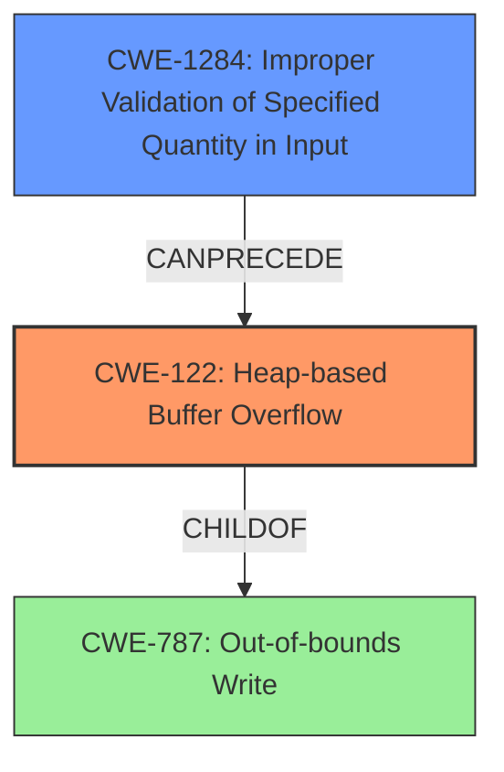

# Analysis Report for CVE-2022-35623

# Vulnerability Analysis Report: CVE-2022-35623

## Description


## Analysis (with Relationship Data)

# Summary
| CWE ID | CWE Name | Confidence | CWE Abstraction Level | CWE Vulnerability Mapping Label | CWE-Vulnerability Mapping Notes |
|---|---|---|---|---|---|
| CWE-122 | Heap-based Buffer Overflow | 0.9 | Variant | Primary | Allowed |
| CWE-1284 | Improper Validation of Specified Quantity in Input | 0.7 | Base | Secondary | Allowed |

## Evidence and Confidence

*   **Confidence Score:** 0.8
*   **Evidence Strength:** HIGH

## Relationship Analysis
The primary weakness is a Heap-based Buffer Overflow (CWE-122), which is a variant of a more general buffer overflow. This is often caused by not validating input sizes (CWE-1284) before allocating memory. The relationship between CWE-1284 and CWE-122 is that **improper validation** can **precede** a buffer overflow. This structure highlights the root cause (lack of validation) leading to a specific consequence (heap overflow).



## Vulnerability Chain
The vulnerability chain starts with **improper validation** of input, leading to an excessive memory allocation and a subsequent **heap overflow**, which can lead to remote code execution or denial of service.
  - CWE-1284: Improper Validation of Specified Quantity in Input (Root Cause)
  - CWE-122: Heap-based Buffer Overflow (Consequence)

## Summary of Analysis
The initial assessment identified several potential CWEs, including integer overflows, buffer over-reads, and improper length handling. However, the core issue is a **heap overflow**, which is directly stated in the vulnerability description. The **root cause** appears to be related to how the software handles the size of reassembled packets, suggesting a possible **improper validation** of input size leading to the overflow.

The evidence supporting CWE-122 is strong, as the vulnerability description explicitly mentions a **heap overflow**. The CVE Reference Links Content Summary also confirms this, stating "Heap overflow during the reassembly of transport layer packets" and "fails to adequately validate the combined size of incoming segments, leading to a buffer overflow on the heap."

The relationship graph highlights how CWE-1284 (Improper Validation of Specified Quantity in Input) can precede CWE-122 (Heap-based Buffer Overflow). This makes CWE-1284 a strong secondary candidate, as the **lack of proper input validation** likely causes the **heap overflow**.

The decision to prioritize CWE-122 is based on the direct evidence of a **heap overflow**. The selection of CWE-1284 as a secondary CWE is based on the likely cause of the overflow: **improper validation** of input size during reassembly. Both CWEs are at appropriate levels of specificity, with CWE-122 being a Variant and CWE-1284 being a Base.

Relevant CWE Information:

## Vulnerability Description
In Nordic nRF5 SDK for Mesh 5.0, a **heap overflow** vulnerability can be triggered by sending a series of segmented control packets and access packets with the same SeqAuth

### Vulnerability Description Key Phrases
- **weakness:** **heap overflow**
- **vector:** series of segmented control packets and access packets with the same SeqAuth
- **product:** Nordic nRF5 SDK for Mesh
- **version:** 5.0

## CVE Reference Links Content Summary
Based on the provided content, here's an analysis:

**Relates to CVE-2022-35623?**

Yes, the title of the document mentions "Nordic Bluetooth Mesh SDK transport reassemble-heap overflow", which strongly suggests this document is related to CVE-2022-35623, since it refers to a heap overflow within the Nordic Bluetooth Mesh SDK, which is the official description of the CVE.

**Vulnerability Details:**

*   **Root Cause:** Heap overflow during the reassembly of transport layer packets in the Nordic Bluetooth Mesh SDK.
*   **Weaknesses:** The vulnerability stems from **improper handling of memory allocation** when reassembling transport layer packets. Specifically, the process of reassembling packets into larger messages likely **fails to adequately validate the combined size** of incoming segments, leading to a buffer overflow on the heap.
*   **Impact:** A heap overflow can lead to memory corruption, potentially allowing attackers to overwrite data structures used by the application or execute arbitrary code. This could cause a crash or denial of service, or in more severe scenarios allow for remote code execution (RCE).
*   **Attack Vectors:** An attacker could exploit this vulnerability by sending a sequence of crafted Bluetooth Mesh packets designed to trigger the heap overflow in the reassembly buffer.
*   **Required Attacker Capabilities/Position:** The attacker needs to be within Bluetooth range of the vulnerable device and have the ability to send malicious Mesh packets. This generally implies physical proximity unless a relaying mechanism is involved.

**Additional Notes:**

*   The document itself is not fully accessible since the JavaScript was disabled. However, the title provides the relevant information.
*   The term "transport reassemble" indicates that the vulnerability lies in the reassembly process of segmented mesh messages.

In summary, the document points to a heap overflow vulnerability in the Nordic Bluetooth Mesh SDK related to reassembling mesh transport packets, which is described by CVE-2022-35623. The overflow could lead to a denial of service or potentially remote code execution.


## CWE Relationship Analysis

Current CWEs represent these abstraction levels: .


### Vulnerability Chain Analysis

**Chain starting from CWE-1284:**
- 1284 (Improper Validation of Specified Quantity in Input) - ROOT


**Chain starting from CWE-787:**
- 787 (Out-of-bounds Write) - ROOT


### CWE Relationship Diagram

```mermaid
graph TD
    classDef primary fill:#f96,stroke:#333,stroke-width:2px
    classDef secondary fill:#69f,stroke:#333
    classDef tertiary fill:#9e9,stroke:#333
```


*Report generated on 2025-03-31 01:00:47*
