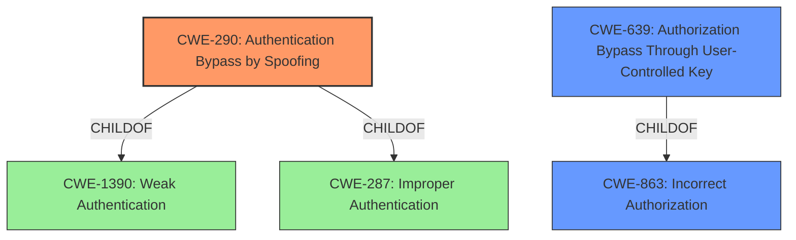

# Raw Analyzer Response for CVE-2022-35629

# Summary
| CWE ID  | CWE Name                                                                 | Confidence | CWE Abstraction Level | CWE Vulnerability Mapping Label | CWE-Vulnerability Mapping Notes |
| :-------- | :----------------------------------------------------------------------- | :--------- | :---------------------- | :------------------------------ | :------------------------------ |
| CWE-290 | Authentication Bypass by Spoofing                                          | 0.85       | Base                    | Primary                          | Allowed                       |
| CWE-639 | Authorization Bypass Through User-Controlled Key                                       | 0.70       | Base                    | Secondary                       | Allowed                       |
| CWE-863 | Incorrect Authorization                                                          | 0.60       | Class                   | Secondary                       | Allowed-with-Review           |

## Evidence and Confidence

*   **Confidence Score:** 0.80
*   **Evidence Strength:** HIGH

## Relationship Analysis
The primary CWE selected is CWE-290 (Authentication Bypass by Spoofing), a Base-level CWE. This is related to CWE-1390 (Weak Authentication) and CWE-287 (Improper Authentication) through ChildOf relationships. The vulnerability involves a client spoofing another client's ID, aligning well with CWE-290. The secondary CWEs are CWE-639 (Authorization Bypass Through User-Controlled Key) and CWE-863 (Incorrect Authorization). CWE-639 is a ChildOf CWE-863.

## Vulnerability Chain
The chain of events starts with **improper input validation**, leading to the ability of one client to spoof another client's ID. This culminates in a potential authorization bypass where the malicious client can send messages as if they were the legitimate client.

## Summary of Analysis
The initial assessment identified that the **weakness** stems from **improper input validation** as highlighted in the "Vulnerability Description Key Phrases". The "CVE Reference Links Content Summary" further supports this by stating that the **weakness** is due to "Inadequate validation of the source of messages, allowing a client to spoof another client's ID."

CWE-290 (Authentication Bypass by Spoofing) is the best fit because the vulnerability allows a client to send messages to the server claiming to be from another client ID. This aligns directly with the description of CWE-290: "This attack-focused weakness is caused by incorrectly implemented authentication schemes that are subject to spoofing attacks." This also corresponds to the vulnerability description where "it was possible for one client, already registered with their own client ID, to send messages to the server claiming to come from another client ID."

CWE-639 (Authorization Bypass Through User-Controlled Key) is a secondary candidate because the client ID can be seen as a key value that identifies the data, where an attacker can modify the key value to gain access to another user's data.

CWE-863 (Incorrect Authorization) is another secondary candidate due to the authorization check not being performed correctly, allowing one client to impersonate another.

The selected CWEs are at the optimal level of specificity, with CWE-290 at the Base level.