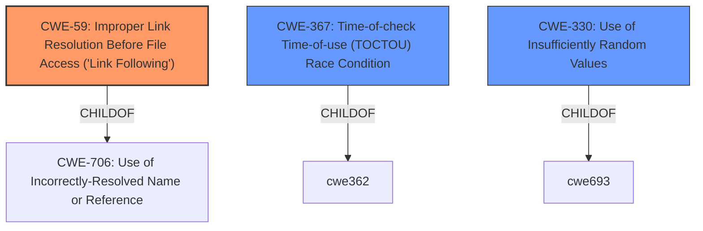

# Raw Analyzer Response for CVE-2022-35631

# Summary
| CWE ID | CWE Name | Confidence | CWE Abstraction Level | CWE Vulnerability Mapping Label | CWE-Vulnerability Mapping Notes |
|---|---|---|---|---|---|
| CWE-59 | Improper Link Resolution Before File Access ('Link Following') | 0.9 | Base | Allowed | Primary CWE |
| CWE-367 | Time-of-check Time-of-use (TOCTOU) Race Condition | 0.7 | Base | Allowed | Secondary Candidate |
| CWE-330 | Use of Insufficiently Random Values | 0.5 | Class | Discouraged | Secondary Candidate |

## Evidence and Confidence

*   **Confidence Score:** 0.8
*   **Evidence Strength:** HIGH

## Relationship Analysis
The primary CWE is CWE-59, which relates to improper link resolution. It has a hierarchical relationship with CWE-706 as a child. CWE-367 (TOCTOU) is related, reflecting the race condition aspect of symlink attacks. The choice of CWE-59 is influenced by its direct match to the symlink attack described. CWE-330 is a more general weakness and is not as directly relevant as CWE-59, but it is related to the **predictable filename**.

## Vulnerability Chain
The vulnerability chain starts with a **predictable filename**, which enables a symlink attack due to **improper link resolution**. This leads to a file overwrite.

Predictable Filename -> Improper Link Resolution (CWE-59) -> File Overwrite

## Summary of Analysis
The initial assessment identified CWE-59 as the primary weakness, supported by the vulnerability description detailing a symlink attack enabled by a **predictable filename**. The analysis considered the relationship of CWE-59 with other CWEs, particularly its parent, CWE-706, and related issues like CWE-367 (TOCTOU). The evidence from the CVE Reference Links Content Summary strongly supports the selection of CWE-59. The decision to use CWE-59 is also influenced by its Base level abstraction, per MITRE guidance.

The vulnerability description explicitly mentions a symlink attack. The "CVE Reference Links Content Summary" mentions:

*   "The Velociraptor client uses a local buffer file to store data temporarily. The filename is **predictable** and stored in the client's configuration file."
*   "On MacOS and Linux, an attacker can exploit a symlink race condition due to the predictable filename."
*   "An attacker can replace the **predictable** buffer file with a symlink to another file, causing the Velociraptor client to overwrite the target file."

The graph relationships influenced the decision by showing the connections between file handling issues and race conditions. CWE-59 is chosen because it represents the core issue of the program not properly handling symbolic links. The selected CWEs are at the optimal level of specificity, with CWE-59 being a Base level CWE.

Relevant CWE Information:

# Enhanced Context (25 CWEs)

## CWE-59: Improper Link Resolution Before File Access ('Link Following')
**Abstraction Level**: Base
**Similarity Score**: 0.81
**Source**: dense

**Description**:
The product attempts to access a file based on the filename, but it does not properly prevent that filename from identifying a link or shortcut that resolves to an unintended resource.

**Mapping Guidance**:
- Usage: Allowed
- Rationale: This CWE entry is at the Base level of abstraction, which is a preferred level of abstraction for mapping to the root causes of vulnerabilities.
**Technical Explanation**: The application does not sufficiently validate or sanitize file paths, allowing an attacker to redirect file operations to unintended locations by creating symbolic links. This can lead to arbitrary file overwrites or information disclosure.

## CWE-367: Time-of-check Time-of-use (TOCTOU) Race Condition
**Abstraction Level**: Base
**Similarity Score**: 0.76
**Source**: dense

**Description**:
The product checks the state of a resource before using that resource, but the resource's state can change between the check and the use in a way that invalidates the results of the check. This can cause the product to perform invalid actions when the resource is in an unexpected state.

**Mapping Guidance**:
- Usage: Allowed
- Rationale: This CWE entry is at the Base level of abstraction, which is a preferred level of abstraction for mapping to the root causes of vulnerabilities.
**Technical Explanation**: This vulnerability involves a race condition where an attacker can modify the filesystem between the time the application checks for a file's existence or attributes and the time it actually uses the file. This can be exploited using symbolic links to redirect file operations to unintended locations.

## CWE-330: Use of Insufficiently Random Values
**Abstraction Level**: Class
**Similarity Score**: 0.76
**Source**: dense

**Description**:
The product uses insufficiently random numbers or values in a security context that depends on unpredictable numbers.

**Mapping Guidance**:
- Usage: Discouraged
- Rationale: This CWE entry is a level-1 Class (i.e., a child of a Pillar). It might have lower-level children that would be more appropriate
**Technical Explanation**: The use of a **predictable filename** makes it easier for an attacker to predict the location of the temporary file and create a symbolic link to exploit the vulnerability.

## Other CWEs Considered and Rejected:
*   CWE-61: UNIX Symbolic Link (Symlink) Following - This is a Compound weakness. CWE-59 is more appropriate at the Base level.
*   CWE-62: UNIX Hard Link, CWE-65: Windows Hard Link - These are specific to hard links, but the vulnerability description focuses on symlinks.
*   CWE-73: External Control of File Name or Path - While there's a **predictable file name**, there isn't external control, so it's not as relevant.
*   CWE-377: Insecure Temporary File - Too general. The symlink issue is more specific.
*   CWE-379: Creation of Temporary File in Directory with Insecure Permissions, CWE-378: Creation of Temporary File With Insecure Permissions - While related to temporary files, the core issue is the improper handling of symlinks, making CWE-59 a better fit.