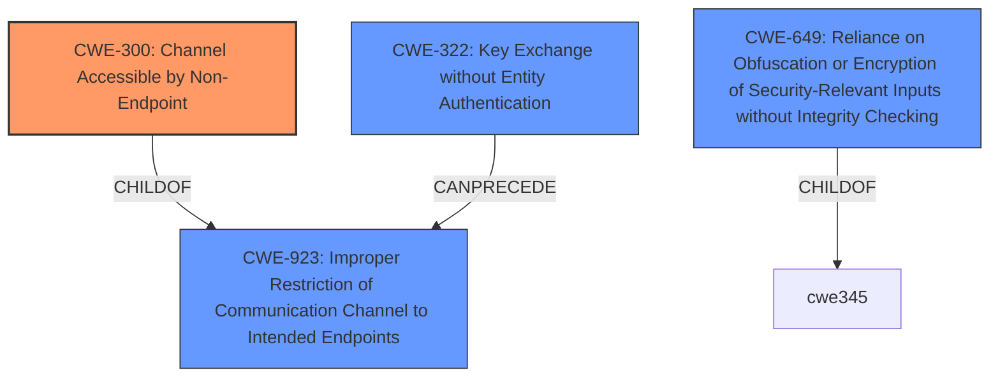

# Enhanced Analysis for CVE-2022-35646

# Summary
| CWE ID | CWE Name | Confidence | CWE Abstraction Level | CWE Vulnerability Mapping Label | CWE-Vulnerability Mapping Notes |
|---|---|---|---|---|---|
| CWE-300 | Channel Accessible by Non-Endpoint | 0.8 | Class | Allowed-with-Review | Primary CWE |
| CWE-322 | Key Exchange without Entity Authentication | 0.6 | Base | Allowed | Secondary Candidate |
| CWE-649 | Reliance on Obfuscation or Encryption of Security-Relevant Inputs without Integrity Checking | 0.5 | Base | Allowed | Secondary Candidate |

## Evidence and Confidence

*   **Confidence Score:** 0.8
*   **Evidence Strength:** MEDIUM

## Relationship Analysis
The primary relationship considered was that CWE-300 **Channel Accessible by Non-Endpoint** is a child of CWE-923 **Improper Restriction of Communication Channel to Intended Endpoints**. This indicates that the vulnerability involves a failure to properly restrict access to the communication channel, enabling a man-in-the-middle attack.
The decision to classify CWE-300 as the primary weakness is due to its specific focus on channel accessibility issues, aligning with the man-in-the-middle attack vector described in the vulnerability. Other relationships such as those of CWE-322 and CWE-649, represent potential contributing factors but are less directly tied to the core issue of unauthorized channel access.



## Vulnerability Chain
The vulnerability chain starts with the **IMPROPER** access control, leading to a man-in-the-middle attack. This allows an authenticated user to modify or cancel other users' access requests.

## Summary of Analysis
The initial analysis considered multiple CWEs, but the final decision was driven by the evidence of a man-in-the-middle attack vector, explicitly mentioned in the vulnerability description.

The vulnerability description states: "IBM Security Verify Governance, Identity Manager 10.0.1 software component could allow an authenticated user to modify or cancel any other users access request using man-in-the-middle techniques."
This points to the root cause being a failure to adequately secure the communication channel, allowing an attacker to intercept and manipulate requests.

CWE-300 **Channel Accessible by Non-Endpoint** directly addresses this scenario, as it describes a situation where the product does not adequately verify the identity of actors at both ends of a communication channel, or does not adequately ensure the integrity of the channel, allowing unauthorized access.

The selection of CWE-300 is also supported by the "CVE Reference Links Content Summary," which highlights "Improper access control or privilege management, allowing unauthorized modification of access requests."

CWE-322 **Key Exchange without Entity Authentication** was considered, which involves performing a key exchange without verifying the identity of the actor. This can lead to an attacker impersonating an actor by modifying traffic between two entities. The reason this wasn't chosen as primary is because the core issue is about channel accessibility, not directly key exchange, although it can be a contributing factor.

CWE-649 **Reliance on Obfuscation or Encryption of Security-Relevant Inputs without Integrity Checking** was also considered. This is relevant as the vulnerability involves modification of access requests, suggesting a lack of integrity checking on the requests. It was not selected as a primary because it assumes the existence of obfuscation or encryption, which is not explicitly stated in the description, making CWE-300 a more direct fit.

The decision to use CWE-300 is further influenced by the mapping guidance, which, while discouraging its general use, acknowledges that it can be appropriate if the prerequisites for exploitation involve an adversary in a privileged "in-the-middle" position, which matches the vulnerability.

The confidence score of 0.8 reflects a strong, but not absolute, certainty.


## CWE Relationship Analysis

Current CWEs represent these abstraction levels: .


### Vulnerability Chain Analysis

**Chain starting from CWE-923:**
- 923 (Improper Restriction of Communication Channel to Intended Endpoints) - ROOT


**Chain starting from CWE-300:**
- 300 (Channel Accessible by Non-Endpoint) - ROOT


### CWE Relationship Diagram

```mermaid
graph TD
    classDef primary fill:#f96,stroke:#333,stroke-width:2px
    classDef secondary fill:#69f,stroke:#333
    classDef tertiary fill:#9e9,stroke:#333
```