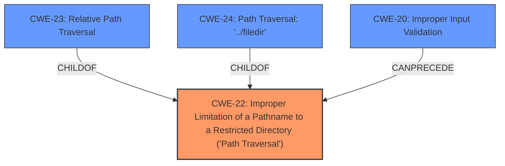

# Raw Analyzer Response for CVE-2022-35650

# Summary
| CWE ID | CWE Name | Confidence | CWE Abstraction Level | CWE Vulnerability Mapping Label | CWE-Vulnerability Mapping Notes |
|---|---|---|---|---|---|
| CWE-22 | Improper Limitation of a Pathname to a Restricted Directory ('Path Traversal') | 1 | Base | Primary | Allowed |
| CWE-23 | Relative Path Traversal | 0.9 | Base | Secondary | Allowed |
| CWE-24 | Path Traversal: '../filedir' | 0.8 | Variant | Secondary | Allowed |
| CWE-20 | Improper Input Validation | 0.6 | Class | Secondary | Discouraged |

## Evidence and Confidence

*   **Confidence Score:** 0.9
*   **Evidence Strength:** HIGH

## Relationship Analysis
The primary CWE is CWE-22, which represents the **improper limitation of a pathname to a restricted directory**. CWE-23 and CWE-24 are child CWEs of CWE-22, representing specific types of path traversal. CWE-23 focuses on relative path traversal, while CWE-24 specifies the "../filedir" variant. CWE-20 is a more general weakness related to **improper input validation**, which can be a contributing factor to path traversal vulnerabilities. The abstraction levels influenced the selection, prioritizing the more specific Base CWE-22.

## Vulnerability Chain
The chain of events is as follows:
1.  **Improper Input Validation** (CWE-20) when importing lesson questions.
2.  **Improper Limitation of a Pathname to a Restricted Directory ('Path Traversal')** (CWE-22) due to the lack of proper neutralization of special elements in the pathname.
3.  **Arbitrary File Read** (Impact) - The attacker can read arbitrary files on the server.

## Summary of Analysis
The initial analysis focused on identifying the root cause and the specific type of vulnerability. The key phrase "**input validation error**" and the description of directory traversal attacks strongly suggested a path traversal vulnerability. The Retriever Results confirmed this, with CWE-22 being the top candidate.

The decision to select CWE-22 as the primary CWE is based on the following evidence:

*   The vulnerability description mentions "**input validation error** when importing lesson questions," indicating a failure to properly validate the input.
*   The CVE Reference Links Content Summary explicitly states "**Insufficient path checks** when importing lesson questions within Moodle. This lack of proper validation allows for directory traversal."
*   The impact is described as "**Arbitrary File Read**," which aligns with the consequences of a successful path traversal attack.

The relationship analysis further supports this decision. CWE-23 (Relative Path Traversal) and CWE-24 (Path Traversal: '../filedir') are child CWEs of CWE-22, representing more specific types of path traversal. While these could be considered, CWE-22 is more appropriate as it captures the general **improper limitation of a pathname**, which encompasses both relative and absolute path traversal.

CWE-20 (Improper Input Validation) is included as a secondary CWE because it represents the underlying cause of the vulnerability. The **lack of proper input validation** allows the path traversal to occur. However, CWE-22 is more specific and accurately describes the nature of the vulnerability.

The selected CWEs are at the optimal level of specificity. CWE-22 is a Base CWE, which is the preferred level of abstraction for mapping to the root causes of vulnerabilities. CWE-23 and CWE-24, as variants, are more specific but not necessarily applicable in all cases of this vulnerability. CWE-20 is a Class CWE and is too general to be the primary mapping.