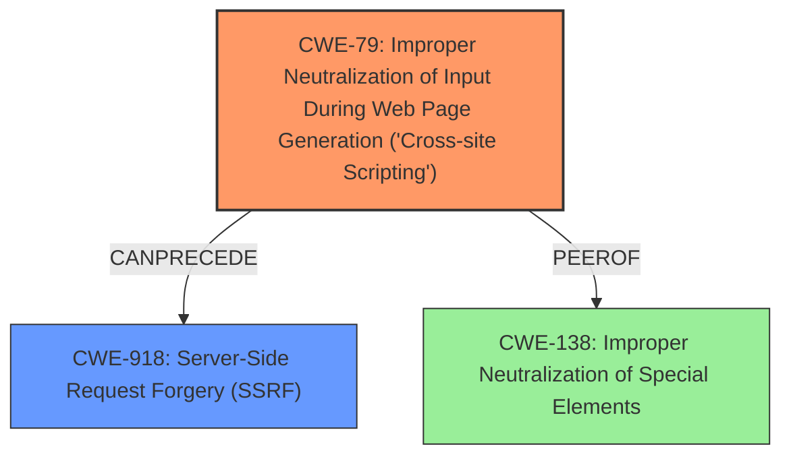

# Analysis for CVE-2022-35651

# Summary
| CWE ID | CWE Name | Confidence | CWE Abstraction Level | CWE Vulnerability Mapping Label | CWE-Vulnerability Mapping Notes |
|---|---|---|---|---|---|
| CWE-79 | Improper Neutralization of Input During Web Page Generation ('Cross-site Scripting') | 0.9 | Base | Primary | Allowed |
| CWE-918 | Server-Side Request Forgery (SSRF) | 0.7 | Base | Secondary | Allowed |

## Evidence and Confidence

*   **Confidence Score:** 0.8
*   **Evidence Strength:** HIGH

## Relationship Analysis
The primary weakness is **CWE-79 [Improper Neutralization of Input During Web Page Generation ('Cross-site Scripting')]**, which occurs due to **insufficient sanitization**. This can **precede** other weaknesses. **CWE-918 [Server-Side Request Forgery (SSRF)]** is a secondary weakness that could also stem from **insufficient sanitization**. Both CWEs are at the Base level, offering appropriate specificity.

## Vulnerability Chain
The vulnerability chain starts with **insufficient sanitization** of user-supplied data. This leads to:
1.  **CWE-79 [Improper Neutralization of Input During Web Page Generation ('Cross-site Scripting')]**: A remote attacker can inject arbitrary HTML and script code.
2.  **CWE-918 [Server-Side Request Forgery (SSRF)]**: The application may make unintended requests to other servers.

## Summary of Analysis
The analysis is based on the provided vulnerability description, which explicitly mentions **insufficient sanitization** as the root cause, leading to both stored XSS and blind SSRF.

The description states: "A stored XSS and blind SSRF vulnerability was found in Moodle, occurs due to **insufficient sanitization** of user-supplied data in the SCORM track details. A remote attacker can trick the victim to follow a specially crafted link and execute arbitrary HTML and script code in users browser in context of vulnerable website to steal potentially sensitive information, change appearance of the web page, can perform phishing and drive-by-download attacks."

**CWE-79 [Improper Neutralization of Input During Web Page Generation ('Cross-site Scripting')]** is selected as the primary CWE because the description explicitly mentions the execution of arbitrary HTML and script code within the user's browser, which is the core characteristic of XSS.

**CWE-918 [Server-Side Request Forgery (SSRF)]** is included as a secondary CWE because the description also mentions a blind SSRF vulnerability. This suggests that the application is making requests to other servers based on user-supplied data, without proper validation.

The relationship graph influenced the decision by highlighting the possible relationships between the different CWEs, particularly how **CWE-79 [Improper Neutralization of Input During Web Page Generation ('Cross-site Scripting')]** can **precede** other weaknesses.

The selected CWEs are at the optimal level of specificity because they accurately represent the root cause and the resulting vulnerabilities described in the vulnerability description.

Other CWEs considered but not used:

*   **CWE-138 [Improper Neutralization of Special Elements]**: While this is a broader category that includes both XSS and SSRF, **CWE-79 [Improper Neutralization of Input During Web Page Generation ('Cross-site Scripting')]** and **CWE-918 [Server-Side Request Forgery (SSRF)]** are more specific and therefore more appropriate.
*   **CWE-80 [Improper Neutralization of Script-Related HTML Tags in a Web Page (Basic XSS)]**: This is a variant of XSS, but **CWE-79 [Improper Neutralization of Input During Web Page Generation ('Cross-site Scripting')]** is preferred as it covers a broader range of XSS vulnerabilities.
*   **CWE-116 [Improper Encoding or Escaping of Output]**: While related to neutralization, the core issue is the lack of sanitization of input, making **CWE-79 [Improper Neutralization of Input During Web Page Generation ('Cross-site Scripting')]** and **CWE-918 [Server-Side Request Forgery (SSRF)]** more relevant.

# Enhanced Query for CVE-2022-35651

# Vulnerability Description

    A stored XSS and blind SSRF vulnerability was found in Moodle, occurs due to **insufficient sanitization** of user-supplied data in the SCORM track details. A remote attacker can trick the victim to follow a specially crafted link and execute arbitrary HTML and script code in users browser in context of vulnerable website to steal potentially sensitive information, change appearance of the web page, can perform phishing and drive-by-download attacks.

    # Keyphrase-Specific CWE Analysis
    This vulnerability contains multiple keyphrases that may map to different CWEs. 
    Please analyze each keyphrase separately and determine the most appropriate CWE(s) for each.

    ## ROOTCAUSE: 'insufficient sanitization'

Relevant CWEs for this ROOTCAUSE:

### 1. CWE-138: Improper Neutralization of Special Elements (Score: 572.80)

The product receives input from an upstream component, but it does not neutralize or incorrectly neutralizes special elements that could be interpreted as control elements or syntactic markers when they are sent to a downstream component....

### 2. CWE-79: Improper Neutralization of Input During Web Page Generation ('Cross-site Scripting') (Score: 473.65)

The product does not neutralize or incorrectly neutralizes user-controllable input before it is placed in output that is used as a web page that is served to other users....

### 3. CWE-116: Improper Encoding or Escaping of Output (Score: 458.38)

The product prepares a structured message for communication with another component, but encoding or escaping of the data is either missing or done incorrectly. As a result, the intended structure of the message is not preserved....

### 4. CWE-80: Improper Neutralization of Script-Related HTML Tags in a Web Page (Basic XSS) (Score: 436.85)

The product receives input from an upstream component, but it does not neutralize or incorrectly neutralizes special characters such as "<", ">", and "&" that could be interpreted as web-scripting elements when they are sent to a downstream component that processes web pages....

### 5. CWE-352: Cross-Site Request Forgery (CSRF) (Score: 431.48)

The web application does not, or can not, sufficiently verify whether a well-formed, valid, consistent request was intentionally provided by the user who submitted the request....

## WEAKNESS: 'cross-site scripting'

Relevant CWEs for this WEAKNESS:

### 1. CWE-138: Improper Neutralization of Special Elements (Score: 572.80)

The product receives input from an upstream component, but it does not neutralize or incorrectly neutralizes special elements that could be interpreted as control elements or syntactic markers when they are sent to a downstream component....

### 2. CWE-79: Improper Neutralization of Input During Web Page Generation ('Cross-site Scripting') (Score: 473.65)

The product does not neutralize or incorrectly neutralizes user-controllable input before it is placed in output that is used as a web page that is served to other users....

### 3. CWE-116: Improper Encoding or Escaping of Output (Score: 458.38)

The product prepares a structured message for communication with another component, but encoding or escaping of the data is either missing or done incorrectly. As a result, the intended structure of the message is not preserved....

### 4. CWE-80: Improper Neutralization of Script-Related HTML Tags in a Web Page (Basic XSS) (Score: 436.85)

The product receives input from an upstream component, but it does not neutralize or incorrectly neutralizes special characters such as "<", ">", and "&" that could be interpreted as web-scripting elements when they are sent to a downstream component that processes web pages....

### 5. CWE-352: Cross-Site Request Forgery (CSRF) (Score: 431.48)

The web application does not, or can not, sufficiently verify whether a well-formed, valid, consistent request was intentionally provided by the user who submitted the request....

## WEAKNESS: 'server-side request forgery'

Relevant CWEs for this WEAKNESS:

### 1. CWE-138: Improper Neutralization of Special Elements (Score: 572.80)

The product receives input from an upstream component, but it does not neutralize or incorrectly neutralizes special elements that could be interpreted as control elements or syntactic markers when they are sent to a downstream component....

### 2. CWE-79: Improper Neutralization of Input During Web Page Generation ('Cross-site Scripting') (Score: 473.65)

The product does not neutralize or incorrectly neutralizes user-controllable input before it is placed in output that is used as a web page that is served to other users....

### 3. CWE-918: Server-Side Request Forgery (SSRF) (Score: 443.47)

The web server receives a URL or similar request from an upstream component and retrieves the contents of this URL, but it does not sufficiently ensure that the request is being sent to the expected destination....

### 4. CWE-611: Improper Restriction of XML External Entity Reference (Score: 432.04)

The product processes an XML document that can contain XML entities with URIs that resolve to documents outside of the intended sphere of control, causing the product to embed incorrect documents into its output....

### 5. CWE-352: Cross-Site Request Forgery (CSRF) (Score: 431.48)

The web application does not, or can not, sufficiently verify whether a well-formed, valid, consistent request was intentionally provided by the user who submitted the request....

## ATTACKER: 'remote attacker'

Relevant CWEs for this ATTACKER:

### 1. CWE-138: Improper Neutralization of Special Elements (Score: 572.80)

The product receives input from an upstream component, but it does not neutralize or incorrectly neutralizes special elements that could be interpreted as control elements or syntactic markers when they are sent to a downstream component....

### 2. CWE-79: Improper Neutralization of Input During Web Page Generation ('Cross-site Scripting') (Score: 473.65)

The product does not neutralize or incorrectly neutralizes user-controllable input before it is placed in output that is used as a web page that is served to other users....

### 3. CWE-116: Improper Encoding or Escaping of Output (Score: 458.38)

The product prepares a structured message for communication with another component, but encoding or escaping of the data is either missing or done incorrectly. As a result, the intended structure of the message is not preserved....

### 4. CWE-80: Improper Neutralization of Script-Related HTML Tags in a Web Page (Basic XSS) (Score: 436.85)

The product receives input from an upstream component, but it does not neutralize or incorrectly neutralizes special characters such as "<", ">", and "&" that could be interpreted as web-scripting elements when they are sent to a downstream component that processes web pages....

### 5. CWE-352: Cross-Site Request Forgery (CSRF) (Score: 431.48)

The web application does not, or can not, sufficiently verify whether a well-formed, valid, consistent request was intentionally provided by the user who submitted the request....

## PRODUCT: 'Moodle'

Relevant CWEs for this PRODUCT:

### 1. CWE-138: Improper Neutralization of Special Elements (Score: 572.80)

The product receives input from an upstream component, but it does not neutralize or incorrectly neutralizes special elements that could be interpreted as control elements or syntactic markers when they are sent to a downstream component....

### 2. CWE-79: Improper Neutralization of Input During Web Page Generation ('Cross-site Scripting') (Score: 473.65)

The product does not neutralize or incorrectly neutralizes user-controllable input before it is placed in output that is used as a web page that is served to other users....

### 3. CWE-116: Improper Encoding or Escaping of Output (Score: 458.38)

The product prepares a structured message for communication with another component, but encoding or escaping of the data is either missing or done incorrectly. As a result, the intended structure of the message is not preserved....

### 4. CWE-80: Improper Neutralization of Script-Related HTML Tags in a Web Page (Basic XSS) (Score: 436.85)

The product receives input from an upstream component, but it does not neutralize or incorrectly neutralizes special characters such as "<", ">", and "&" that could be interpreted as web-scripting elements when they are sent to a downstream component that processes web pages....

### 5. CWE-352: Cross-Site Request Forgery (CSRF) (Score: 431.48)

The web application does not, or can not, sufficiently verify whether a well-formed, valid, consistent request was intentionally provided by the user who submitted the request....

## COMPONENT: 'SCORM track details'

Relevant CWEs for this COMPONENT:

### 1. CWE-138: Improper Neutralization of Special Elements (Score: 572.80)

The product receives input from an upstream component, but it does not neutralize or incorrectly neutralizes special elements that could be interpreted as control elements or syntactic markers when they are sent to a downstream component....

### 2. CWE-79: Improper Neutralization of Input During Web Page Generation ('Cross-site Scripting') (Score: 473.65)

The product does not neutralize or incorrectly neutralizes user-controllable input before it is placed in output that is used as a web page that is served to other users....

### 3. CWE-116: Improper Encoding or Escaping of Output (Score: 458.38)

The product prepares a structured message for communication with another component, but encoding or escaping of the data is either missing or done incorrectly. As a result, the intended structure of the message is not preserved....

### 4. CWE-80: Improper Neutralization of Script-Related HTML Tags in a Web Page (Basic XSS) (Score: 436.85)

The product receives input from an upstream component, but it does not neutralize or incorrectly neutralizes special characters such as "<", ">", and "&" that could be interpreted as web-scripting elements when they are sent to a downstream component that processes web pages....

### 5. CWE-352: Cross-Site Request Forgery (CSRF) (Score: 431.48)

The web application does not, or can not, sufficiently verify whether a well-formed, valid, consistent request was intentionally provided by the user who submitted the request....

    # Analysis Instructions
    1. For each keyphrase, identify the most appropriate CWE(s) that represent the weakness.
    2. Consider how the different keyphrases might relate to each other in the vulnerability chain.
    3. Provide a final determination of primary CWE(s) and any secondary CWEs.
    4. Format your response using the standard analysis template.

    Please analyze how these different weaknesses interact and provide a comprehensive CWE classification.
    