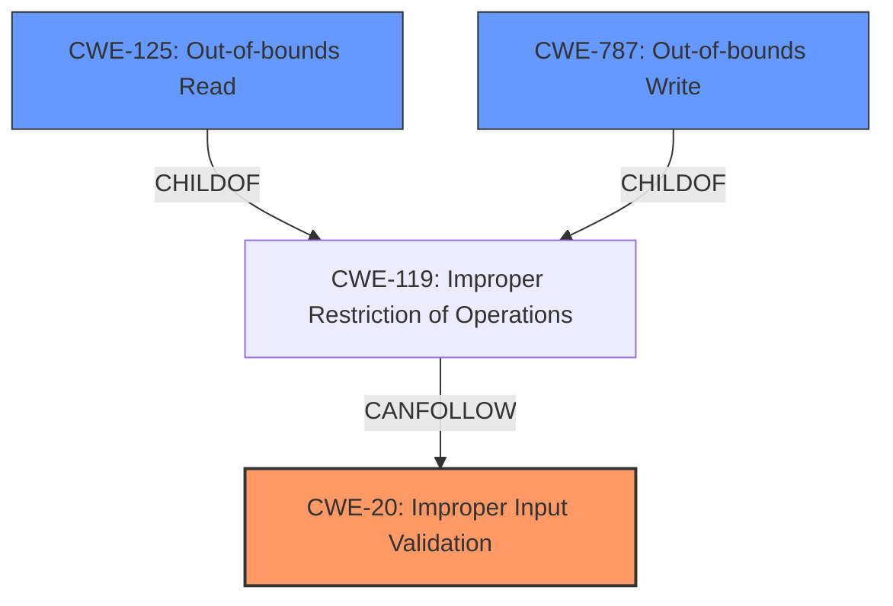

# Raw Analyzer Response for CVE-2022-35668

# Summary
| CWE ID | CWE Name | Confidence | CWE Abstraction Level | CWE Vulnerability Mapping Label | CWE-Vulnerability Mapping Notes |
|---|---|---|---|---|---|
| CWE-20 | Improper Input Validation | 0.75 | Class | Primary | Discouraged |
| CWE-125 | Out-of-bounds Read | 0.60 | Base | Secondary | Allowed |
| CWE-787 | Out-of-bounds Write | 0.50 | Base | Secondary | Allowed |

## Evidence and Confidence

*   **Confidence Score:** 0.70
*   **Evidence Strength:** MEDIUM

## Relationship Analysis
The primary CWE is CWE-20, a class-level weakness. While CWE-20 is discouraged, the provided information lacks the specificity to pinpoint a more precise variant related to input validation. CWE-125 and CWE-787 are base-level weaknesses describing out-of-bounds read and write issues which can be a consequence of **improper input validation**. They are children of CWE-119: Improper Restriction of Operations Within the Bounds of a Memory Buffer. This hierarchical relationship suggests a potential chain where **improper input validation** leads to memory access errors.

## Vulnerability Chain
The vulnerability chain starts with **Improper Input Validation** (CWE-20). The consequences of this are not clearly defined, but leading to disclosure of sensitive memory and potential bypass of ASLR suggests potential out-of-bounds read (CWE-125) or out-of-bounds write (CWE-787). The chain can be described as:
1.  **Improper Input Validation (CWE-20)**: The application fails to properly validate input from a malicious file.
2.  Out-of-bounds Read (CWE-125) or Out-of-bounds Write (CWE-787): The **improper input validation** leads to memory access outside the intended buffer.
3.  Information Exposure: Disclosure of sensitive memory.

## Summary of Analysis
The initial analysis identified **Improper Input Validation** as the root cause, which is supported by the "Vulnerability Description Key Phrases" and "CVE Reference Links Content Summary". However, CWE-20 is a broad class, and the description mentions "disclosure of sensitive memory". The retriever results suggest CWE-125 (Out-of-bounds Read) and CWE-787 (Out-of-bounds Write) as potential candidates.

The decision to include CWE-125 and CWE-787 as secondary CWEs is based on the potential impact and chain relationship. The vulnerability description mentions "disclosure of sensitive memory" which could be caused by reading outside the bounds of a buffer (CWE-125). Also, exploiting the vulnerability can bypass ASLR which suggests writing to memory outside the intended buffer (CWE-787).

The selection of CWE-20 is primarily based on the provided evidence, specifically the "Vulnerability Description Key Phrases" and "CVE Reference Links Content Summary" that explicitly state "**Improper Input Validation**" as the root cause.

Relevant CWE Information:

# Enhanced Context (25 CWEs)
The following CWEs were identified as potentially relevant to this vulnerability:

## CWE-226: Sensitive Information in Resource Not Removed Before Reuse
**Abstraction Level**: Base
**Similarity Score**: 0.76
**Source**: dense

**Description**:
The product releases a resource such as memory or a file so that it can be made available for reuse, but it does not clear or "zeroize" the information contained in the resource before the product performs a critical state transition or makes the resource available for reuse by other entities.

**Mapping Guidance**:
- Usage: Allowed
- Rationale: This CWE entry is at the Base level of abstraction, which is a preferred level of abstraction for mapping to the root causes of vulnerabilities.

**Why it was not selected:** This CWE does not seem to fit the vulnerability description. The vulnerability is caused by **improper input validation**, and not due to failure to clear sensitive information.

## CWE-131: Incorrect Calculation of Buffer Size
**Abstraction Level**: Base
**Similarity Score**: 0.76
**Source**: dense

**Description**:
The product does not correctly calculate the size to be used when allocating a buffer, which could lead to a buffer overflow.

**Mapping Guidance**:
- Usage: Allowed
- Rationale: This CWE entry is at the Base level of abstraction, which is a preferred level of abstraction for mapping to the root causes of vulnerabilities.

**Why it was not selected:** While buffer overflows might be a consequence, the root cause is **improper input validation**, not incorrect calculation of buffer size.

## CWE-404: Improper Resource Shutdown or Release
**Abstraction Level**: Class
**Similarity Score**: 0.76
**Source**: dense

**Description**:
The product does not release or incorrectly releases a resource before it is made available for re-use.

**Mapping Guidance**:
- Usage: Allowed-with-Review
- Rationale: This CWE entry is a Class and might have Base-level children that would be more appropriate

**Why it was not selected:** The vulnerability is not related to resource shutdown or release. The problem is related to **improper input validation**.

## CWE-191: Integer Underflow (Wrap or Wraparound)
**Abstraction Level**: Base
**Similarity Score**: 0.76
**Source**: dense

**Description**:
The product subtracts one value from another, such that the result is less than the minimum allowable integer value, which produces a value that is not equal to the correct result.

**Mapping Guidance**:
- Usage: Allowed
- Rationale: This CWE entry is at the Base level of abstraction, which is a preferred level of abstraction for mapping to the root causes of vulnerabilities.

**Why it was not selected:** The vulnerability is not related to integer underflow. The problem is related to **improper input validation**.

## CWE-667: Improper Locking
**Abstraction Level**: Class
**Similarity Score**: 0.76
**Source**: dense

**Description**:
The product does not properly acquire or release a lock on a resource, leading to unexpected resource state changes and behaviors.

**Mapping Guidance**:
- Usage: Allowed-with-Review
- Rationale: This CWE entry is a Class and might have Base-level children that would be more appropriate

**Why it was not selected:** The vulnerability is not related to improper locking. The problem is related to **improper input validation**.

## CWE-125: Out-of-bounds Read
**Abstraction Level**: Base
**Similarity Score**: 0.75
**Source**: dense

**Description**:
The product reads data past the end, or before the beginning, of the intended buffer.

**Mapping Guidance**:
- Usage: Allowed
- Rationale: This CWE entry is at the Base level of abstraction, which is a preferred level of abstraction for mapping to the root causes of vulnerabilities.

**Why it was selected:** This can be a consequence of **improper input validation**.

## CWE-129: Improper Validation of Array Index
**Abstraction Level**: Variant
**Similarity Score**: 0.75
**Source**: dense

**Description**:
The product uses untrusted input when calculating or using an array index, but the product does not validate or incorrectly validates the index to ensure the index references a valid position within the array.

**Mapping Guidance**:
- Usage: Allowed
- Rationale: This CWE entry is at the Variant level of abstraction, which is a preferred level of abstraction for mapping to the root causes of vulnerabilities.

**Why it was not selected:** While **improper validation of array index** could be the case, the provided information is not specific enough.

## CWE-1289: Improper Validation of Unsafe Equivalence in Input
**Abstraction Level**: Base
**Similarity Score**: 0.75
**Source**: dense

**Description**:
The product receives an input value that is used as a resource identifier or other type of reference, but it does not validate or incorrectly validates that the input is equivalent to a potentially-unsafe value.

**Mapping Guidance**:
- Usage: Allowed
- Rationale: This CWE entry is at the Base level of abstraction, which is a preferred level of abstraction for mapping to the root causes of vulnerabilities.

**Why it was not selected:** This CWE does not seem to fit