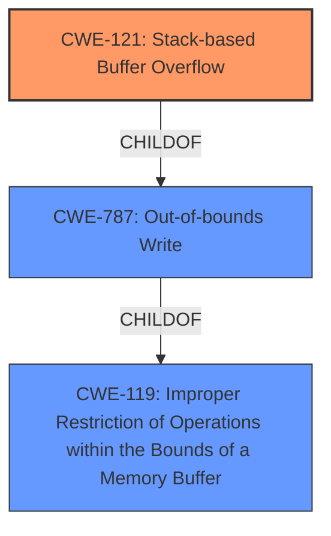

# Enhanced Analysis for CVE-2022-35710

# Summary
| CWE ID | CWE Name | Confidence | CWE Abstraction Level | CWE Vulnerability Mapping Label | CWE-Vulnerability Mapping Notes |
|---|---|---|---|---|---|
| CWE-121 | Stack-based Buffer Overflow | 1.0 | Variant | Allowed | Primary CWE |
| CWE-787 | Out-of-bounds Write | 0.7 | Base | Allowed | Secondary Candidate |
| CWE-119 | Improper Restriction of Operations within the Bounds of a Memory Buffer | 0.6 | Class | Discouraged | Secondary Candidate |

## Evidence and Confidence

*   **Confidence Score:** 0.9
*   **Evidence Strength:** HIGH

## Relationship Analysis
The primary CWE, CWE-121 Stack-based Buffer Overflow, is a variant of CWE-787 Out-of-bounds Write, which in turn is a child of CWE-119 Improper Restriction of Operations within the Bounds of a Memory Buffer. The analysis favors CWE-121 because the vulnerability description explicitly mentions a "Stack-based Buffer Overflow", making it a more specific and accurate classification than its parents. While CWE-787 is a valid base-level CWE, the context provided allows for the selection of the more descriptive variant, CWE-121. CWE-119 is too general and its mapping guidance discourages its use when more specific CWEs are available.



## Vulnerability Chain
The vulnerability chain begins with the receipt of a crafted network packet. This packet triggers a **stack-based buffer overflow (CWE-121)** due to the product's failure to properly manage the size of data written to a stack-allocated buffer, leading to **out-of-bounds write (CWE-787)**. The ultimate impact is arbitrary code execution.

## Summary of Analysis
The initial assessment strongly supports classifying the vulnerability as CWE-121 Stack-based Buffer Overflow, based on the explicit mention of "Stack-based Buffer Overflow" in the vulnerability description and the CVE Reference Links Content Summary.

> **Vulnerability Description Key Phrases**
> -   **weakness:** **Stack-based Buffer Overflow**
>
> **CVE Reference Links Content Summary**
> **Root cause of vulnerability:** Stack-based buffer overflow
> **Weaknesses/vulnerabilities present:** A stack-based buffer overflow (CWE-121) is present in Adobe ColdFusion.

This direct evidence overrides any inclination to select a more general CWE. The hierarchical relationships confirm that CWE-121 is a specific type of out-of-bounds write, further solidifying the choice. The description aligns perfectly with CWE-121's definition as a buffer overflow where the overwritten buffer is allocated on the stack. The selection of CWE-121 is at the optimal level of specificity because the vulnerability description provides enough information to identify the specific type of buffer overflow (stack-based) rather than just a generic buffer overflow (CWE-119) or out-of-bounds write (CWE-787).

Relevant CWE Information:

# Enhanced Context (25 CWEs)

## CWE-1289: Improper Validation of Unsafe Equivalence in Input
Not used. This CWE is about improper validation of input equivalence, which is not the primary issue in this vulnerability. The vulnerability is about writing outside buffer bounds.

## CWE-1288: Improper Validation of Consistency within Input
Not used. This CWE is about improper validation of consistency within input, which is not the primary issue in this vulnerability. The vulnerability is about writing outside buffer bounds.

## CWE-606: Unchecked Input for Loop Condition
Not used. The vulnerability is not directly related to loop conditions but to writing outside buffer bounds on the stack.

## CWE-183: Permissive List of Allowed Inputs
Not used. The vulnerability is not related to a permissive list of allowed inputs.

## CWE-124: Buffer Underwrite ('Buffer Underflow')
Not used. The vulnerability is a buffer overflow, not a buffer underflow.

## CWE-191: Integer Underflow (Wrap or Wraparound)
Not used. The vulnerability is not directly related to integer underflow.

## CWE-131: Incorrect Calculation of Buffer Size
Not used. While incorrect buffer size calculation could contribute to a buffer overflow, the description explicitly identifies a stack-based buffer overflow as the root cause.

## CWE-807: Reliance on Untrusted Inputs in a Security Decision
Not used. The vulnerability isn't explicitly about security decisions based on untrusted inputs.

## CWE-184: Incomplete List of Disallowed Inputs
Not used. The vulnerability is not related to an incomplete list of disallowed inputs.

## CWE-179: Incorrect Behavior Order: Early Validation
Not used. The vulnerability isn't about incorrect behavior order or early validation.

## CWE-190: Integer Overflow or Wraparound
Not used. Integer overflow is not the primary cause of this vulnerability.

## CWE-125: Out-of-bounds Read
Not used. The vulnerability is caused by an out-of-bounds write, not an out-of-bounds read.

## CWE-1284: Improper Validation of Specified Quantity in Input
Not used. While the buffer overflow might be related to a quantity not being validated, it isn't the primary weakness described.

## CWE-119: Improper Restriction of Operations within the Bounds of a Memory Buffer
Considered but not used as the primary CWE. While technically correct (as it's a parent of CWE-121 and CWE-787), it's too general. The vulnerability description specifically mentions a stack-based buffer overflow, allowing for a more specific classification. The mapping guidance for CWE-119 discourages its use when more specific CWEs are available.

## CWE-839: Numeric Range Comparison Without Minimum Check
Not used. The vulnerability is not related to numeric range comparison.

## CWE-128: Wrap-around Error
Not used. This CWE is not directly relevant to the described vulnerability.

## CWE-41: Improper Resolution of Path Equivalence
Not used. This CWE is not directly relevant to the described vulnerability.

## CWE-170: Improper Null Termination
Not used. This CWE is not directly relevant to the described vulnerability.

## CWE-22: Improper Limitation of a Pathname to a Restricted Directory ('Path Traversal')
Not used. This CWE is not directly relevant to the described vulnerability.

## CWE-770: Allocation of Resources Without Limits or Throttling
Not used. This CWE is not directly relevant to the described vulnerability.

## CWE-73: External Control of File Name or Path
Not used. This CWE is not directly relevant to the described vulnerability.

## CWE-129: Improper Validation of Array Index
Not used. While a stack-based buffer overflow could involve an array index, it is not the primary weakness described.

## CWE-787: Out-of-bounds Write
Considered but not used as the primary CWE. While an out-of-bounds write is certainly occurring, the description explicitly mentions "stack-based", so CWE-121 is preferred.

## CWE-121: Stack-based Buffer Overflow
This CWE is the best fit for the vulnerability. The vulnerability description explicitly states that it is a **stack-based buffer overflow**. This aligns perfectly with the definition of CWE-121, which is a buffer overflow where the buffer being overwritten is allocated on the stack.


## CWE Relationship Analysis

Current CWEs represent these abstraction levels: .


### Vulnerability Chain Analysis

**Chain starting from CWE-41:**
- 41 (Improper Resolution of Path Equivalence) - ROOT


**Chain starting from CWE-807:**
- 807 (Reliance on Untrusted Inputs in a Security Decision) - ROOT


### CWE Relationship Diagram

```mermaid
graph TD
    classDef primary fill:#f96,stroke:#333,stroke-width:2px
    classDef secondary fill:#69f,stroke:#333
    classDef tertiary fill:#9e9,stroke:#333
```