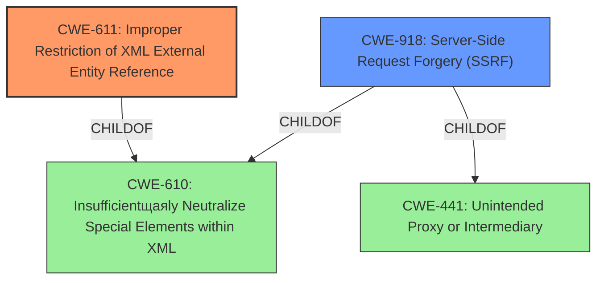

# Analysis for CVE-2022-35741

# Summary
| CWE ID | CWE Name | Confidence | CWE Abstraction Level | CWE Vulnerability Mapping Label | CWE-Vulnerability Mapping Notes |
|---|---|---|---|---|---|
| CWE-611 | Improper Restriction of XML External Entity Reference | 1.0 | Base | Primary | Allowed |
| CWE-918 | Server-Side Request Forgery (SSRF) | 0.7 | Base | Secondary | Allowed |

## Evidence and Confidence

*   **Confidence Score:** 0.9
*   **Evidence Strength:** HIGH

## Relationship Analysis
The primary CWE identified is CWE-611 (Improper Restriction of XML External Entity Reference), which is a Base-level CWE. The secondary CWE identified is CWE-918 (Server-Side Request Forgery (SSRF)), which is also a Base-level CWE. CWE-611 is related to CWE-610, and CWE-918 is related to CWE-441 and CWE-610.

## Vulnerability Chain
The vulnerability chain starts with **improper XML parsing**, leading to **XXE injection**. This can then lead to arbitrary file reading, denial of service, and server-side request forgery (SSRF).
  - **Root Cause:** **Improper XML Parsing**
  - **Weakness:** **XXE Injection** (CWE-611)
  - **Impacts:** Arbitrary file reading, Denial of Service, Server-Side Request Forgery (SSRF) (CWE-918)

## Summary of Analysis
The primary weakness is CWE-611, as the vulnerability description explicitly mentions "**XXE injection**" as a weakness and "**improper XML parsing**" as a rootcause, and the CVE reference summary identifies the **root cause of vulnerability** as stemming from the use of XML-based SAML 2.0 messages during the authentication flow which are parsed by standard libraries susceptible to **XXE injection**. The description of CWE-611 (Improper Restriction of XML External Entity Reference) states, "The product processes an XML document that can contain XML entities with URIs that resolve to documents outside of the intended sphere of control, causing the product to embed incorrect documents into its output." This aligns directly with the vulnerability description.

The secondary weakness, CWE-918 (Server-Side Request Forgery), is identified because one of the impacts of the XXE vulnerability is SSRF.

The selection of these CWEs is based on the evidence provided in the vulnerability description, CVE reference summary, and the descriptions of the CWEs themselves. The retriever results also support the selection of CWE-611 and CWE-918 as relevant to the vulnerability. These CWEs are at the optimal level of specificity, as they accurately represent the root cause and potential impacts of the vulnerability.

Relevant CWE Information:
- **Vulnerability Description Key Phrases**: "**rootcause:** **improper XML parsing**", "**weakness:** **XXE injection**", "**impact:** arbitrary file reading and denial of service and server-side request forgery"
- **CVE Reference Links Content Summary**: "**Root cause of vulnerability:** The vulnerability stems from the use of XML-based SAML 2.0 messages during the authentication flow in Apache CloudStack. These messages are parsed by standard libraries that are susceptible to XML external entity (XXE) injection.", "**Weaknesses/vulnerabilities present:** The vulnerability is an XXE injection.", "Server-side request forgery (SSRF) on the CloudStack management server."

CWE-22 (Improper Limitation of a Pathname to a Restricted Directory ('Path Traversal')) was considered because arbitrary file reading is listed as an impact, but it was not selected because the root cause is not related to path traversal. Similarly, CWE-770 (Allocation of Resources Without Limits or Throttling) was considered because denial of service is listed as an impact, but it was not selected because the root cause is not directly related to resource allocation.
CWE-1390 (Weak Authentication), CWE-306 (Missing Authentication for Critical Function), and CWE-287 (Improper Authentication) were considered because the vulnerability is in the SAML 2.0 authentication Service Provider plugin, but these were not selected because the root cause is XXE injection and not a general authentication issue.