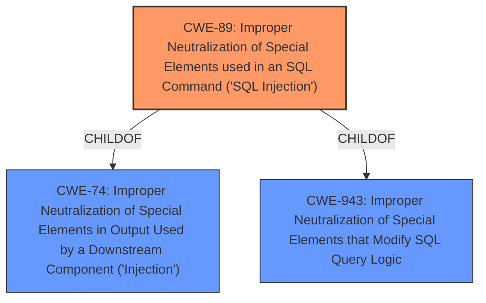

# Enhanced Analysis for CVE-2022-3579

# Summary
| CWE ID | CWE Name | Confidence | CWE Abstraction Level | CWE Vulnerability Mapping Label | CWE-Vulnerability Mapping Notes |
|---|---|---|---|---|---|
| CWE-89 | Improper Neutralization of Special Elements used in an SQL Command ('SQL Injection') | 1.0 | Base | Allowed | Primary CWE |

## Evidence and Confidence

*   **Confidence Score:** 1.0
*   **Evidence Strength:** HIGH

## Relationship Analysis
The primary CWE, CWE-89, is a base-level CWE, which is the preferred level of abstraction. CWE-89 is a child of CWE-74 (Improper Neutralization of Special Elements in Output Used by a Downstream Component ('Injection')) and CWE-943 (Improper Neutralization of Special Elements that Modify SQL Query Logic). This reflects the hierarchical nature of the weakness, where SQL Injection is a specific type of injection that affects SQL queries.



## Vulnerability Chain
The vulnerability chain starts with **improper input sanitization**, which leads to the **SQL injection** vulnerability. This allows an attacker to bypass authentication.

## Summary of Analysis
The analysis indicates a clear SQL injection vulnerability. The vulnerability description and the CVE reference summary both highlight the lack of proper input sanitization as the root cause. The application **does not neutralize or incorrectly neutralizes** user-supplied inputs in the login form (username and password fields), leading to the **SQL injection**. This directly matches the description of CWE-89.

The selection of CWE-89 is strongly supported by the evidence provided. The "Vulnerability Description Key Phrases" section explicitly mentions "**rootcause:** **improper input sanitization**" and "**weakness:** **sql injection**". Additionally, the CVE Reference Links Content Summary states, "The application is vulnerable to SQL injection due to insufficient sanitization of user-supplied inputs in the login form (username and password fields)."

The retriever results also show CWE-89 as the top candidate with a score of 1.0. This further validates the selection of CWE-89 as the primary weakness.

The selection of CWE-89 is at the optimal level of specificity, as it directly addresses the root cause (SQL injection) and is a base-level CWE, which is the preferred level of abstraction.

CWE-79 (Improper Neutralization of Input During Web Page Generation ('Cross-site Scripting')) was considered but not selected. While XSS can be related to input validation issues, the provided information specifically points to SQL injection as the vulnerability, making CWE-89 a more accurate fit.


## CWE Relationship Analysis

Current CWEs represent these abstraction levels: .


### Vulnerability Chain Analysis

**Chain starting from CWE-89:**
- 89 (Improper Neutralization of Special Elements used in an SQL Command ('SQL Injection')) - ROOT


**Chain starting from CWE-74:**
- 74 (Improper Neutralization of Special Elements in Output Used by a Downstream Component ('Injection')) - ROOT


### CWE Relationship Diagram

```mermaid
graph TD
    classDef primary fill:#f96,stroke:#333,stroke-width:2px
    classDef secondary fill:#69f,stroke:#333
    classDef tertiary fill:#9e9,stroke:#333
```