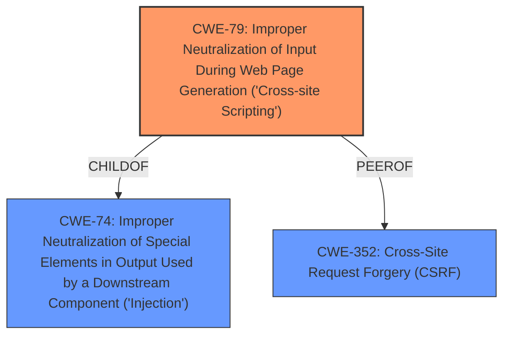

# Analysis Report for CVE-2022-3580

# Vulnerability Analysis Report: CVE-2022-3580

## Description


## Analysis (with Relationship Data)

# Summary
| CWE ID | CWE Name | Confidence | CWE Abstraction Level | CWE Vulnerability Mapping Label | CWE-Vulnerability Mapping Notes |
|---|---|---|---|---|---|
| CWE-79 | Improper Neutralization of Input During Web Page Generation ('Cross-site Scripting') | 1.0 | Base | Primary | Allowed |

## Evidence and Confidence

*   **Confidence Score:** 1.0
*   **Evidence Strength:** HIGH

## Relationship Analysis
The primary relationship that influenced the decision was the ChildOf relationship between CWE-79 and CWE-74, indicating that XSS is a specific type of injection. Additionally, the PeerOf relationship between CWE-79 and CWE-352 (CSRF) highlights a potential attack vector where CSRF could be used to deliver an XSS payload. The base level abstraction of CWE-79 makes it the appropriate choice.



## Vulnerability Chain
The vulnerability chain involves a failure to neutralize user input, leading to the possibility of injecting malicious scripts into web pages served to other users:
  1. **Root Cause:** **Improper Neutralization of Input** (CWE-79) in the `User Creation Handler` component.
  2. **Weakness:** The system **does not properly sanitize user-controllable input**.
  3. **Impact:** The injected script can be executed by other users, leading to information theft or other malicious activities.

## Summary of Analysis
The analysis strongly supports the selection of CWE-79 as the primary weakness. The vulnerability description explicitly states that the **rootcause** is **cross-site scripting**, and the provided evidence confirms the failure to neutralize user input before generating web pages. The "CVE Reference Links Content Summary" section indicates that the system "fails to properly sanitize user-controllable input before using it in web page output" and that the "**Weakness/Vulnerability:** The primary weakness is a cross-site scripting (XSS) vulnerability (CWE-79). The system does not neutralize or incorrectly neutralizes user-controllable input."

The relationship graph further supports this selection, showing that CWE-79 is a specific type of injection (ChildOf CWE-74) and can be related to CSRF (PeerOf CWE-352) as a potential attack vector. The high confidence in this assessment is based on the explicit evidence and clear alignment with the CWE-79 description.

The selection of CWE-79 is at the optimal level of specificity because it directly addresses the **rootcause** of the vulnerability (failure to neutralize input) and aligns with the base level of abstraction recommended by MITRE.

Relevant CWE Information:

# Enhanced Context (25 CWEs)
The following CWEs were identified as potentially relevant to this vulnerability:

## CWE-208: Observable Timing Discrepancy
**Abstraction Level**: Base
**Similarity Score**: 0.80

## CWE-203: Observable Discrepancy
**Abstraction Level**: Base
**Similarity Score**: 0.77

## CWE-204: Observable Response Discrepancy
**Abstraction Level**: Base
**Similarity Score**: 0.77

## CWE-330: Use of Insufficiently Random Values
**Abstraction Level**: Class
**Similarity Score**: 0.77

## CWE-74: Improper Neutralization of Special Elements in Output Used by a Downstream Component ('Injection')
**Abstraction Level**: Class
**Similarity Score**: 0.76

## CWE-41: Improper Resolution of Path Equivalence
**Abstraction Level**: Base
**Similarity Score**: 0.75

## CWE-668: Exposure of Resource to Wrong Sphere
**Abstraction Level**: Class
**Similarity Score**: 0.75

## CWE-407: Inefficient Algorithmic Complexity
**Abstraction Level**: Class
**Similarity Score**: 0.75

## CWE-1289: Improper Validation of Unsafe Equivalence in Input
**Abstraction Level**: Base
**Similarity Score**: 0.75

## CWE-345: Insufficient Verification of Data Authenticity
**Abstraction Level**: Class
**Similarity Score**: 0.75

## CWE-79: Improper Neutralization of Input During Web Page Generation ('Cross-site Scripting')
**Abstraction Level**: Base
**Similarity Score**: 7381.22

## CWE-116: Improper Encoding or Escaping of Output
**Abstraction Level**: Class
**Similarity Score**: 6855.16

## CWE-184: Incomplete List of Disallowed Inputs
**Abstraction Level**: Base
**Similarity Score**: 6670.07

## CWE-352: Cross-Site Request Forgery (CSRF)
**Abstraction Level**: Compound
**Similarity Score**: 6611.90

## CWE-434: Unrestricted Upload of File with Dangerous Type
**Abstraction Level**: Base
**Similarity Score**: 6601.60

## CWE-79: Improper Neutralization of Input During Web Page Generation ('Cross-site Scripting')
**Abstraction Level**: base
**Similarity Score**: 5.03

## CWE-434: Unrestricted Upload of File with Dangerous Type
**Abstraction Level**: base
**Similarity Score**: 5.03

## CWE-183: Permissive List of Allowed Inputs
**Abstraction Level**: base
**Similarity Score**: 4.82

## CWE-494: Download of Code Without Integrity Check
**Abstraction Level**: base
**Similarity Score**: 4.33

## CWE-78: Improper Neutralization of Special Elements used in an OS Command ('OS Command Injection')
**Abstraction Level**: base
**Similarity Score**: 4.33

## CWE-94: Improper Control of Generation of Code ('Code Injection')
**Abstraction Level**: base
**Similarity Score**: 4.33

## CWE-385: Covert Timing Channel
**Abstraction Level**: base
**Similarity Score**: 4.33

## CWE-613: Insufficient Session Expiration
**Abstraction Level**: base
**Similarity Score**: 4.21

## CWE-22: Improper Limitation of a Pathname to a Restricted Directory ('Path Traversal')
**Abstraction Level**: base
**Similarity Score**: 3.89

## CWE-98: Improper Control of Filename for Include/Require Statement in PHP Program ('PHP Remote File Inclusion')
**Abstraction Level**: variant
**Similarity Score**: 3.75

**CWEs Considered But Not Used:**

*   **CWE-74: Improper Neutralization of Special Elements in Output Used by a Downstream Component ('Injection')**: While CWE-74 is a parent of CWE-79, the description is less specific and doesn't directly address the XSS vulnerability.
*   **CWE-89: Improper Neutralization of Special Elements used in an SQL Command ('SQL Injection')**: This CWE is specific to SQL injection, which is not mentioned in the vulnerability description.
*   **CWE-80: Improper Neutralization of Script-Related HTML Tags in a Web Page (Basic XSS)**: While related to XSS, CWE-80 is a more specific variant that focuses on script-related HTML tags. CWE-79 is more general and fits the description better.
*   **CWE-352: Cross-Site Request Forgery (CSRF)**: Although CSRF can be related to XSS, the description does not indicate any CSRF vulnerability.
*   **CWE-434: Unrestricted Upload of File with Dangerous Type**: This CWE is not relevant as the vulnerability does not involve file uploads.
*   **CWE-96: Improper Neutralization of Directives in Statically Saved Code ('Static Code Injection')**: This CWE is not relevant as the vulnerability description does not state anything about static code injection.
*   **CWE-184: Incomplete List of Disallowed Inputs**: While a denylist could be used to prevent XSS, the vulnerability description doesn't mention a denylist or any attempt to filter inputs. Therefore, this CWE is not applicable.
*   **CWE-1022: Use of Web Link to Untrusted Target with window.opener Access**: This CWE is not relevant as the vulnerability does not involve links to untrusted targets.
*   **CWE-341: Predictable from Observable State**: This CWE is not relevant as the vulnerability does not involve predictability.
*   **CWE-20


## CWE Relationship Analysis

Current CWEs represent these abstraction levels: .


### Vulnerability Chain Analysis

**Chain starting from CWE-89:**
- 89 (Improper Neutralization of Special Elements used in an SQL Command ('SQL Injection')) - ROOT


**Chain starting from CWE-208:**
- 208 (Observable Timing Discrepancy) - ROOT


### CWE Relationship Diagram

```mermaid
graph TD
    classDef primary fill:#f96,stroke:#333,stroke-width:2px
    classDef secondary fill:#69f,stroke:#333
    classDef tertiary fill:#9e9,stroke:#333
```


*Report generated on 2025-03-31 10:26:42*
