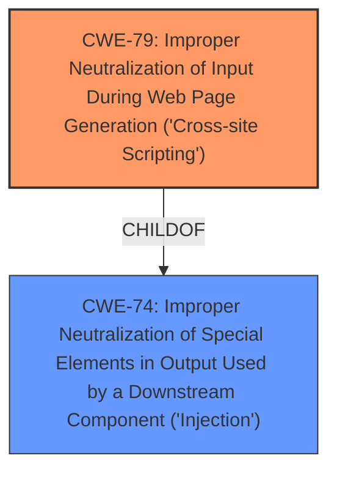

# Enhanced Analysis for CVE-2022-3581

# Summary
| CWE ID | CWE Name | Confidence | CWE Abstraction Level | CWE Vulnerability Mapping Label | CWE-Vulnerability Mapping Notes |
|---|---|---|---|---|---|
| CWE-79 | Improper Neutralization of Input During Web Page Generation ('Cross-site Scripting') | 1.0 | Base | Allowed | Primary CWE |

## Evidence and Confidence

*   **Confidence Score:** 1.0
*   **Evidence Strength:** HIGH

## Relationship Analysis
The analysis centered on identifying the root cause of the vulnerability and its relationship to the broader category of injection flaws.

-   **Parent-child hierarchical relationships:** CWE-79 is a base-level CWE and a child of CWE-74 (Improper Neutralization of Special Elements in Output Used by a Downstream Component ('Injection')). This relationship indicates that CWE-79 is a more specific instance of a general injection issue.
-   **Chain relationships showing progression of vulnerability:** The vulnerability involves **improper input sanitization** leading directly to **cross-site scripting**.
-   **Peer relationships that offered alternative classifications:** CWE-352 Cross-Site Request Forgery (CSRF) was considered because it is often related to XSS.
-   **How abstraction levels influenced your selection:** The base-level abstraction of CWE-79 was selected because it directly represents the specific vulnerability, which involves the **improper neutralization of user input** used to generate web pages.



## Vulnerability Chain
The vulnerability chain starts with the **improper input sanitization** and progresses to the **cross-site scripting vulnerability**.
-   The root cause is the lack of input validation and sanitization.
-   The weakness is cross-site scripting (XSS).
-   The impact is the ability to inject malicious scripts into web pages viewed by other users.

## Summary of Analysis
The primary assessment is based on the vulnerability description provided. The key phrases clearly indicate an **improper input sanitization** issue leading to a **cross-site scripting vulnerability**.

-   **Evidence:** The vulnerability description states that the **manipulation of the argument Name leads to cross site scripting**. The CVE Reference Links Content Summary confirms that the **root cause is the lack of proper input sanitization**.
-   **Graph Relationships:** The hierarchical relationship between CWE-79 and its parent CWE-74 supports the classification, placing it within the broader context of injection vulnerabilities.
-   **Justification:** CWE-79 is the most appropriate classification because it specifically addresses the scenario where user-controllable input is not adequately neutralized before being used in the output of a web page, leading to XSS.
-   **Level of Specificity:** CWE-79 is at the optimal level of specificity (Base) because it directly describes the weakness without being overly general or abstract.

Relevant CWE Information:

# Enhanced Context (25 CWEs)
The following CWEs were identified as potentially relevant to this vulnerability:

## CWE-705: Incorrect Control Flow Scoping
**Abstraction Level**: Class
**Similarity Score**: 0.78
**Source**: dense

## CWE-41: Improper Resolution of Path Equivalence
**Abstraction Level**: Base
**Similarity Score**: 0.77
**Source**: dense

## CWE-74: Improper Neutralization of Special Elements in Output Used by a Downstream Component ('Injection')
**Abstraction Level**: Class
**Similarity Score**: 0.77
**Source**: dense

## CWE-1289: Improper Validation of Unsafe Equivalence in Input
**Abstraction Level**: Base
**Similarity Score**: 0.76
**Source**: dense

## CWE-668: Exposure of Resource to Wrong Sphere
**Abstraction Level**: Class
**Similarity Score**: 0.76
**Source**: dense

## CWE-451: User Interface (UI) Misrepresentation of Critical Information
**Abstraction Level**: Class
**Similarity Score**: 0.76
**Source**: dense

## CWE-184: Incomplete List of Disallowed Inputs
**Abstraction Level**: Base
**Similarity Score**: 0.76
**Source**: dense

## CWE-691: Insufficient Control Flow Management
**Abstraction Level**: Pillar
**Similarity Score**: 0.75
**Source**: dense

## CWE-799: Improper Control of Interaction Frequency
**Abstraction Level**: Class
**Similarity Score**: 0.75
**Source**: dense

## CWE-138: Improper Neutralization of Special Elements
**Abstraction Level**: Class
**Similarity Score**: 0.75
**Source**: dense

## CWE-79: Improper Neutralization of Input During Web Page Generation ('Cross-site Scripting')
**Abstraction Level**: Base
**Similarity Score**: 7133.42
**Source**: sparse

## CWE-116: Improper Encoding or Escaping of Output
**Abstraction Level**: Class
**Similarity Score**: 6609.18
**Source**: sparse

## CWE-352: Cross-Site Request Forgery (CSRF)
**Abstraction Level**: Compound
**Similarity Score**: 6414.66
**Source**: sparse

## CWE-434: Unrestricted Upload of File with Dangerous Type
**Abstraction Level**: Base
**Similarity Score**: 6381.73
**Source**: sparse

## CWE-80: Improper Neutralization of Script-Related HTML Tags in a Web Page (Basic XSS)
**Abstraction Level**: Variant
**Similarity Score**: 6294.58
**Source**: sparse

## CWE-79: Improper Neutralization of Input During Web Page Generation ('Cross-site Scripting')
**Abstraction Level**: base
**Similarity Score**: 5.03
**Source**: graph

## CWE-434: Unrestricted Upload of File with Dangerous Type
**Abstraction Level**: base
**Similarity Score**: 5.03
**Source**: graph

## CWE-183: Permissive List of Allowed Inputs
**Abstraction Level**: base
**Similarity Score**: 4.82
**Source**: graph

## CWE-494: Download of Code Without Integrity Check
**Abstraction Level**: base
**Similarity Score**: 4.33
**Source**: graph

## CWE-208: Observable Timing Discrepancy
**Abstraction Level**: base
**Similarity Score**: 4.33
**Source**: graph

## CWE-385: Covert Timing Channel
**Abstraction Level**: base
**Similarity Score**: 4.33
**Source**: graph

## CWE-613: Insufficient Session Expiration
**Abstraction Level**: base
**Similarity Score**: 4.21
**Source**: graph

## CWE-94: Improper Control of Generation of Code ('Code Injection')
**Abstraction Level**: base
**Similarity Score**: 3.89
**Source**: graph

## CWE-351: Insufficient Type Distinction
**Abstraction Level**: base
**Similarity Score**: 3.64
**Source**: graph

## CWE-430: Deployment of Wrong Handler
**Abstraction Level**: base
**Similarity Score**: 3.64
**Source**: graph

CWEs Considered but Not Used:

*   CWE-74: Improper Neutralization of Special Elements in Output Used by a Downstream Component ('Injection'): While related as a parent, it is too high-level and doesn't directly represent the XSS vulnerability.
*   CWE-89: Improper Neutralization of Special Elements used in an SQL Command ('SQL Injection'): This is specific to SQL injection, which is not the case here.
*   CWE-80: Improper Neutralization of Script-Related HTML Tags in a Web Page (Basic XSS): While this is a variant of XSS, CWE-79 is more general and accurately describes the vulnerability.
*   CWE-352: Cross-Site Request Forgery (CSRF): Although XSS and CSRF can be related, CSRF is not the primary weakness in this case.
*   CWE-434: Unrestricted Upload of File with Dangerous Type: This is related to file uploads, which is not part of this vulnerability.
*   CWE-96: Improper Neutralization of Directives in Statically Saved Code ('Static Code Injection'): This is a static code injection which is not the case here.
*   CWE-494: Download of Code Without Integrity Check: This is related to downloading code without integrity check which is not part of this vulnerability.
*   CWE-1022: Use of Web Link to Untrusted Target with window.opener Access: This is related to using web links to untrusted targets which is not part of this vulnerability.
*   CWE-


## CWE Relationship Analysis

Current CWEs represent these abstraction levels: .


### Vulnerability Chain Analysis

**Chain starting from CWE-89:**
- 89 (Improper Neutralization of Special Elements used in an SQL Command ('SQL Injection')) - ROOT


**Chain starting from CWE-208:**
- 208 (Observable Timing Discrepancy) - ROOT


### CWE Relationship Diagram

```mermaid
graph TD
    classDef primary fill:#f96,stroke:#333,stroke-width:2px
    classDef secondary fill:#69f,stroke:#333
    classDef tertiary fill:#9e9,stroke:#333
```