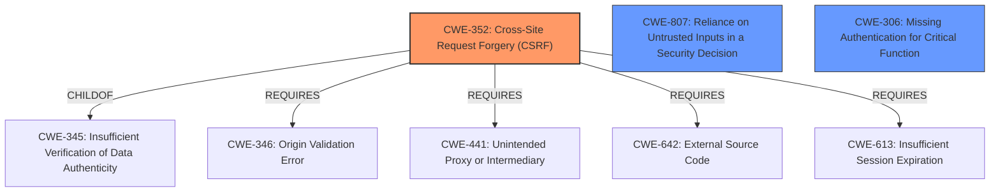

# Analysis for CVE-2022-3582

# Summary
| CWE ID | CWE Name | Confidence | CWE Abstraction Level | CWE Vulnerability Mapping Label | CWE-Vulnerability Mapping Notes |
|---|---|---|---|---|---|
| CWE-352 | Cross-Site Request Forgery (CSRF) | 1.0 | Compound | Allowed | Primary CWE |
| CWE-807 | Reliance on Untrusted Inputs in a Security Decision | 0.6 | Base | Allowed | Secondary Candidate |
| CWE-306 | Missing Authentication for Critical Function | 0.5 | Base | Allowed | Secondary Candidate |

## Evidence and Confidence

*   **Confidence Score:** 0.9
*   **Evidence Strength:** HIGH

## Relationship Analysis
The primary relationship influencing the CWE selection is that CWE-352 is a compound weakness that requires multiple conditions to be present, making it a suitable fit for the described vulnerability. CWE-352 has relationships such as ChildOf to CWE-345 (Insufficient Verification of Data Authenticity) and Requires to CWE-346 (Origin Validation Error), CWE-441 (Unintended Proxy or Intermediary), CWE-642 (External Source Code), and CWE-613 (Insufficient Session Expiration), painting a picture of what could have occurred. CWE-807 (Reliance on Untrusted Inputs in a Security Decision) is considered as the **rootcause** is **improper access control**. CWE-306 (Missing Authentication for Critical Function) is also considered, though it is less specific than CWE-352 in this context.

## Vulnerability Chain
The vulnerability chain starts with the **improper access control** (**rootcause**), leading to the lack of CSRF protection mechanisms, and finally resulting in the ability for an attacker to forge requests on behalf of authenticated users, leading to the impact of changing passwords and potentially compromising the entire web application.

## Summary of Analysis
The initial analysis focused on identifying the **rootcause** and impact described in the vulnerability report. The primary CWE, CWE-352 (Cross-Site Request Forgery (CSRF)), was selected based on the description aligning with the vulnerability's impact. The "CVE Reference Links Content Summary" section provides clear evidence: "The application does not implement proper CSRF protection mechanisms, allowing attackers to forge requests on behalf of authenticated users." This directly supports the selection of CWE-352. The relationship analysis further solidified this choice, as CWE-352 is a compound weakness that encapsulates multiple conditions necessary for a CSRF attack.

CWE-807 (Reliance on Untrusted Inputs in a Security Decision) was considered because the **rootcause** is **improper access control** and the application relies on the existence or values of an input, but the input can be modified by an untrusted actor in a way that bypasses the protection mechanism. However, the description is more focused on the lack of CSRF protection, making CWE-352 a better fit.

CWE-306 (Missing Authentication for Critical Function) was considered because the "change password" functionality lacks proper authentication mechanisms which leads to the CSRF vulnerability. However, the vulnerability is more accurately described as a CSRF issue rather than a complete lack of authentication.

The selected CWEs are at the optimal level of specificity, with CWE-352 being a compound weakness that directly addresses the CSRF vulnerability. The MITRE mapping guidance supports the selection of CWE-352, stating that it is an allowed mapping.

Relevant CWE Information:

# Enhanced Context (25 CWEs)

## CWE-352: Cross-Site Request Forgery (CSRF)
**Abstraction:** Compound
**Status:** Stable

### Description
The web application does not, or can not, sufficiently verify whether a well-formed, valid, consistent request was intentionally provided by the user who submitted the request.

### Extended Description
When a web server is designed to receive a request from a client without any mechanism for verifying that it was intentionally sent, then it might be possible for an attacker to trick a client into making an unintentional request to the web server which will be treated as an authentic request. This can be done via a URL, image load, XMLHttpRequest, etc. and can result in exposure of data or unintended code execution.

### Alternative Terms
Session Riding
Cross Site Reference Forgery
XSRF

### Relationships
ChildOf -> CWE-345
ChildOf -> CWE-345
Requires -> CWE-346
Requires -> CWE-441
Requires -> CWE-642
Requires -> CWE-613

### Mapping Guidance
**Usage:** Allowed
**Rationale:** This is a well-known Composite of multiple weaknesses that must all occur simultaneously, although it is attack-oriented in nature.

## CWE-807: Reliance on Untrusted Inputs in a Security Decision
**Abstraction Level**: Base
**Similarity Score**: 0.77
**Source**: dense

**Description**:
The product uses a protection mechanism that relies on the existence or values of an input, but the input can be modified by an untrusted actor in a way that bypasses the protection mechanism.

**Mapping Guidance**:
- Usage: Allowed
- Rationale: This CWE entry is at the Base level of abstraction, which is a preferred level of abstraction for mapping to the root causes of vulnerabilities.

## CWE-306: Missing Authentication for Critical Function
**Abstraction:** Base
**Status:** Draft

### Description
The product does not perform any authentication for functionality that requires a provable user identity or consumes a significant amount of resources.

### Extended Description
Not provided

### Alternative Terms
None

### Relationships
ChildOf -> CWE-287
ChildOf -> CWE-287

### Mapping Guidance
**Usage:** Allowed
**Rationale:** This CWE entry is at the Base level of abstraction, which is a preferred level of abstraction for mapping to the root causes of vulnerabilities.