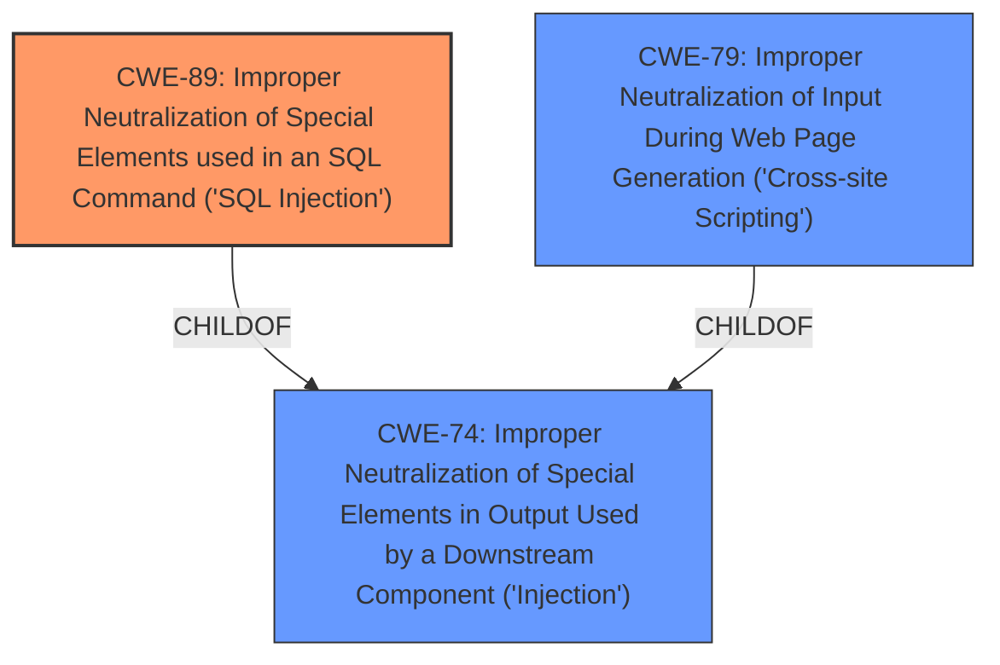

# Enhanced Analysis for CVE-2022-3584

# Summary
| CWE ID | CWE Name | Confidence | CWE Abstraction Level | CWE Vulnerability Mapping Label | CWE-Vulnerability Mapping Notes |
|---|---|---|---|---|---|
| CWE-89 | Improper Neutralization of Special Elements used in an SQL Command ('SQL Injection') | 1.0 | Base | Allowed | Primary CWE |
| CWE-79 | Improper Neutralization of Input During Web Page Generation ('Cross-site Scripting') | 0.5 | Base | Allowed | Secondary Candidate |

## Evidence and Confidence

*   **Confidence Score:** 0.9
*   **Evidence Strength:** HIGH

## Relationship Analysis
The primary relationship considered was the parent-child relationship between CWE-74 (Improper Neutralization of Special Elements in Output Used by a Downstream Component ('Injection')) and CWE-89 (Improper Neutralization of Special Elements used in an SQL Command ('SQL Injection')), where CWE-89 is a more specific instance of CWE-74. Additionally, the close relationship between CWE-74 and CWE-79 (Improper Neutralization of Input During Web Page Generation ('Cross-site Scripting')) was considered, as both involve improper neutralization of input, but CWE-79 is specific to web page generation. The tool's suggestion of CWE-79 was considered. I rated it lower because the vulnerability is related to SQL Injection, not necessarily reflected or persistent Cross-site scripting.



## Vulnerability Chain
The vulnerability chain starts with the **failure to sanitize user input**, leading to **SQL injection** when the `id` argument in `edituser.php` is manipulated. The impact of this chain includes the potential for extracting sensitive data or modifying database content, as demonstrated by the attacker's ability to retrieve a hash from the database.

## Summary of Analysis
The initial analysis strongly points to CWE-89 (Improper Neutralization of Special Elements used in an SQL Command ('SQL Injection')) as the primary weakness. The vulnerability description explicitly mentions "**sql injection**" due to the manipulation of the `id` argument in `edituser.php`. The "CVE Reference Links Content Summary" confirms that the **root cause** is the application's **failure to validate user-supplied input** before using it in an SQL query.

The Retriever Results further support this conclusion, with CWE-89 receiving a score of 1.0. The mapping guidance for CWE-89 states that it is at the Base level of abstraction, which is preferred. The vulnerability description aligns perfectly with CWE-89's description: "The product constructs all or part of an SQL command using externally-influenced input...but it does not neutralize or incorrectly neutralizes special elements that could modify the intended SQL command..."

The tool suggested CWE-79 (Improper Neutralization of Input During Web Page Generation ('Cross-site Scripting')), which was considered. While input neutralization is a shared aspect, CWE-79 focuses on web page generation, whereas the described vulnerability directly involves SQL commands. Therefore, CWE-79 is considered a secondary candidate with a lower confidence score.

The selection of CWE-89 is at the optimal level of specificity because it directly addresses the SQL injection vulnerability caused by the **lack of input sanitization**.


## CWE Relationship Analysis

Current CWEs represent these abstraction levels: .


### Vulnerability Chain Analysis

**Chain starting from CWE-89:**
- 89 (Improper Neutralization of Special Elements used in an SQL Command ('SQL Injection')) - ROOT


**Chain starting from CWE-74:**
- 74 (Improper Neutralization of Special Elements in Output Used by a Downstream Component ('Injection')) - ROOT


### CWE Relationship Diagram

```mermaid
graph TD
    classDef primary fill:#f96,stroke:#333,stroke-width:2px
    classDef secondary fill:#69f,stroke:#333
    classDef tertiary fill:#9e9,stroke:#333
```