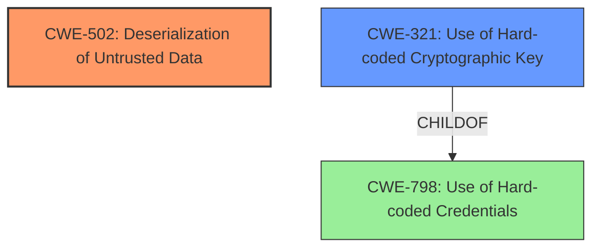

# Enhanced Analysis for CVE-2022-35857

# Summary
| CWE ID | CWE Name | Confidence | CWE Abstraction Level | CWE Vulnerability Mapping Label | CWE-Vulnerability Mapping Notes |
|---|---|---|---|---|---|
| CWE-502 | Deserialization of Untrusted Data | 0.9 | Base | Primary | Allowed |
| CWE-321 | Use of Hard-coded Cryptographic Key | 0.8 | Variant | Secondary | Allowed |

## Evidence and Confidence

*   **Confidence Score:** 0.85
*   **Evidence Strength:** HIGH

## Relationship Analysis
The primary weakness is CWE-502, **Deserialization of Untrusted Data**, because the application **mishandles deserialization**. The supporting weakness is CWE-321, **Use of Hard-coded Cryptographic Key**, because the application uses a **hardcoded key** to encrypt the `rememberMe` parameter. CWE-321 is a ChildOf CWE-798 **Use of Hard-coded Credentials**. The relationship between CWE-502 and CWE-915 needs further exploration. CWE-915 is more narrowly scoped to object modification, and is not necessarily used for deserialization.



## Vulnerability Chain
The vulnerability chain involves:
1.  **Use of Hard-coded Cryptographic Key (CWE-321)**: The application uses a hardcoded key to encrypt the `rememberMe` parameter.
2.  **Deserialization of Untrusted Data (CWE-502)**: The application **mishandles deserialization** of the `rememberMe` parameter, leading to arbitrary code execution.

## Summary of Analysis
The initial assessment identified **Deserialization of Untrusted Data (CWE-502)** as the primary weakness due to the **mishandling of deserialization**. The supporting weakness is **Use of Hard-coded Cryptographic Key (CWE-321)**. The application's use of a **hardcoded key** to encrypt the `rememberMe` parameter allows remote attackers to execute arbitrary code because **deserialization is mishandled**.

The **Vulnerability Description Key Phrases** section states the **rootcause** as **mishandling of deserialization**, which aligns with CWE-502. The **CVE Reference Links Content Summary** confirms the use of a **hardcoded encryption key** and a **deserialization vulnerability**.

Based on the retriever results, **Use of Hard-coded Cryptographic Key (CWE-321)** and **Deserialization of Untrusted Data (CWE-502)** are the top candidates. The evidence clearly points to both weaknesses being present.

CWE-502 is at the Base level of abstraction, and CWE-321 is at the Variant level of abstraction, which are both preferred levels of abstraction for mapping to the root causes of vulnerabilities.

Other CWEs Considered but Not Used:
*   CWE-918 **Server-Side Request Forgery (SSRF)**, CWE-917 **Improper Neutralization of Special Elements used in an Expression Language Statement ('Expression Language Injection')**, CWE-639 **Authorization Bypass Through User-Controlled Key**, CWE-94 **Improper Control of Generation of Code ('Code Injection')**, CWE-259 **Use of Hard-coded Password**, CWE-915 **Improperly Controlled Modification of Dynamically-Determined Object Attributes**, CWE-345 **Insufficient Verification of Data Authenticity**, and CWE-22 **Improper Limitation of a Pathname to a Restricted Directory ('Path Traversal')** do not fit the vulnerability description as accurately as CWE-502 and CWE-321.

Relevant CWE Information:

# Enhanced Context (25 CWEs)
The following CWEs were identified as potentially relevant to this vulnerability:

## CWE-23: Relative Path Traversal
**Abstraction Level**: Base
**Similarity Score**: 0.80
**Source**: dense

**Description**:
The product uses external input to construct a pathname that should be within a restricted directory, but it does not properly neutralize sequences such as ".." that can resolve to a location that is outside of that directory.

**Mapping Guidance**:
- Usage: Allowed
- Rationale: This CWE entry is at the Base level of abstraction, which is a preferred level of abstraction for mapping to the root causes of vulnerabilities.


## CWE-41: Improper Resolution of Path Equivalence
**Abstraction Level**: Base
**Similarity Score**: 0.80
**Source**: dense

**Description**:
The product is vulnerable to file system contents disclosure through path equivalence. Path equivalence involves the use of special characters in file and directory names. The associated manipulations are intended to generate multiple names for the same object.

**Mapping Guidance**:
- Usage: Allowed
- Rationale: This CWE entry is at the Base level of abstraction, which is a preferred level of abstraction for mapping to the root causes of vulnerabilities.


## CWE-73: External Control of File Name or Path
**Abstraction Level**: Base
**Similarity Score**: 0.79
**Source**: dense

**Description**:
The product allows user input to control or influence paths or file names that are used in filesystem operations.

**Mapping Guidance**:
- Usage: Allowed
- Rationale: This CWE entry is at the Base level of abstraction, which is a preferred level of abstraction for mapping to the root causes of vulnerabilities.


## CWE-74: Improper Neutralization of Special Elements in Output Used by a Downstream Component ('Injection')
**Abstraction Level**: Class
**Similarity Score**: 0.78
**Source**: dense

**Description**:
The product constructs all or part of a command, data structure, or record using externally-influenced input from an upstream component, but it does not neutralize or incorrectly neutralizes special elements that could modify how it is parsed or interpreted when it is sent to a downstream component.

**Mapping Guidance**:
- Usage: Discouraged
- Rationale: CWE-74 is high-level and often misused when lower-level weaknesses are more appropriate.


## CWE-36: Absolute Path Traversal
**Abstraction Level**: Base
**Similarity Score**: 0.78
**Source**: dense

**Description**:
The product uses external input to construct a pathname that should be within a restricted directory, but it does not properly neutralize absolute path sequences such as "/abs/path" that can resolve to a location that is outside of that directory.

**Mapping Guidance**:
- Usage: Allowed
- Rationale: This CWE entry is at the Base level of abstraction, which is a preferred level of abstraction for mapping to the root causes of vulnerabilities.


## CWE-59: Improper Link Resolution Before File Access ('Link Following')
**Abstraction Level**: Base
**Similarity Score**: 0.78
**Source**: dense

**Description**:
The product attempts to access a file based on the filename, but it does not properly prevent that filename from identifying a link or shortcut that resolves to an unintended resource.

**Mapping Guidance**:
- Usage: Allowed
- Rationale: This CWE entry is at the Base level of abstraction, which is a preferred level of abstraction for mapping to the root causes of vulnerabilities.


## CWE-427: Uncontrolled Search Path Element
**Abstraction Level**: Base
**Similarity Score**: 0.77
**Source**: dense

**Description**:
The product uses a fixed or controlled search path to find resources, but one or more locations in that path can be under the control of unintended actors.

**Mapping Guidance**:
- Usage: Allowed
- Rationale: This CWE entry is at the Base level of abstraction, which is a preferred level of abstraction for mapping to the root causes of vulnerabilities.


## CWE-184: Incomplete List of Disallowed Inputs
**Abstraction Level**: Base
**Similarity Score**: 0.77
**Source**: dense

**Description**:
The product implements a protection mechanism that relies on a list of inputs (or properties of inputs) that are not allowed by policy or otherwise require other action to neutralize before additional processing takes place, but the list is incomplete.

**Mapping Guidance**:
- Usage: Allowed
- Rationale: This CWE entry is at the Base level of abstraction, which is a preferred level of abstraction for mapping to the root causes of vulnerabilities.


## CWE-639: Authorization Bypass Through User-Controlled Key
**Abstraction Level**: Base
**Similarity Score**: 0.77
**Source**: dense

**Description**:
The system's authorization functionality does not prevent one user from gaining access to another user's data or record by modifying the key value identifying the data.

**Mapping Guidance**:
- Usage: Allowed
- Rationale: This CWE


## CWE Relationship Analysis

Current CWEs represent these abstraction levels: .


### Vulnerability Chain Analysis

**Chain starting from CWE-41:**
- 41 (Improper Resolution of Path Equivalence) - ROOT


**Chain starting from CWE-259:**
- 259 (Use of Hard-coded Password) - ROOT


### CWE Relationship Diagram

```mermaid
graph TD
    classDef primary fill:#f96,stroke:#333,stroke-width:2px
    classDef secondary fill:#69f,stroke:#333
    classDef tertiary fill:#9e9,stroke:#333
```