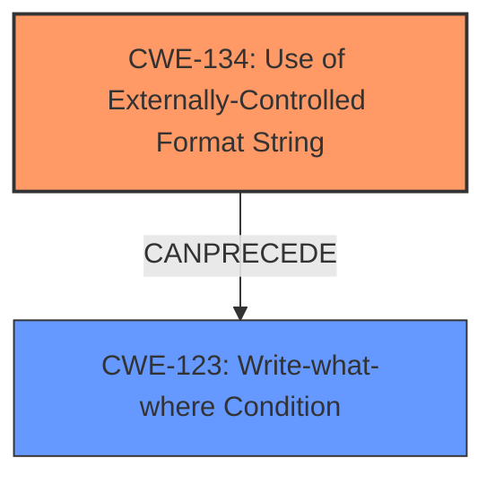

# Analysis for CVE-2022-35875

# Summary
| CWE ID | CWE Name | Confidence | CWE Abstraction Level | CWE Vulnerability Mapping Label | CWE-Vulnerability Mapping Notes |
|---|---|---|---|---|---|
| CWE-134 | Use of Externally-Controlled Format String | 1.0 | Base | Allowed | Primary CWE |
| CWE-123 | Write-what-where Condition | 0.6 | Base | Allowed | Secondary CWE |

## Evidence and Confidence

*   **Confidence Score:** 0.8
*   **Evidence Strength:** HIGH

## Relationship Analysis
The primary relationship influencing the CWE selection is the CANPRECEDE relationship where CWE-134 can lead to CWE-123. While CWE-134 is the root cause (improper use of an externally-controlled format string), it can then lead to a "write-what-where" condition (CWE-123) due to the attacker's ability to manipulate memory addresses via format string specifiers. The weakness is at the base level as it clearly identifies the flaw in handling format strings.

## Vulnerability Chain
The vulnerability chain starts with the use of an externally-controlled format string (CWE-134). An attacker can then manipulate the format string specifiers to write to arbitrary memory locations, leading to a write-what-where condition (CWE-123). This can then allow the attacker to corrupt memory, disclose information, or cause a denial of service.

## Summary of Analysis
The initial assessment, based on the vulnerability description and key phrases, strongly pointed towards a format string injection vulnerability. The CVE Reference Links Content Summary further solidified this by highlighting the use of `vsnprintf` with an attacker-controlled format string.

The Retriever Results also confirmed that CWE-134 is the most relevant CWE. The relationship analysis further clarifies that the ability to write to arbitrary memory locations is a downstream effect of the format string injection, leading to the consideration of CWE-123.

The final decision is to classify this vulnerability as CWE-134 (Primary) because the root cause is directly related to the use of an externally-controlled format string. CWE-123 is a secondary CWE as a potential consequence of the format string injection.

Evidence:

*   Vulnerability Description: "Four **format string injection** vulnerabilities exist...This vulnerability arises from **format string injection** via the `wpapsk` configuration parameter"
*   CVE Reference Links Content Summary: "The `log` function uses `vsnprintf` with a format string that can be controlled by an attacker...the format string vulnerability allows an attacker to read stack memory and potentially write arbitrary memory via format string specifiers."

These excerpts confirm the presence of a format string injection vulnerability. The provided information supports classifying the vulnerability as CWE-134 at the Base level of abstraction, which is an allowed usage according to MITRE's mapping guidance.

CWE-78, CWE-89, and CWE-20 were considered but not selected because they are related to OS command injection, SQL injection, and improper input validation, respectively. While input validation might be a factor, the core issue is the mishandling of format strings, making CWE-134 a more precise fit. CWE-120 and CWE-125 relate to buffer overflows and out-of-bounds reads, and while these could be consequences, they are not the root cause.
# Enhanced Context (25 CWEs)
The following CWEs were identified as potentially relevant to this vulnerability:

## CWE-74: Improper Neutralization of Special Elements in Output Used by a Downstream Component ('Injection')
**Abstraction Level**: Class
**Similarity Score**: 0.77
**Source**: dense

**Description**:
The product constructs all or part of a command, data structure, or record using externally-influenced input from an upstream component, but it does not neutralize or incorrectly neutralizes special elements that could modify how it is parsed or interpreted when it is sent to a downstream component.

**Mapping Guidance**:
- Usage: Discouraged
- Rationale: CWE-74 is high-level and often misused when lower-level weaknesses are more appropriate.

## CWE-184: Incomplete List of Disallowed Inputs
**Abstraction Level**: Base
**Similarity Score**: 0.76
**Source**: dense

**Description**:
The product implements a protection mechanism that relies on a list of inputs (or properties of inputs) that are not allowed by policy or otherwise require other action to neutralize before additional processing takes place, but the list is incomplete.

**Mapping Guidance**:
- Usage: Allowed
- Rationale: This CWE entry is at the Base level of abstraction, which is a preferred level of abstraction for mapping to the root causes of vulnerabilities.

## CWE-88: Improper Neutralization of Argument Delimiters in a Command ('Argument Injection')
**Abstraction Level**: Base
**Similarity Score**: 0.75
**Source**: dense

**Description**:
The product constructs a string for a command to be executed by a separate component
in another control sphere, but it does not properly delimit the
intended arguments, options, or switches within that command string.

**Mapping Guidance**:
- Usage: Allowed
- Rationale: This CWE entry is at the Base level of abstraction, which is a preferred level of abstraction for mapping to the root causes of vulnerabilities.

## CWE-138: Improper Neutralization of Special Elements
**Abstraction Level**: Class
**Similarity Score**: 0.75
**Source**: dense

**Description**:
The product receives input from an upstream component, but it does not neutralize or incorrectly neutralizes special elements that could be interpreted as control elements or syntactic markers when they are sent to a downstream component.

**Mapping Guidance**:
- Usage: Discouraged
- Rationale: This CWE entry is a level-1 Class (i.e., a child of a Pillar). It might have lower-level children that would be more appropriate

## CWE-134: Use of Externally-Controlled Format String
**Abstraction Level**: Base
**Similarity Score**: 0.75
**Source**: dense

**Description**:
The product uses a function that accepts a format string as an argument, but the format string originates from an external source.

**Mapping Guidance**:
- Usage: Allowed
- Rationale: This CWE entry is at the Base level of abstraction, which is a preferred level of abstraction for mapping to the root causes of vulnerabilities.

## CWE-1289: Improper Validation of Unsafe Equivalence in Input
**Abstraction Level**: Base
**Similarity Score**: 0.74
**Source**: dense

**Description**:
The product receives an input value that is used as a resource identifier or other type of reference, but it does not validate or incorrectly validates that the input is equivalent to a potentially-unsafe value.

**Mapping Guidance**:
- Usage: Allowed
- Rationale: This CWE entry is at the Base level of abstraction, which is a preferred level of abstraction for mapping to the root causes of vulnerabilities.

## CWE-917: Improper Neutralization of Special Elements used in an Expression Language Statement ('Expression Language Injection')
**Abstraction Level**: Base
**Similarity Score**: 0.74
**Source**: dense

**Description**:
The product constructs all or part of an expression language (EL) statement in a framework such as a Java Server Page (JSP) using externally-influenced input from an upstream component, but it does not neutralize or incorrectly neutralizes special elements that could modify the intended EL statement before it is executed.

**Mapping Guidance**:
- Usage: Allowed
- Rationale: This CWE entry is at the Base level of abstraction, which is a preferred level of abstraction for mapping to the root causes of vulnerabilities.

## CWE-80: Improper Neutralization of Script-Related HTML Tags in a Web Page (Basic XSS)
**Abstraction Level**: Variant
**Similarity Score**: 0.74
**Source**: dense

**Description**:
The product receives input from an upstream component, but it does not neutralize or incorrectly neutralizes special characters such as "<", ">", and "&" that could be interpreted as web-scripting elements when they are sent to a downstream component that processes web pages.

**Mapping Guidance**:
- Usage: Allowed
- Rationale: This CWE entry is at the Variant level of abstraction, which is a preferred level of abstraction for mapping to the root causes of vulnerabilities.

## CWE-116: Improper Encoding or Escaping of Output
**Abstraction Level**: Class
**Similarity Score**: 0.73
**Source**: dense

**Description**:
The product prepares a structured message for communication with another component, but encoding or escaping of the data is either missing or done incorrectly. As a result, the intended structure of the message is not preserved.

**Mapping Guidance**:
- Usage: Allowed-