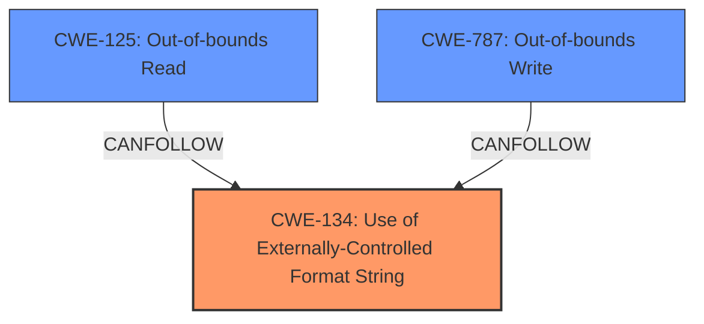

# Analysis for CVE-2022-35876

# Summary
| CWE ID | CWE Name | Confidence | CWE Abstraction Level | CWE Vulnerability Mapping Label | CWE-Vulnerability Mapping Notes |
|---|---|---|---|---|---|
| CWE-134 | Use of Externally-Controlled Format String | 1.0 | Base | Primary | Allowed |
| CWE-125 | Out-of-bounds Read | 0.6 | Base | Secondary | Allowed |
| CWE-787 | Out-of-bounds Write | 0.6 | Base | Secondary | Allowed |

## Evidence and Confidence

*   **Confidence Score:** 0.8
*   **Evidence Strength:** HIGH

## Relationship Analysis
The primary weakness is **CWE-134 (Use of Externally-Controlled Format String)**. This leads to **memory corruption** and **information disclosure**, which can be related to **CWE-125 (Out-of-bounds Read)** and **CWE-787 (Out-of-bounds Write)**. The chain starts with the format string injection, which allows an attacker to read from or write to arbitrary memory locations.

## Vulnerability Chain
The vulnerability chain starts with the **format string injection** (**CWE-134**), which allows an attacker to read sensitive information (information disclosure via **CWE-125**) or overwrite memory (memory corruption via **CWE-787**), ultimately leading to denial of service.

## Summary of Analysis
The vulnerability description clearly indicates a **format string injection** vulnerability. The phrases "format string injection via the `default_key_id` and `key` configuration parameters, as used within the `testWifiAP` XCMD handler" point directly to **CWE-134 (Use of Externally-Controlled Format String)**. This is further supported by the high similarity scores in the retriever results for this CWE. The resulting **memory corruption** and **information disclosure** are likely consequences of the format string injection. **Memory corruption** can be further classified as **CWE-787 (Out-of-bounds Write)** and **information disclosure** can be further classified as **CWE-125 (Out-of-bounds Read)**.

The selection of **CWE-134** as the primary CWE is based on the explicit mention of "format string injection" in the vulnerability description and the consistently high scores for **CWE-134** across all keyphrase analyses.

The chain of events is:
1.  **CWE-134**: A **format string injection** vulnerability exists due to the use of externally-controlled format strings in the `testWifiAP` XCMD handler.
2.  **CWE-125**: This leads to **information disclosure** via out-of-bounds reads.
3.  **CWE-787**: This leads to **memory corruption** via out-of-bounds writes.

Other CWEs were considered but deemed less relevant:

*   **CWE-190 (Integer Overflow or Wraparound)**: While listed in the retriever results, there is no explicit mention of integer overflows or wraparounds in the vulnerability description.
*   **CWE-78 (Improper Neutralization of Special Elements used in an OS Command ('OS Command Injection'))** and **CWE-88 (Improper Neutralization of Argument Delimiters in a Command ('Argument Injection'))**: These are related to command injection vulnerabilities, but the description focuses on format string injection, making these less relevant.
*   **CWE-20 (Improper Input Validation)**: This is a very broad CWE and less specific than **CWE-134**, which directly addresses the **format string injection** issue.
*   **CWE-259 (Use of Hard-coded Password)** and **CWE-798 (Use of Hard-coded Credentials)**: These are related to hard-coded credentials, but the primary issue is **format string injection**, making these less relevant.

The selected CWEs are at the optimal level of specificity. **CWE-134** is a base-level CWE that directly addresses the root cause of the vulnerability. **CWE-125** and **CWE-787** are also base-level CWEs that describe the specific consequences of the format string injection.