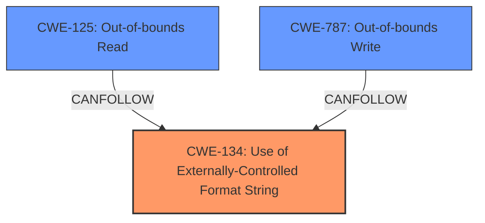

# Analysis for CVE-2022-35876

# Summary
| CWE ID | CWE Name | Confidence | CWE Abstraction Level | CWE Vulnerability Mapping Label | CWE-Vulnerability Mapping Notes |
|---|---|---|---|---|---|
| CWE-134 | Use of Externally-Controlled Format String | 1.0 | Base | Primary | Allowed |
| CWE-125 | Out-of-bounds Read | 0.6 | Base | Secondary | Allowed |
| CWE-787 | Out-of-bounds Write | 0.6 | Base | Secondary | Allowed |

## Evidence and Confidence

*   **Confidence Score:** 0.8
*   **Evidence Strength:** HIGH

## Relationship Analysis
The primary weakness is **CWE-134 (Use of Externally-Controlled Format String)**. This leads to **memory corruption** and **information disclosure**, which can be related to **CWE-125 (Out-of-bounds Read)** and **CWE-787 (Out-of-bounds Write)**. The chain starts with the format string injection, which allows an attacker to read from or write to arbitrary memory locations.

## Vulnerability Chain
The vulnerability chain starts with the **format string injection** (**CWE-134**), which allows an attacker to read sensitive information (information disclosure via **CWE-125**) or overwrite memory (memory corruption via **CWE-787**), ultimately leading to denial of service.

## Summary of Analysis
The vulnerability description clearly indicates a **format string injection** vulnerability. The phrases "format string injection via the `default_key_id` and `key` configuration parameters, as used within the `testWifiAP` XCMD handler" point directly to **CWE-134 (Use of Externally-Controlled Format String)**. This is further supported by the high similarity scores in the retriever results for this CWE. The resulting **memory corruption** and **information disclosure** are likely consequences of the format string injection. **Memory corruption** can be further classified as **CWE-787 (Out-of-bounds Write)** and **information disclosure** can be further classified as **CWE-125 (Out-of-bounds Read)**.

The selection of **CWE-134** as the primary CWE is based on the explicit mention of "format string injection" in the vulnerability description and the consistently high scores for **CWE-134** across all keyphrase analyses.

The chain of events is:
1.  **CWE-134**: A **format string injection** vulnerability exists due to the use of externally-controlled format strings in the `testWifiAP` XCMD handler.
2.  **CWE-125**: This leads to **information disclosure** via out-of-bounds reads.
3.  **CWE-787**: This leads to **memory corruption** via out-of-bounds writes.

Other CWEs were considered but deemed less relevant:

*   **CWE-190 (Integer Overflow or Wraparound)**: While listed in the retriever results, there is no explicit mention of integer overflows or wraparounds in the vulnerability description.
*   **CWE-78 (Improper Neutralization of Special Elements used in an OS Command ('OS Command Injection'))** and **CWE-88 (Improper Neutralization of Argument Delimiters in a Command ('Argument Injection'))**: These are related to command injection vulnerabilities, but the description focuses on format string injection, making these less relevant.
*   **CWE-20 (Improper Input Validation)**: This is a very broad CWE and less specific than **CWE-134**, which directly addresses the **format string injection** issue.
*   **CWE-259 (Use of Hard-coded Password)** and **CWE-798 (Use of Hard-coded Credentials)**: These are related to hard-coded credentials, but the primary issue is **format string injection**, making these less relevant.

The selected CWEs are at the optimal level of specificity. **CWE-134** is a base-level CWE that directly addresses the root cause of the vulnerability. **CWE-125** and **CWE-787** are also base-level CWEs that describe the specific consequences of the format string injection.

# Enhanced Query for CVE-2022-35876

# Vulnerability Description

    Four **format string injection** vulnerabilities exist in the XCMD testWifiAP functionality of Abode Systems, Inc. iota All-In-One Security Kit 6.9X and 6.9Z. Specially-crafted configuration values can lead to **memory corruption**, **information disclosure** and denial of service. An attacker can modify a configuration value and then execute an XCMD to trigger these vulnerabilities.This vulnerability arises from **format string injection** via the `default_key_id` and `key` configuration parameters, as used within the `testWifiAP` XCMD handler

    # Keyphrase-Specific CWE Analysis
    This vulnerability contains multiple keyphrases that may map to different CWEs. 
    Please analyze each keyphrase separately and determine the most appropriate CWE(s) for each.

    ## ROOTCAUSE: 'format string injection'

Relevant CWEs for this ROOTCAUSE:

### 1. CWE-134: Use of Externally-Controlled Format String (Score: 1181.98)

The product uses a function that accepts a format string as an argument, but the format string originates from an external source....

### 2. CWE-190: Integer Overflow or Wraparound (Score: 445.09)

The product performs a calculation that can
         produce an integer overflow or wraparound when the logic
         assumes that the resulting value will always be larger than
         the original value. This occurs when an integer value is
         incremented to a value that is too large to st...

### 3. CWE-78: Improper Neutralization of Special Elements used in an OS Command ('OS Command Injection') (Score: 443.74)

The product constructs all or part of an OS command using externally-influenced input from an upstream component, but it does not neutralize or incorrectly neutralizes special elements that could modify the intended OS command when it is sent to a downstream component....

### 4. CWE-88: Improper Neutralization of Argument Delimiters in a Command ('Argument Injection') (Score: 423.93)

The product constructs a string for a command to be executed by a separate component
in another control sphere, but it does not properly delimit the
intended arguments, options, or switches within that command string....

### 5. CWE-89: Improper Neutralization of Special Elements used in an SQL Command ('SQL Injection') (Score: 421.31)

The product constructs all or part of an SQL command using externally-influenced input from an upstream component, but it does not neutralize or incorrectly neutralizes special elements that could modify the intended SQL command when it is sent to a downstream component. Without sufficient removal o...

## WEAKNESS: 'memory corruption'

Relevant CWEs for this WEAKNESS:

### 1. CWE-134: Use of Externally-Controlled Format String (Score: 1181.98)

The product uses a function that accepts a format string as an argument, but the format string originates from an external source....

### 2. CWE-190: Integer Overflow or Wraparound (Score: 445.09)

The product performs a calculation that can
         produce an integer overflow or wraparound when the logic
         assumes that the resulting value will always be larger than
         the original value. This occurs when an integer value is
         incremented to a value that is too large to st...

### 3. CWE-787: Out-of-bounds Write (Score: 397.17)

The product writes data past the end, or before the beginning, of the intended buffer....

### 4. CWE-20: Improper Input Validation (Score: 390.45)

The product receives input or data, but it does
        not validate or incorrectly validates that the input has the
        properties that are required to process the data safely and
        correctly....

### 5. CWE-125: Out-of-bounds Read (Score: 387.35)

The product reads data past the end, or before the beginning, of the intended buffer....

## WEAKNESS: 'information disclosure'

Relevant CWEs for this WEAKNESS:

### 1. CWE-134: Use of Externally-Controlled Format String (Score: 1181.98)

The product uses a function that accepts a format string as an argument, but the format string originates from an external source....

### 2. CWE-190: Integer Overflow or Wraparound (Score: 445.09)

The product performs a calculation that can
         produce an integer overflow or wraparound when the logic
         assumes that the resulting value will always be larger than
         the original value. This occurs when an integer value is
         incremented to a value that is too large to st...

### 3. CWE-78: Improper Neutralization of Special Elements used in an OS Command ('OS Command Injection') (Score: 443.74)

The product constructs all or part of an OS command using externally-influenced input from an upstream component, but it does not neutralize or incorrectly neutralizes special elements that could modify the intended OS command when it is sent to a downstream component....

### 4. CWE-125: Out-of-bounds Read (Score: 387.35)

The product reads data past the end, or before the beginning, of the intended buffer....

### 5. CWE-259: Use of Hard-coded Password (Score: 384.05)

The product contains a hard-coded password, which it uses for its own inbound authentication or for outbound communication to external components....

## IMPACT: 'denial of service'

Relevant CWEs for this IMPACT:

### 1. CWE-134: Use of Externally-Controlled Format String (Score: 1181.98)

The product uses a function that accepts a format string as an argument, but the format string originates from an external source....

### 2. CWE-190: Integer Overflow or Wraparound (Score: 445.09)

The product performs a calculation that can
         produce an integer overflow or wraparound when the logic
         assumes that the resulting value will always be larger than
         the original value. This occurs when an integer value is
         incremented to a value that is too large to st...

### 3. CWE-78: Improper Neutralization of Special Elements used in an OS Command ('OS Command Injection') (Score: 443.74)

The product constructs all or part of an OS command using externally-influenced input from an upstream component, but it does not neutralize or incorrectly neutralizes special elements that could modify the intended OS command when it is sent to a downstream component....

### 4. CWE-20: Improper Input Validation (Score: 390.45)

The product receives input or data, but it does
        not validate or incorrectly validates that the input has the
        properties that are required to process the data safely and
        correctly....

### 5. CWE-125: Out-of-bounds Read (Score: 387.35)

The product reads data past the end, or before the beginning, of the intended buffer....

## PRODUCT: 'Abode Systems iota All-In-One Security Kit'

Relevant CWEs for this PRODUCT:

### 1. CWE-134: Use of Externally-Controlled Format String (Score: 1181.98)

The product uses a function that accepts a format string as an argument, but the format string originates from an external source....

### 2. CWE-190: Integer Overflow or Wraparound (Score: 445.09)

The product performs a calculation that can
         produce an integer overflow or wraparound when the logic
         assumes that the resulting value will always be larger than
         the original value. This occurs when an integer value is
         incremented to a value that is too large to st...

### 3. CWE-78: Improper Neutralization of Special Elements used in an OS Command ('OS Command Injection') (Score: 443.74)

The product constructs all or part of an OS command using externally-influenced input from an upstream component, but it does not neutralize or incorrectly neutralizes special elements that could modify the intended OS command when it is sent to a downstream component....

### 4. CWE-259: Use of Hard-coded Password (Score: 384.05)

The product contains a hard-coded password, which it uses for its own inbound authentication or for outbound communication to external components....

### 5. CWE-798: Use of Hard-coded Credentials (Score: 172.83)

The product contains hard-coded credentials, such as a password or cryptographic key....

## VERSION: '6.9X and 6.9Z'

Relevant CWEs for this VERSION:

### 1. CWE-134: Use of Externally-Controlled Format String (Score: 1181.98)

The product uses a function that accepts a format string as an argument, but the format string originates from an external source....

### 2. CWE-190: Integer Overflow or Wraparound (Score: 445.09)

The product performs a calculation that can
         produce an integer overflow or wraparound when the logic
         assumes that the resulting value will always be larger than
         the original value. This occurs when an integer value is
         incremented to a value that is too large to st...

### 3. CWE-78: Improper Neutralization of Special Elements used in an OS Command ('OS Command Injection') (Score: 443.74)

The product constructs all or part of an OS command using externally-influenced input from an upstream component, but it does not neutralize or incorrectly neutralizes special elements that could modify the intended OS command when it is sent to a downstream component....

### 4. CWE-259: Use of Hard-coded Password (Score: 384.05)

The product contains a hard-coded password, which it uses for its own inbound authentication or for outbound communication to external components....

### 5. CWE-798: Use of Hard-coded Credentials (Score: 172.83)

The product contains hard-coded credentials, such as a password or cryptographic key....

## COMPONENT: 'XCMD testWifiAP functionality'

Relevant CWEs for this COMPONENT:

### 1. CWE-134: Use of Externally-Controlled Format String (Score: 1181.98)

The product uses a function that accepts a format string as an argument, but the format string originates from an external source....

### 2. CWE-190: Integer Overflow or Wraparound (Score: 445.09)

The product performs a calculation that can
         produce an integer overflow or wraparound when the logic
         assumes that the resulting value will always be larger than
         the original value. This occurs when an integer value is
         incremented to a value that is too large to st...

### 3. CWE-78: Improper Neutralization of Special Elements used in an OS Command ('OS Command Injection') (Score: 443.74)

The product constructs all or part of an OS command using externally-influenced input from an upstream component, but it does not neutralize or incorrectly neutralizes special elements that could modify the intended OS command when it is sent to a downstream component....

### 4. CWE-259: Use of Hard-coded Password (Score: 384.05)

The product contains a hard-coded password, which it uses for its own inbound authentication or for outbound communication to external components....

### 5. CWE-798: Use of Hard-coded Credentials (Score: 172.83)

The product contains hard-coded credentials, such as a password or cryptographic key....

    # Analysis Instructions
    1. For each keyphrase, identify the most appropriate CWE(s) that represent the weakness.
    2. Consider how the different keyphrases might relate to each other in the vulnerability chain.
    3. Provide a final determination of primary CWE(s) and any secondary CWEs.
    4. Format your response using the standard analysis template.

    Please analyze how these different weaknesses interact and provide a comprehensive CWE classification.
    