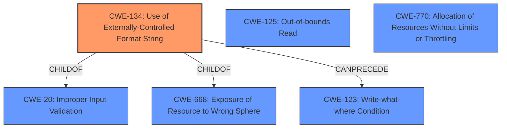

# Analysis Report for CVE-2022-35877

# Vulnerability Analysis Report: CVE-2022-35877

## Description


## Analysis (with Relationship Data)

# Summary
| CWE ID    | CWE Name                                                                                                   | Confidence | CWE Abstraction Level | CWE Vulnerability Mapping Label | CWE-Vulnerability Mapping Notes |
| :-------- | :--------------------------------------------------------------------------------------------------------- | :--------- | :---------------------- | :------------------------------ | :------------------------------ |
| CWE-134   | Use of Externally-Controlled Format String                                                                 | 1          | Base                    | Primary CWE                     | Allowed                         |
| CWE-125   | Out-of-bounds Read                                                                                        | 0.75       | Base                    | Secondary Candidate             | Allowed                         |
| CWE-770   | Allocation of Resources Without Limits or Throttling                                                     | 0.75       | Base                    | Secondary Candidate             | Allowed                         |

## Evidence and Confidence

*   **Confidence Score:** 0.9
*   **Evidence Strength:** HIGH

## Relationship Analysis
The primary weakness is CWE-134, which can lead to other weaknesses. The analysis considered the following relationships:
  - CWE-134 is a Base CWE, which is the preferred level of abstraction. It is a child of CWE-20 (Improper Input Validation) and CWE-668 (Exposure of Resource to Wrong Sphere).
  - CWE-134 can precede CWE-123 (Write-what-where Condition), indicating a potential path to memory corruption.
  - CWE-125 (Out-of-bounds Read) and CWE-770 (Allocation of Resources Without Limits or Throttling) were considered because format string vulnerabilities can lead to information disclosure and denial of service, respectively, which align with these weaknesses.



## Vulnerability Chain
The vulnerability chain starts with the **format string injection** (CWE-134). This can lead to:
  - Memory corruption
  - Information disclosure (potentially through out-of-bounds read, CWE-125)
  - Denial of service (potentially through resource exhaustion, CWE-770).
The root cause is the **lack of input sanitization/validation**, allowing attacker-controlled data to be used as a format string.

## Summary of Analysis
The primary CWE is CWE-134 (Use of Externally-Controlled Format String), as supported by the vulnerability description and the provided CVE reference links content summary. The description explicitly mentions "format string injection" as the vulnerability. The reference links confirm that attacker-controlled configuration values are directly injected into the format string parameter of the `log` function without proper sanitization. This makes CWE-134 the most accurate and specific classification.

The retriever results also list CWE-134 as the top match with the highest score.

CWE-125 (Out-of-bounds Read) and CWE-770 (Allocation of Resources Without Limits or Throttling) are considered as secondary candidates since the impact of format string injection can potentially lead to information disclosure via out-of-bounds read and denial of service through resource exhaustion. However, the primary weakness is the format string injection itself.

The final selection emphasizes the root cause (CWE-134) while acknowledging potential consequences (CWE-125, CWE-770). This provides a comprehensive understanding of the vulnerability while maintaining specificity.

Relevant CWE Information:

# Enhanced Context (25 CWEs)
The following CWEs were identified as potentially relevant to this vulnerability:

## CWE-74: Improper Neutralization of Special Elements in Output Used by a Downstream Component ('Injection')
**Abstraction Level**: Class
**Similarity Score**: 0.75
**Source**: dense

**Description**:
The product constructs all or part of a command, data structure, or record using externally-influenced input from an upstream component, but it does not neutralize or incorrectly neutralizes special elements that could modify how it is parsed or interpreted when it is sent to a downstream component.

**Mapping Guidance**:
- Usage: Discouraged
- Rationale: CWE-74 is high-level and often misused when lower-level weaknesses are more appropriate.

## CWE-184: Incomplete List of Disallowed Inputs
**Abstraction Level**: Base
**Similarity Score**: 0.74
**Source**: dense

**Description**:
The product implements a protection mechanism that relies on a list of inputs (or properties of inputs) that are not allowed by policy or otherwise require other action to neutralize before additional processing takes place, but the list is incomplete.

**Mapping Guidance**:
- Usage: Allowed
- Rationale: This CWE entry is at the Base level of abstraction, which is a preferred level of abstraction for mapping to the root causes of vulnerabilities.

## CWE-138: Improper Neutralization of Special Elements
**Abstraction Level**: Class
**Similarity Score**: 0.73
**Source**: dense

**Description**:
The product receives input from an upstream component, but it does not neutralize or incorrectly neutralizes special elements that could be interpreted as control elements or syntactic markers when they are sent to a downstream component.

**Mapping Guidance**:
- Usage: Discouraged
- Rationale: This CWE entry is a level-1 Class (i.e., a child of a Pillar). It might have lower-level children that would be more appropriate

## CWE-1289: Improper Validation of Unsafe Equivalence in Input
**Abstraction Level**: Base
**Similarity Score**: 0.73
**Source**: dense

**Description**:
The product receives an input value that is used as a resource identifier or other type of reference, but it does not validate or incorrectly validates that the input is equivalent to a potentially-unsafe value.

**Mapping Guidance**:
- Usage: Allowed
- Rationale: This CWE entry is at the Base level of abstraction, which is a preferred level of abstraction for mapping to the root causes of vulnerabilities.

## CWE-134: Use of Externally-Controlled Format String
**Abstraction Level**: Base
**Similarity Score**: 0.73
**Source**: dense

**Description**:
The product uses a function that accepts a format string as an argument, but the format string originates from an external source.

**Mapping Guidance**:
- Usage: Allowed
- Rationale: This CWE entry is at the Base level of abstraction, which is a preferred level of abstraction for mapping to the root causes of vulnerabilities.

## CWE-88: Improper Neutralization of Argument Delimiters in a Command ('Argument Injection')
**Abstraction Level**: Base
**Similarity Score**: 0.72
**Source**: dense

**Description**:
The product constructs a string for a command to be executed by a separate component
in another control sphere, but it does not properly delimit the
intended arguments, options, or switches within that command string.

**Mapping Guidance**:
- Usage: Allowed
- Rationale: This CWE entry is at the Base level of abstraction, which is a preferred level of abstraction for mapping to the root causes of vulnerabilities.

## CWE-80: Improper Neutralization of Script-Related HTML Tags in a Web Page (Basic XSS)
**Abstraction Level**: Variant
**Similarity Score**: 0.72
**Source**: dense

**Description**:
The product receives input from an upstream component, but it does not neutralize or incorrectly neutralizes special characters such as "<", ">", and "&" that could be interpreted as web-scripting elements when they are sent to a downstream component that processes web pages.

**Mapping Guidance**:
- Usage: Allowed
- Rationale: This CWE entry is at the Variant level of abstraction, which is a preferred level of abstraction for mapping to the root causes of vulnerabilities.

## CWE-917: Improper Neutralization of Special Elements used in an Expression Language Statement ('Expression Language Injection')
**Abstraction Level**: Base
**Similarity Score**: 0.71
**Source**: dense

**Description**:
The product constructs all or part of an expression language (EL) statement in a framework such as a Java Server Page (JSP) using externally-influenced input from an upstream component, but it does not neutralize or incorrectly neutralizes special elements that could modify the intended EL statement before it is executed.

**Mapping Guidance**:
- Usage:


## CWE Relationship Analysis

Current CWEs represent these abstraction levels: .


### Vulnerability Chain Analysis

**Chain starting from CWE-80:**
- 80 (Improper Neutralization of Script-Related HTML Tags in a Web Page (Basic XSS)) - ROOT


**Chain starting from CWE-184:**
- 184 (Incomplete List of Disallowed Inputs) - ROOT


### CWE Relationship Diagram

```mermaid
graph TD
    classDef primary fill:#f96,stroke:#333,stroke-width:2px
    classDef secondary fill:#69f,stroke:#333
    classDef tertiary fill:#9e9,stroke:#333
```


*Report generated on 2025-03-30 23:15:15*
