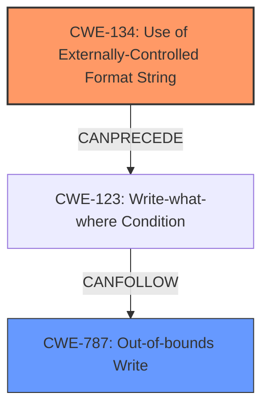

# Enhanced Analysis for CVE-2022-35878

# Summary
| CWE ID | CWE Name | Confidence | CWE Abstraction Level | CWE Vulnerability Mapping Label | CWE-Vulnerability Mapping Notes |
|---|---|---|---|---|---|
| CWE-134 | Use of Externally-Controlled Format String | 1.0 | Base | Allowed | Primary CWE |
| CWE-787 | Out-of-bounds Write | 0.5 | Base | Allowed | Secondary Candidate |

## Evidence and Confidence

*   **Confidence Score:** 0.75
*   **Evidence Strength:** HIGH

## Relationship Analysis
The primary relationship that influences the selection is that CWE-134 [Use of Externally-Controlled Format String] can precede CWE-123 [Write-what-where Condition]. While the description mentions memory corruption, which is often associated with out-of-bounds writes, the root cause is more directly tied to the use of an externally controlled format string. Therefore, CWE-134 is chosen as the primary CWE, and CWE-787 [Out-of-bounds Write] is a secondary candidate because the format string vulnerability leads to memory corruption.



## Vulnerability Chain
The vulnerability chain starts with the use of an externally controlled format string (CWE-134). This can lead to a write-what-where condition (CWE-123), which in turn results in an out-of-bounds write (CWE-787) and ultimately, memory corruption, information disclosure, and denial of service.

## Summary of Analysis
The analysis indicates a **format string injection** vulnerability. The `log` function uses `vsnprintf` with a format string derived from network inputs, allowing for external control (CWE-134). This can then lead to memory corruption (potentially CWE-787) and other impacts.

The key evidence is:
*   "Four **format string injection** vulnerabilities exist in the UPnP logging functionality"
*   "This vulnerability arises from **format string injection** via `ST` and `Location` HTTP response headers"
*   "The `log` function uses `vsnprintf` to format log messages, and the format string parameter is derived from network inputs."

CWE-134 [Use of Externally-Controlled Format String] is a **Base** level CWE and is the most specific and appropriate choice given the available evidence. While the vulnerability leads to memory corruption, the root cause is the format string injection itself, justifying CWE-134 as the primary weakness.

CWE-787 [Out-of-bounds Write] was considered because memory corruption is listed as an impact. However, it is a consequence of the format string injection rather than the root cause. Therefore, it is a secondary consideration.

Other CWEs considered but not used:

*   CWE-190 [Integer Overflow or Wraparound], CWE-78 [Improper Neutralization of Special Elements used in an OS Command ('OS Command Injection')], CWE-89 [Improper Neutralization of Special Elements used in an SQL Command ('SQL Injection')], CWE-1286 [Improper Validation of Syntactic Correctness of Input], CWE-121 [Stack-based Buffer Overflow], CWE-128 [Wrap-around Error], CWE-20 [Improper Input Validation], CWE-125 [Out-of-bounds Read]: These were not selected as they do not directly relate to the format string injection root cause.


## CWE Relationship Analysis

Current CWEs represent these abstraction levels: .


### Vulnerability Chain Analysis

**Chain starting from CWE-190:**
- 190 (Integer Overflow or Wraparound) - ROOT


**Chain starting from CWE-89:**
- 89 (Improper Neutralization of Special Elements used in an SQL Command ('SQL Injection')) - ROOT


### CWE Relationship Diagram

```mermaid
graph TD
    classDef primary fill:#f96,stroke:#333,stroke-width:2px
    classDef secondary fill:#69f,stroke:#333
    classDef tertiary fill:#9e9,stroke:#333
```