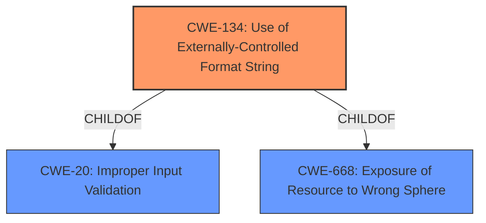

# Enhanced Analysis for CVE-2022-35884

# Summary
| CWE ID | CWE Name | Confidence | CWE Abstraction Level | CWE Vulnerability Mapping Label | CWE-Vulnerability Mapping Notes |
|---|---|---|---|---|---|
| CWE-134 | Use of Externally-Controlled Format String | 1.0 | Base | Allowed | Primary CWE |

## Evidence and Confidence

*   **Confidence Score:** 1.0
*   **Evidence Strength:** HIGH

## Relationship Analysis
The primary relationship that influenced the decision was the ChildOf relationship between CWE-134 and CWE-20 (Improper Input Validation). While input validation is often a factor, the core issue is the direct use of an external string as a format string.



## Vulnerability Chain
The vulnerability chain starts with the receipt of an externally controlled format string via the `ssid_hex` parameter. This string is then used in a logging function without proper sanitization, leading to memory corruption, information disclosure, or denial of service.

## Summary of Analysis
The initial analysis identified **format string injection** as the root cause. The Talos report confirms this, stating that the `ssid_hex` parameter is used in an `snprintf` function and then passed as the `format` argument to a logging function that uses `vsnprintf`. This allows an attacker to control the format string passed to `vsnprintf`. The evidence from the CVE Reference Links Content Summary section is very strong:

"**Root Cause:** The vulnerability stems from a **format string injection** flaw in the `web_wireless_connect` function of the device's web interface. Specifically, the `ssid_hex` parameter, which is intended to set the Wi-Fi SSID, is used in an `snprintf` function to create an OS command. This command is then passed as the `format` argument to a logging function, `log`, which uses `vsnprintf`. This allows an attacker to control the format string passed to `vsnprintf`."

The direct use of the externally controlled format string makes CWE-134 the most specific and appropriate choice. The retriever results also strongly suggest CWE-134.

CWE-20, Improper Input Validation, was considered but deemed less specific. While input validation is a factor, the core issue is the direct use of an external string as a format string. CWE-78, Improper Neutralization of Special Elements used in an OS Command ('OS Command Injection') was also considered because `snprintf` is used to create an OS command, but the key issue is the **format string injection**, not the OS command itself.
CWE-120, Buffer Copy without Checking Size of Input ('Classic Buffer Overflow'), was not selected because although memory corruption is a possible impact, the root cause is the **format string injection**, not a buffer copy operation.

# Relevant CWE Information:

## Enhanced Context (25 CWEs)

### CWE-134: Use of Externally-Controlled Format String
**Abstraction:** Base
**Status:** Draft

#### Description
The product uses a function that accepts a format string as an argument, but the format string originates from an external source.

#### Extended Description
When an attacker can modify an externally-controlled format string, this can lead to buffer overflows, denial of service, or data representation problems.

#### Mapping Guidance
**Usage:** Allowed
**Rationale:** This CWE entry is at the Base level of abstraction, which is a preferred level of abstraction for mapping to the root causes of vulnerabilities.


## CWE Relationship Analysis

Current CWEs represent these abstraction levels: .


### Vulnerability Chain Analysis

**Chain starting from CWE-668:**
- 668 (Exposure of Resource to Wrong Sphere) - ROOT


**Chain starting from CWE-20:**
- 20 (Improper Input Validation) - ROOT


### CWE Relationship Diagram

```mermaid
graph TD
    classDef primary fill:#f96,stroke:#333,stroke-width:2px
    classDef secondary fill:#69f,stroke:#333
    classDef tertiary fill:#9e9,stroke:#333
```