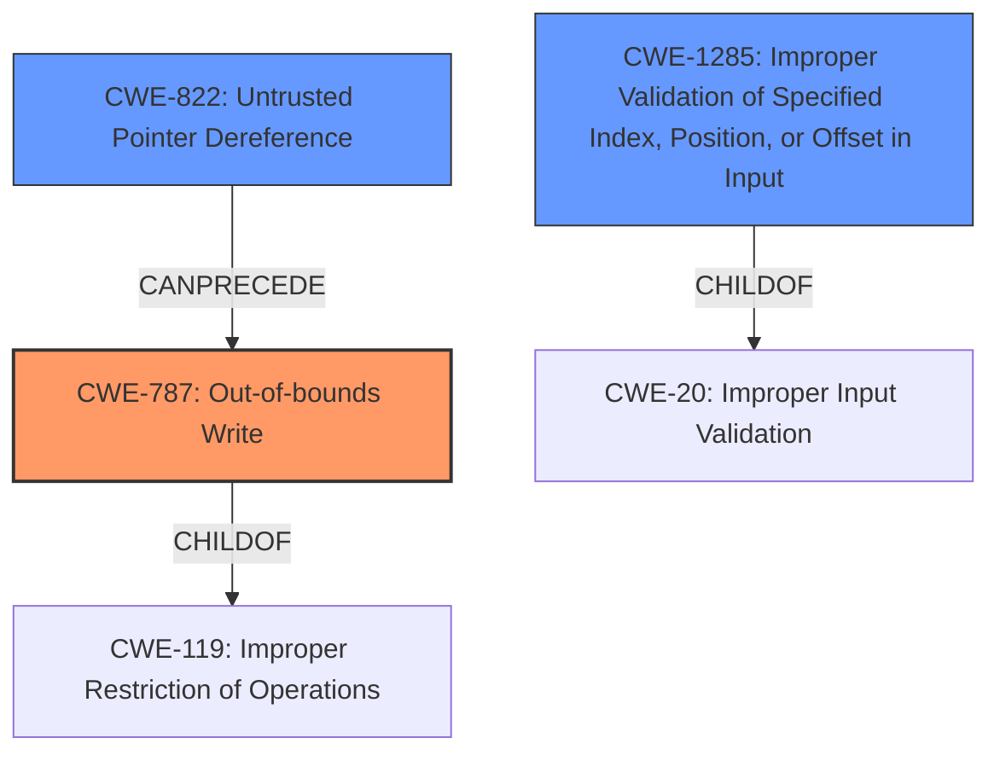

# Analysis for CVE-2022-35893

# Summary
| CWE ID | CWE Name | Confidence | CWE Abstraction Level | CWE Vulnerability Mapping Label | CWE-Vulnerability Mapping Notes |
|---|---|---|---|---|---|
| CWE-787 | Out-of-bounds Write | 1.0 | Base | Allowed | Primary CWE |
| CWE-822 | Untrusted Pointer Dereference | 0.7 | Base | Allowed | Secondary Candidate |
| CWE-1285 | Improper Validation of Specified Index, Position, or Offset in Input | 0.6 | Base | Allowed | Secondary Candidate |

## Evidence and Confidence

*   **Confidence Score:** 0.9
*   **Evidence Strength:** HIGH

## Relationship Analysis
The primary CWE, CWE-787 (**Out-of-bounds Write**), is a child of CWE-119 (**Improper Restriction of Operations**), indicating a more specific type of memory corruption. CWE-822 (**Untrusted Pointer Dereference**) can precede CWE-787, suggesting a potential chain where an untrusted pointer leads to an out-of-bounds write. CWE-1285 (**Improper Validation of Specified Index, Position, or Offset in Input**) is a child of CWE-20 (**Improper Input Validation**), highlighting that the root cause involves a failure to validate input related to memory access. The relationships helped to narrow down the selection to the most specific and relevant CWEs.

## Vulnerability Chain
The vulnerability chain starts with a **lack of input validation**, leading to the possibility of writing to arbitrary memory locations in SMRAM, ultimately resulting in privilege escalation to SMM and potential installation of firmware backdoors.
  - **Root Cause:** Lack of input validation of the target address in `SmfbFunc2` and `SmfbFunc3` functions.
  - **Weakness:** **SMM memory corruption** due to missing validation of the `addr` argument.
  - **Impact:** Escalation of privileges to SMM, arbitrary code execution in SMM, and potential for firmware backdoors.

## Summary of Analysis
The initial analysis identified **SMM memory corruption** as the key weakness, supported by the CVE reference summary detailing the lack of input validation for memory writes. The retriever results highlighted CWE-787 (**Out-of-bounds Write**) as the top candidate, aligning with the ability to write to arbitrary memory locations. CWE-822 (**Untrusted Pointer Dereference**) and CWE-1285 (**Improper Validation of Specified Index, Position, or Offset in Input**) were also considered due to the untrusted nature of the input and the missing validation, respectively.

The final conclusion is that CWE-787 (**Out-of-bounds Write**) is the primary CWE because the vulnerability allows attackers to write to arbitrary memory locations within SMRAM, directly matching the CWE description. CWE-822 (**Untrusted Pointer Dereference**) is a secondary candidate since the vulnerability involves using attacker-controlled input as a memory address. CWE-1285 (**Improper Validation of Specified Index, Position, or Offset in Input**) is another secondary candidate since the address is not validated. These CWEs are at the optimal level of specificity as they directly address the root cause and mechanism of the vulnerability.

Relevant CWE Information:

# Enhanced Context (25 CWEs)

## CWE-787: Out-of-bounds Write
**Technical Explanation:** The vulnerability in `FvbServicesRuntimeDxe` allows an attacker to write data past the end or before the beginning of the intended buffer in SMRAM. This is due to the missing validation of the target address in `SmfbFunc2` and `SmfbFunc3` functions.
**Security Implications:** An out-of-bounds write can lead to memory corruption, privilege escalation, and arbitrary code execution in SMM.
**Relationship:** CWE-787 is a child of CWE-119 (**Improper Restriction of Operations within the Bounds of a Memory Buffer**), indicating a specific type of memory corruption.
**Mapping Guidance Influence:** The "Usage: Allowed" guidance confirms that CWE-787 is appropriate for this type of vulnerability.

## CWE-822: Untrusted Pointer Dereference
**Technical Explanation:** The vulnerability involves using attacker-controlled input (`addr` argument) as a memory address without proper validation. This constitutes dereferencing a pointer obtained from an untrusted source.
**Security Implications:** Dereferencing an untrusted pointer can lead to reading or writing to unexpected memory locations, causing crashes or arbitrary code execution.
**Relationship:** CWE-822 can precede CWE-787, suggesting a potential chain where an untrusted pointer is dereferenced, leading to an out-of-bounds write.
**Mapping Guidance Influence:** The "Usage: Allowed" guidance supports the use of CWE-822 when a value from an untrusted source is converted to a pointer and dereferenced.

## CWE-1285: Improper Validation of Specified Index, Position, or Offset in Input
**Technical Explanation:** The `addr` argument, which specifies the memory address to write to, is not properly validated before being used. This allows attackers to specify arbitrary memory locations, leading to the out-of-bounds write.
**Security Implications:** Improper validation of the index, position, or offset can lead to unauthorized access to memory and potential security breaches.
**Relationship:** CWE-1285 is a child of CWE-20 (**Improper Input Validation**), highlighting the root cause of the vulnerability.
**Mapping Guidance Influence:** The "Usage: Allowed" guidance confirms that CWE-1285 is appropriate when input specifying an index, position, or offset is not properly validated.

## Considered but not used:
- CWE-119 (**Improper Restriction of Operations within the Bounds of a Memory Buffer**): While this is a parent of CWE-787, it is too general and the lower-level CWE is more appropriate. The mapping guidance also discourages its use.
- CWE-20 (**Improper Input Validation**): This is a high-level class CWE. CWE-1285 is a child of CWE-20 and is more specific to the vulnerability.
- CWE-367 (**Time-of-check Time-of-use (TOCTOU) Race Condition**): This CWE does not accurately describe the vulnerability because there is no race condition described in the root cause.
- CWE-825 (**Expired Pointer Dereference**): This CWE does not accurately describe the vulnerability because there is no evidence the memory was previously valid.
- CWE-667 (**Improper Locking**): This CWE does not accurately describe the vulnerability because there is no locking described in the root cause.
- CWE-415 (**Double Free**): This CWE does not accurately describe the vulnerability because there is no evidence of a double free.
- CWE-908 (**Use of Uninitialized Resource**): This CWE does not accurately describe the vulnerability because there is no evidence of an uninitialized resource being used.