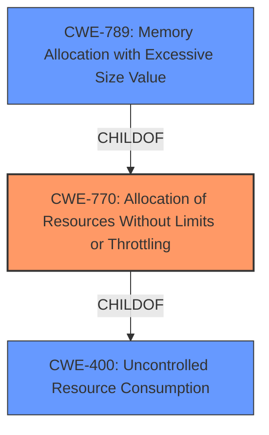

# Analysis Report for CVE-2022-35915

# Vulnerability Analysis Report: CVE-2022-35915

## Description


## Analysis (with Relationship Data)

# Summary
| CWE ID | CWE Name | Confidence | CWE Abstraction Level | CWE Vulnerability Mapping Label | CWE-Vulnerability Mapping Notes |
|---|---|---|---|---|---|
| **CWE-770** | **Allocation of Resources Without Limits or Throttling** | 0.9 | Base | Primary | Allowed |
| CWE-400 | Uncontrolled Resource Consumption | 0.7 | Class | Secondary | Discouraged |
| CWE-789 | Memory Allocation with Excessive Size Value | 0.6 | Variant | Secondary | Allowed |

## Evidence and Confidence

*   **Confidence Score:** 0.9
*   **Evidence Strength:** HIGH

## Relationship Analysis
The primary CWE is CWE-770, which is a Base level CWE and a child of CWE-400. CWE-400 represents a broader class of resource consumption issues. CWE-789 is a variant of CWE-770 related to memory allocation with excessive size. The hierarchical relationship shows that CWE-770 is a more specific instance of uncontrolled resource consumption, and CWE-789 a specific type of resource allocation issue that could lead to resource exhaustion.



## Vulnerability Chain
The chain of events is as follows:
1.  **Root Cause:** The `ERC165Checker` in OpenZeppelin Contracts **does not limit the amount of data** it reads when calling `supportsInterface`. This is the **lack of throttling**, which leads to...
2.  **Weakness:** An attacker-controlled contract can return a large amount of data, leading to **unbounded gas consumption**.
3.  **Impact:** Denial of Service (DoS) due to excessive gas usage.

## Summary of Analysis
Based on the vulnerability description and the provided information, the primary weakness is **CWE-770 Allocation of Resources Without Limits or Throttling**. This is because the `ERC165Checker` **does not properly limit the amount of data** it reads when calling `supportsInterface`. The "CVE Reference Links Content Summary" states that the "vulnerability stems from the way the `ERC165Checker` handles responses from `supportsInterface` queries" and that "the `ERC165Checker` **does not limit the amount of data** it reads". This aligns perfectly with the description of CWE-770, which states: "The product allocates a reusable resource or group of resources on behalf of an actor without imposing any restrictions on the size or number of resources that can be allocated". The resource being allocated is gas, and there is no limit imposed on the amount of gas that can be consumed.

CWE-400 Uncontrolled Resource Consumption is a broader category, and while applicable, CWE-770 is a more specific and accurate representation of the **root cause**. The mapping guidance for CWE-400 discourages its use when more specific mappings are available.

CWE-789 Memory Allocation with Excessive Size Value is also relevant because gas can be considered a resource, and the contract is effectively allocating gas based on the size of the data returned by the `supportsInterface` call. However, this is less direct than CWE-770, which focuses on the **lack of limits or throttling**.

The hierarchical relationships in the graph confirm that CWE-770 is the most appropriate choice, being a base-level CWE that directly addresses the root cause of the vulnerability. CWE-770 is more specific than CWE-400, and more directly linked to the **lack of limits** than CWE-789.

The confidence in this assessment is high because the evidence from the vulnerability description and the CVE reference summary directly supports the selection of CWE-770.


## CWE Relationship Analysis

Current CWEs represent these abstraction levels: .


### Vulnerability Chain Analysis

**Chain starting from CWE-400:**
- 400 (Uncontrolled Resource Consumption) - ROOT


**Chain starting from CWE-770:**
- 770 (Allocation of Resources Without Limits or Throttling) - ROOT


### CWE Relationship Diagram

```mermaid
graph TD
    classDef primary fill:#f96,stroke:#333,stroke-width:2px
    classDef secondary fill:#69f,stroke:#333
    classDef tertiary fill:#9e9,stroke:#333
```


*Report generated on 2025-03-31 05:03:58*
