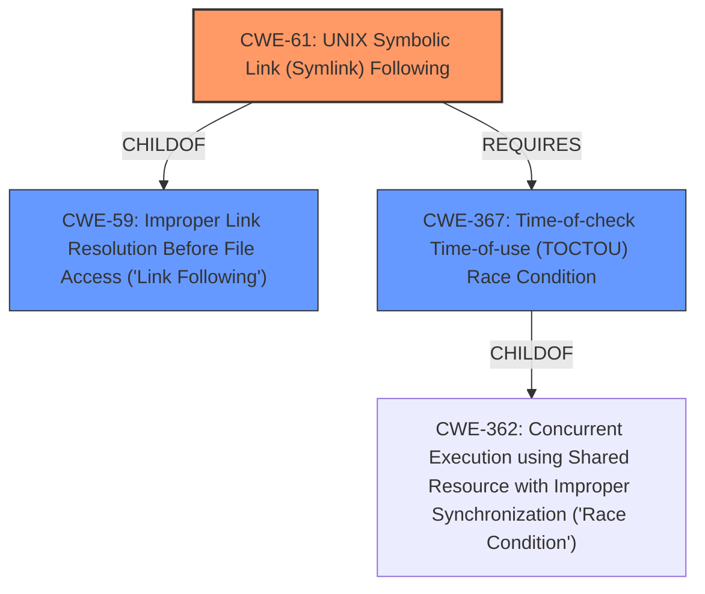

# Analysis for CVE-2022-3592

# Summary
| CWE ID | CWE Name | Confidence | CWE Abstraction Level | CWE Vulnerability Mapping Label | CWE-Vulnerability Mapping Notes |
|---|---|---|---|---|---|
| CWE-61 | UNIX Symbolic Link (Symlink) Following | 1.0 | Compound | Allowed | Primary CWE |
| CWE-59 | Improper Link Resolution Before File Access ('Link Following') | 0.8 | Base | Allowed | Secondary Candidate |
| CWE-367 | Time-of-check Time-of-use (TOCTOU) Race Condition | 0.6 | Base | Allowed | Secondary Candidate |

## Evidence and Confidence

*   **Confidence Score:** 0.9
*   **Evidence Strength:** HIGH

## Relationship Analysis
The primary CWE is CWE-61, which is a compound weakness comprising multiple underlying weaknesses. It is a child of CWE-59 (Improper Link Resolution), indicating a more specific case of the general link following issue. CWE-61 also *Requires* CWE-367 (TOCTOU), suggesting a potential race condition element in the vulnerability. The relationship analysis indicates that the vulnerability involves a complex interplay of symlink handling, potential race conditions, and inadequate checks. The vulnerability description indicates that the **symlink following** is the **rootcause** of the issue.

## Vulnerability Chain
The vulnerability chain begins with **improper handling of symlinks**, allowing an attacker to create a symlink that escapes the intended share path. This may be influenced by a **race condition** where the state of the symlink changes between the check and use. The final impact is the ability for a remote user to access restricted files on the server's file system.

## Summary of Analysis
The initial analysis and resulting conclusion are based on the provided evidence, specifically the vulnerability description, key phrases, and CVE reference links summary. The evidence clearly points to a **symlink following** issue as the **rootcause**, which is confirmed by the vulnerability description key phrases section stating: "**rootcause**: **symlink following**".

The graph relationships influenced the selection of CWE-61 as the primary CWE due to its direct relevance to **symlink following** and its relationship to other CWEs, such as CWE-367, which may contribute to the vulnerability.

The selected CWEs are at the optimal level of specificity. CWE-61 is a Compound weakness that accurately represents the combination of multiple weaknesses involved in the vulnerability. While CWE-59 is a parent of CWE-61, it is less specific and does not fully capture the intricacies of the vulnerability.

Relevant CWE Information:

# Enhanced Context (25 CWEs)
The following CWEs were identified as potentially relevant to this vulnerability:

## CWE-59: Improper Link Resolution Before File Access ('Link Following')
**Abstraction Level**: Base
**Similarity Score**: 0.81
**Source**: dense

**Description**:
The product attempts to access a file based on the filename, but it does not properly prevent that filename from identifying a link or shortcut that resolves to an unintended resource.

**Mapping Guidance**:
- Usage: Allowed
- Rationale: This CWE entry is at the Base level of abstraction, which is a preferred level of abstraction for mapping to the root causes of vulnerabilities.

## CWE-61: UNIX Symbolic Link (Symlink) Following
**Abstraction Level**: Compound
**Similarity Score**: 0.77
**Source**: dense

**Description**:
The product, when opening a file or directory, does not sufficiently account for when the file is a symbolic link that resolves to a target outside of the intended control sphere. This could allow an attacker to cause the product to operate on unauthorized files.

**Mapping Guidance**:
- Usage: Allowed
- Rationale: This is a well-known Composite of multiple weaknesses that must all occur simultaneously, although it is attack-oriented in nature.

## CWE-367: Time-of-check Time-of-use (TOCTOU) Race Condition
**Abstraction Level**: Base
**Similarity Score**: 0.76
**Source**: dense

**Description**:
The product checks the state of a resource before using that resource, but the resource's state can change between the check and the use in a way that invalidates the results of the check. This can cause the product to perform invalid actions when the resource is in an unexpected state.

**Mapping Guidance**:
- Usage: Allowed
- Rationale: This CWE entry is at the Base level of abstraction, which is a preferred level of abstraction for mapping to the root causes of vulnerabilities.

### Detailed Analysis of Selected CWEs:

*   **CWE-61: UNIX Symbolic Link (Symlink) Following**
    *   **Technical Explanation:** The vulnerability allows a malicious client to create a symbolic link that escapes the configured share path due to insufficient checks when following symlinks in user space. This aligns with the CWE-61 description, which states that the product "does not sufficiently account for when the file is a symbolic link that resolves to a target outside of the intended control sphere."
    *   **Security Implications:** This can lead to unauthorized access to files outside the intended share, potentially compromising the entire server's file system.
    *   **Relationships:** CWE-61 is a child of CWE-59 (Improper Link Resolution) and *Requires* CWE-367 (TOCTOU). This highlights the specific type of link resolution issue and the potential for race conditions to exacerbate the problem.
    *   **Mapping Guidance:** The MITRE mapping guidance allows the use of CWE-61 because it is a "well-known Composite of multiple weaknesses that must all occur simultaneously."
    *   **Confidence:** 1.0
*   **CWE-59: Improper Link Resolution Before File Access ('Link Following')**
    *   **Technical Explanation:** This CWE describes the general case where a product fails to prevent a filename from resolving to an unintended resource via a link. The Samba vulnerability is a specific instance of this, where the symlink allows access outside the configured share.
    *   **Security Implications:** Similar to CWE-61, this can lead to unauthorized access to sensitive files.
    *   **Relationships:** CWE-59 is a parent of CWE-61, indicating a broader category of link resolution issues.
    *   **Mapping Guidance:** The MITRE mapping guidance allows the use of CWE-59 because it is a base level weakness.
    *   **Confidence:** 0.8
*   **CWE-367: Time-of-check Time-of-use (TOCTOU) Race Condition**
    *   **Technical Explanation:** While not explicitly stated, a race condition *could* be a contributing factor if the state of the symlink target changes between the time it is checked and the time it is accessed. This aligns with the CWE-367 description.
    *   **Security Implications:** A race condition could allow an attacker to manipulate the symlink target in a way that bypasses security checks.
    *   **Relationships:** CWE-367 is related to CWE-61 through the *Requires* relationship, suggesting that a race condition may be a contributing factor.
    *   **Mapping Guidance:** The MITRE mapping guidance allows the use of CWE-367 because it is a base level weakness.
    *   **Confidence:** 0.6

### CWEs Considered But Not Used:

*   **CWE-22: Improper Limitation of a Pathname to a Restricted Directory ('Path Traversal')**: This CWE was considered because the vulnerability allows escaping the configured share path. However, the **rootcause** is not directly related to path traversal but to the **improper handling of symlinks**. Therefore, CWE-61 and CWE-59 are more appropriate.
*   **CWE-73: External Control of File Name or Path**: This CWE was considered because the attacker controls the symlink path. However, the core issue is how the system handles the symlink, not the external control of the path itself. Therefore, CWE-61 and CWE-59 are more fitting.
*   **CWE-99: Improper Control of Resource Identifiers ('Resource Injection')**: This CWE was considered but deemed less relevant because the primary issue is the improper handling of symlinks, rather than the injection of a resource identifier.