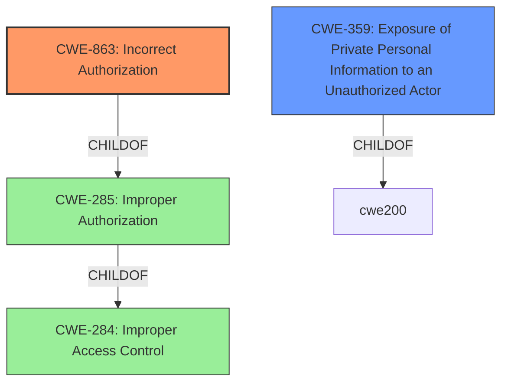

# Enhanced Analysis for CVE-2022-35921

# Summary
| CWE ID | CWE Name | Confidence | CWE Abstraction Level | CWE Vulnerability Mapping Label | CWE-Vulnerability Mapping Notes |
|---|---|---|---|---|---|
| CWE-863 | Incorrect Authorization | 1.0 | Class | Allowed-with-Review | Primary CWE |
| CWE-359 | Exposure of Private Personal Information to an Unauthorized Actor | 0.7 | Base | Allowed | Secondary Candidate |

## Evidence and Confidence

*   **Confidence Score:** 0.85
*   **Evidence Strength:** HIGH

## Relationship Analysis
The primary CWE is CWE-863, which is a Class-level CWE. While it is more general, there is no specific Base or Variant that fits the vulnerability. The vulnerability involves the application performing an authorization check, but doing it incorrectly, leading to users bypassing privacy settings.



## Vulnerability Chain
The chain of events is as follows:
1.  The application has a feature to disable private discussions (**weakness: not respect private discussion disablement**).
2.  The application **incorrectly** performs the authorization check (CWE-863).
3.  Users are able to bypass privacy settings and initiate private discussions with users who have disabled them.
4.  Exposure of Private Personal Information to an Unauthorized Actor (CWE-359)

## Summary of Analysis
The primary weakness is that the application **does not respect private discussion disablement** by users. This is caused by an **Incorrect Authorization** (CWE-863) since the application performs an authorization check, but it does not correctly perform the check.

The evidence is strong as the "CVE Reference Links Content Summary" explicitly states:
- "The primary weakness is the failure to enforce user-defined preferences for blocking private discussions. This allows unauthorized actions to occur, violating the intended access control mechanism."
- "Logic Error: The code logic incorrectly evaluated user's block setting, which allowed bypassing the check."

CWE-863 is a Class-level CWE, but it is the most appropriate based on the evidence provided. Although CWE-285 (Improper Authorization) is the parent of CWE-863, the description for CWE-863 specifically mentions that the authorization check is performed, but it is done incorrectly. The retriever results also list CWE-863 as the top candidate.

CWE-359 (Exposure of Private Personal Information to an Unauthorized Actor) is included as a secondary CWE since the vulnerability ultimately leads to a privacy violation.

The selected CWEs are at the optimal level of specificity given the information provided. More detailed CWEs might exist, but there isn't sufficient evidence to support them.

Relevant CWE Information:

# Enhanced Context (25 CWEs)

## CWE-212: Improper Removal of Sensitive Information Before Storage or Transfer
**Abstraction Level**: Base
**Similarity Score**: 0.81
**Source**: dense

**Description**:
The product stores, transfers, or shares a resource that contains sensitive information, but it does not properly remove that information before the product makes the resource available to unauthorized actors.
**Omitted due to lacking sufficient evidence.**

## CWE-226: Sensitive Information in Resource Not Removed Before Reuse
**Abstraction Level**: Base
**Similarity Score**: 0.79
**Source**: dense

**Description**:
The product releases a resource such as memory or a file so that it can be made available for reuse, but it does not clear or "zeroize" the information contained in the resource before the product performs a critical state transition or makes the resource available for reuse by other entities.
**Omitted due to lacking sufficient evidence.**

## CWE-538: Insertion of Sensitive Information into Externally-Accessible File or Directory
**Abstraction Level**: Base
**Similarity Score**: 0.78
**Source**: dense

**Description**:
The product places sensitive information into files or directories that are accessible to actors who are allowed to have access to the files, but not to the sensitive information.
**Omitted due to lacking sufficient evidence.**

## CWE-639: Authorization Bypass Through User-Controlled Key
**Abstraction Level**: Base
**Similarity Score**: 0.77
**Source**: dense

**Description**:
The system's authorization functionality does not prevent one user from gaining access to another user's data or record by modifying the key value identifying the data.
**Omitted due to it being too specific.**

## CWE-668: Exposure of Resource to Wrong Sphere
**Abstraction Level**: Class
**Similarity Score**: 0.76
**Source**: dense

**Description**:
The product exposes a resource to the wrong control sphere, providing unintended actors with inappropriate access to the resource.
**Omitted because it is high-level and lower-level CWEs are available.**

## CWE-319: Cleartext Transmission of Sensitive Information
**Abstraction Level**: Base
**Similarity Score**: 0.76
**Source**: dense

**Description**:
The product transmits sensitive or security-critical data in cleartext in a communication channel that can be sniffed by unauthorized actors.
**Omitted due to lacking sufficient evidence.**

## CWE-359: Exposure of Private Personal Information to an Unauthorized Actor
**Abstraction Level**: Base
**Similarity Score**: 0.76
**Source**: dense

**Description**:
The product does not properly prevent a person's private, personal information from being accessed by actors who either (1) are not explicitly authorized to access the information or (2) do not have the implicit consent of the person about whom the information is collected.
**Included as a secondary CWE.**

## CWE-200: Exposure of Sensitive Information to an Unauthorized Actor
**Abstraction Level**: Class
**Similarity Score**: 0.76
**Source**: dense

**Description**:
The product exposes sensitive information to an actor that is not explicitly authorized to have access to that information.
**Omitted because CWE-359 is more specific and a better fit.**

## CWE-74: Improper Neutralization of Special Elements in Output Used by a Downstream Component ('Injection')
**Abstraction Level**: Class
**Similarity Score**: 0.76
**Source**: dense

**Description**:
The product constructs all or part of a command, data structure, or record using externally-influenced input from an upstream component, but it does not neutralize or incorrectly neutralizes special elements that could modify how it is parsed or interpreted when it is sent to a downstream component.
**Omitted because it is irrelevant to the vulnerability description.**

## CWE-404: Improper Resource Shutdown or Release
**Abstraction Level**: Class
**Similarity Score**: 0.76
**Source**: dense

**Description**:
The product does not release or incorrectly releases a resource before it is made available for re-use.
**Omitted because it is irrelevant to the vulnerability description.**

## CWE-79: Improper Neutralization of Input During Web Page Generation ('Cross-site Scripting')
**Abstraction Level**: Base
**Similarity Score**: 7437.43
**Source**: sparse

**Description**:
The product does not neutralize or incorrectly neutralizes user-controllable input before it is placed in output that is used as a web page that is served to other users.
**Omitted because it is irrelevant to the vulnerability description.**

## CWE-863: Incorrect Authorization
**Abstraction Level**: Class
**Similarity Score**: 7227.83
**Source**: sparse

**Description**:
The product performs an authorization check when an actor attempts to access a resource or perform an action, but it does not correctly perform the check.
**Included as the primary CWE.**

## CWE-285: Improper Authorization
**Abstraction Level**: Class
**Similarity Score**: 7020.74
**Source**: sparse

**Description**:
The product does not perform or incorrectly performs an authorization check when an actor attempts to access a resource or perform an action.
**Omitted because CWE-863 is more specific and a better fit.**

## CWE-923: Improper Restriction of Communication Channel to Intended Endpoints
**Abstraction Level**: Class
**Similarity Score**: 7016.50
**Source**: sparse

**Description**:
The product establishes a communication channel to (or from) an endpoint for privileged or protected operations, but it does not properly ensure that it is communicating with the correct


## CWE Relationship Analysis

Current CWEs represent these abstraction levels: .


### Vulnerability Chain Analysis

**Chain starting from CWE-200:**
- 200 (Exposure of Sensitive Information to an Unauthorized Actor) - ROOT


**Chain starting from CWE-538:**
- 538 (Insertion of Sensitive Information into Externally-Accessible File or Directory) - ROOT


### CWE Relationship Diagram

```mermaid
graph TD
    classDef primary fill:#f96,stroke:#333,stroke-width:2px
    classDef secondary fill:#69f,stroke:#333
    classDef tertiary fill:#9e9,stroke:#333
```